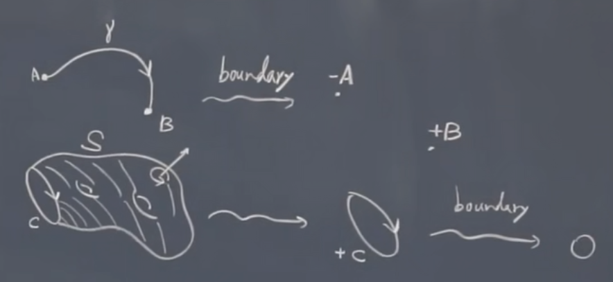
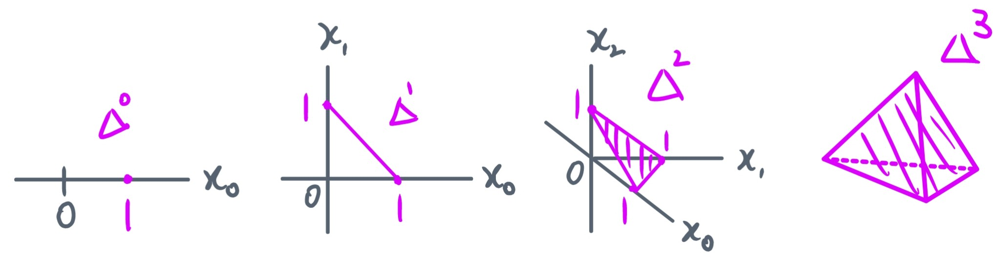
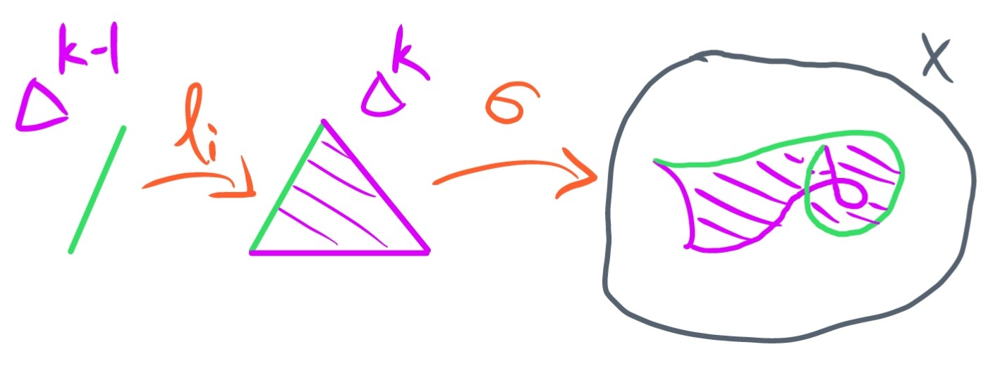

+++

title = "代数拓扑 1 - 奇异同调"
date = 2022-11-25
draft = false

[taxonomies]
categories = ["代数拓扑"]
tags = ["数学", "拓扑学", "代数拓扑"]

[extra]
lang = "zh"
toc = true
mathjax = true

+++

本文存在部分内容尚未完全施工完毕, 作者将尽快更新！



### 参考资料 & 教材

- **[NTU] Algebraic Topology - Chen-Yu Chi**：台大齐震宇教授的代数拓扑公开课;
- **Introduction to Homological Algebra - nLab**：同调代数的入门教程;
- **Introduction to Topology - 2 - nLab**：同伦论的入门教程.
- **An introduction to algebraic topology - Joseph J. Rotman**：Rotman 的代数拓扑教材.

### 前置需求

本笔记已省去一些基础的定义以及具体细节, 以跟上课堂进度, 省略的基础定义包括但不限于：

- **范畴论 (category theory)**：范畴, 函子, 自然变换, 同构, 自然同构等的基础定义与性质;
- **拓扑学 (topology theory)**：拓扑空间, 开闭集, 连续映射, 同胚, 开球闭球, $\R^n$ 等的基本定义与性质;
- **群论 (group theory)**：群, 自由群, 阿贝尔群, 群同态, 陪集, 商群等的基本定义与性质.

### 记号

为了方便或直观, 这里会使用一些记号：

- 文本描述上的映射 $f$ 通常被记为 $f : X \to Y$, 于复合情况下则记为 $g \circ f$ 或 $X \overset{f}{\to} Y \overset{g}{\to} Z$.
- 自然数集 $\N \coloneqq \N^0 = \set{ 0, 1, 2, \dots }$, 而不含 $0$ 的自然数集则记为 $\N^\times \coloneqq \N^1 = \set{1, 2, \dots}$;
- 设有范畴 $\mathcal{C}$ 及 $\mathcal{C}$ 中的对象 $X$, 称 $X$ 属于 $\mathcal{C}$ 将被记为 $X \in \mathcal{C}$ 而非 $X \in \operatorname{Ob}(\mathcal{C})$;
- 设有范畴 $\mathcal{C}$ 及 $\mathcal{C}$ 中的态射 $f$, 称 $f$ 属于 $\mathcal{C}$ 将被记为 $f \in \operatorname{Mor}(\mathcal{C})$;
- 设有范畴 $\mathcal{C}$ 及 $X \in \mathcal{C}$, 若有 $f : X \to Y$ 以及 $x \in X$, 则态射的具体映射方式被记为 $\begin{align} X & \overset{f}{\to} Z \\ x & \mapsto f(x) \end{align}$.
- 设有范畴 $\mathcal{C}$ 及 $X, Y, Z \in \mathcal{C}$, 若有 $f : X \to Y$ 和 $g : Y \to Z$, 则复合态射 $h = g \circ f$ 连带其态射集被记为 $\begin{align} X & \overset{h}{\to} Z \\ g & \circ f \end{align}$.

## 0. 前置介绍与基础定义

### 动机

代数拓扑很大程度上所研究的课题是关于 **拓扑不变量 (topological invariants)** 在抽象的空间 (例如拓扑空间) 上的一些性质, 而拓扑不变量是指在双向连续映射 (不一定是同胚) 下所保持的一些不变量. 例如我们现在考虑所有拓扑空间构成的范畴 $\operatorname{Top}$, 从中抽出任意的拓扑空间 $X \in \operatorname{Top}$, 由于直接在拓扑空间中研究一些抽象的性质是比较困难的事情, 我们希望 "代数化" 地探讨关于 $X$ 上的一些性质, 那么便可以与由代数结构所构成的范畴建立函子关系, 即如阿贝尔群范畴, 那么便能建立映射 $\begin{align} \operatorname{Top} & \to \operatorname{Ab} \\ X & \mapsto G(X) \end{align}$, 那么当然我们所研究的不仅仅只有对象之间的映射, 还要探讨关于连续映射到群同态之间的映射关系, 使得实际上我们能构造出以下满足同态性的交换图：
$$
% https://darknmt.github.io/res/xypic-editor/#eyJub2RlcyI6W3sicG9zaXRpb24iOlsxLDBdLCJ2YWx1ZSI6IlgifSx7InBvc2l0aW9uIjpbMSwxXSwidmFsdWUiOiJHKFgpIn0seyJwb3NpdGlvbiI6WzIsMF0sInZhbHVlIjoiWSJ9LHsicG9zaXRpb24iOlsyLDFdLCJ2YWx1ZSI6IkcoWSkifSx7InBvc2l0aW9uIjpbMCwwXSwidmFsdWUiOiJcXG9wZXJhdG9ybmFtZXtUb3B9In0seyJwb3NpdGlvbiI6WzAsMV0sInZhbHVlIjoiXFxvcGVyYXRvcm5hbWV7QWJ9In1dLCJlZGdlcyI6W3siZnJvbSI6MCwidG8iOjIsInZhbHVlIjoiZiIsImxhYmVsUG9zaXRpb24iOiJsZWZ0In0seyJmcm9tIjoxLCJ0byI6MywidmFsdWUiOiJHKGYpIiwibGFiZWxQb3NpdGlvbiI6InJpZ2h0In0seyJmcm9tIjoyLCJ0byI6M30seyJmcm9tIjowLCJ0byI6MX0seyJmcm9tIjo0LCJ0byI6NX1dfQ==
\xymatrix{
\operatorname{Top} \ar@{->}[d] & X \ar@{->}[r]^{f} \ar@{->}[d] & Y \ar@{->}[d] \\
\operatorname{Ab} & G(X) \ar@{->}[r]_{G(f)} & G(Y)
}
$$
其中 $X, Y \in \operatorname{Top}$, $f$ 为他们之间的连续映射, 而 $G(X), G(Y) \in \operatorname{Abel}$, 他们之间的群同态为 $G(f)$, 很自然地就引出了函子的概念, 而该函子通常被称为从拓扑空间范畴到阿贝尔群范畴的 **同调函子 (homology functor)**.

### 例子 1.0.1 (拓扑空间中的边缘)

透过对拓扑空间的 "代数化", 我们能够得出许多好处, 例如我们考虑一个在拓扑空间上从端点 $A$ 到 $B$ 的线段 $\gamma$, 那么这个线段 (或称为 **面 (face)**) 的 **边界 (boundary)** 显然便是点 $A$ 以及 $B$, 现在再令该线段是带有 "方向" 的, 例如是从出发点 $A$ 到终点 $B$, 则该线段的边界为 $-A, + B$.

而当我们进一步考虑可能这已经是个复杂的三维形状 $S$ 时, 例如一个带有两个 **亏格 (genus)** 的 **环面 (torus)** (亏格即 "洞"), 并且在旁边切出一个截面使得 $S$ 的边界就是围着该截面的一个有向的环状边缘 $+C$. 那么现在问题是 $+C$ 能够拥有边界吗？从上图的可视化中显然我们看到 $+C$ 并没有包含任何端点, 亦即是说其边界数量为 $0$, 就意味着连续接着两次求边缘的态射, 将他们复合起来后所得到的是 $0$, 将该概念加以推广并代数化后便是所谓的 **边缘算子 (boundary operator)** 以及 **链复形 (chain complex)** 中的概念了.

### 注释 (同伦论的发展动机)

由于我们讨论连续性时通常都是研究拓扑空间之间的连续映射, 那么现在我们不仅仅研究两个空间之间的连续映射, 例如可以考虑连续映射本身的 **连续形变 (continuous deformation)**, 该概念就被称之为 **同伦 (homotopy)**, 而研究关于同伦关系的理论便是 **同伦论 (homotopy theory)**. 特别要注意的是, 同伦类似于同胚, 事实上其亦构成拓扑空间上的一种等价关系, 其所构成的等价类被称为 **同伦类 (homotopy classes)**.

而代数化后, 类似于上述从的函子 $\operatorname{Top} \to \operatorname{Abel}$, 我们当然亦可再稍微把条件放宽一些构造出到群范畴的函子, 即 $\operatorname{Top} \to \operatorname{Grp}$, 该处会产生一个叫作 **弱同伦等价 (weak homotopy equivalence)** 的 "等价关系", 详细的描述与定义将于下面章节提及.

### 注释 (同调代数的发展动机)

由于上面已经提及到弱同伦等价并不是完全的等价关系, 因为其虽满足自反性以及传递性, 但却不满足对称性 (可交换性, 或阿贝尔性), 那么同调代数出现的目的便是为了让弱同伦等价能够交换 而对其进行 **阿贝尔化 (abelianization)**, 该处便引入了大量关于范畴化的概念, 是范畴论的起源, 亦是 **交换图 (commutative diagram)** 一词的根源.

### 注释

以下是一些基础的, 需要使用到的基础定义, 不再详细阐述.

### 定义 1.0.1 (拓扑空间, 开集)

设 $X$​​​​ 为非空集, $X$​​ 的一个子集族 $\tau$​​ 被称为 $X$​​ 的一个 **拓扑 (topology)**，若其满足 **拓扑公理 (topological axioms)**：

1. $X, \empty \in \tau$;
2. $\tau$​ 中任意多个成员的并集仍在 $\tau$​ 中;
3. $\tau$ 中有限多个成员的交集仍在 $\tau$​ 中 $\iff$ $\tau$ 中任二成员的交仍在 $\tau$ 中.

则 $(X, \tau)$ 被称为是 **拓扑空间 (topological space)**, 一般可简记为 $X$, 而 $\tau$​ 中的成员称为该拓扑空间的 **开集 (open sets)**.

### 定义 1.0.2 (子空间拓扑)

设有拓扑空间 $X, Y$, 若 $Y \hookrightarrow X$ 是拓扑空间中基础集之间的包含映射, 并且 $\set{U_i \sub X}_{i \in I}$ 是 $X$ 中的拓扑, 则 $Y$ 中的 **子空间拓扑 (subspace topology)** 被定义为 $\set{ U_i \cap Y \sub Y }_{i \in I}$.

### 定义 1.0.3 (连续映射)

设 $X, Y$ 为拓扑空间, 映射 $f : X \to Y$, 若 $Y$ 中任意开集 $U$ 的原像 $f^{-1}(U)$ 是 $X$ 中的一个开集, 则称 $f$ 为从 $X$ 到 $Y$ 的 **连续映射 (continuous maps)**, 或称 **$f$ 连续 ($f$ is continuous)**.

### 定义 1.0.4 (同胚映射)

设 $X, Y$ 为拓扑空间, 若 $f : X \to Y$ 是一个双射映射, 并且 $f, f^{-1}$ 都是连续的, 则：

- 称 $f$ 为一个 **同胚映射 / 同胚 / 拓扑同构 (homeomorphism / topological isomorphism)**.
- 称拓扑空间 $X$ 与 $Y$ 是 **同胚的 (homeomorphic)**, 或称 $X$ 同胚于 $Y$.

### 定义 1.0.5 (系数与形式线性组合)

- 设有任意集合 $S$, 若称映射 $a : S \to \Z$ 为 $S$ 的 **形式线性组合 (formal linear combination)**, 其于映射后使得仅有限个 $a_s \in \Z$ 不为 $0$.

- 若确定其中的元素 $s \in S$ 使得 $a_s = 1 \in \Z$ 而其余的元素映射至 $0$, 使得被记为：
  $$
  a = \sum_{s \in S} a_s \cdot s.
  $$
  且该表达式中的 $a_s \in \Z$ 被称为是 $s$ 于该线性组合上的 **系数 (coefficient)**.

### 定义 1.0.6 (形式线性组合群)

设有任意集合 $S$, 所有 $S$ 的形式线性组合以及 $\Z$ 上的加法运算构成自由阿贝尔群, 称为 **形式线性组合群 (group of linear combinations)**, 记为 $\Z[S]$.

### 命题 1.0.8 ($\Z[S] \cong \bigoplus_{s \in S} \Z$)

### 命题 1.0.9 ($\Z[S \times T] \cong \Z[S] \oplus \Z[T]$)

## 1. 奇异同调群

### 定义 1.1.1 (标准单纯形)

设有 $k \in \N$, 定义 **$k$ 维标准单纯形 / $k$ 维单纯形 (topological $k$-simplex)** 为 $\R^{k+1}$ 下的一个子集：
$$
\Delta^k \coloneqq \Set{ \vec x \in \R^{k+1} ： \left(\sum_{i = 0}^k x_i = 1 \right) \and \left( \forall i, x_i \geq 0 \right) } \sub \R^{k+1}
$$
并且其上的拓扑是由 $\R^{k+1}$ 的标准拓扑所诱导出的子空间拓扑.

### 例子 1.1.2 (点, 标准区间, 填充三角形, 填充四面体)

现在假设有 $\Delta^k$, 若我们分别取 $k \in \N$ 为以下不同数值：

- 若 $k = 0$, 即 $\Delta^0 = *$, 则 $0$ 维单纯形表象如同一个 **点 (point)**;
- 若 $k = 1$, 即 $\Delta^1 = [0, 1]$, 则表现如同一个 **标准区间 (standard interval)** $[0,1]$;
- 若 $k = 2$, 即 $\Delta^2$ 表现如同一个 **填充三角形 (filled triangle)**;
- 若 $k = 3$, 即 $\Delta^3$ 表现如同一个 **填充四面体 (tetrahedron)**.

而 $0$ 至 $3$ 维单纯形的具体几何呈现可观察下图：

事实上从上图又可观察到 $\Delta^k$ 实际上有 $k+1$ 个边界, 并且 $\Delta^k$ 又是作为 $\Delta^{k+1}$ 的边界而存在的, 因此我们可将 $\Delta^k$ 嵌入 到 $\Delta^{k+1}$ 中, 反之又可将 $\Delta^{k+1}$ 退化为 $\Delta^k$, 那么便可考虑建立包含以及退化映射, 即下述定义.

### 定义 1.1.3 (第 $i$ 面的包含映射)

设有 $k \in \N^\times$ 以及 $0 \leq i \leq k$, 则称 $\ell_i$ 为 $k$ 维单纯形的 **第 $i$ 面的包含映射 ($i$-th face inclusion)**, 并定义为：
$$
\begin{align}
\Delta^k & \overset{\ell_i}{\to} \Delta^{k+1} \qquad (\R^{k+1} \hookrightarrow \R^{k+2}) \\
(x_0, \dots, x_k) & \mapsto (x_0, \dots, x_{i-1}, 0, x_i, \dots, x_k)
\end{align}
$$

### 例子 1.1.4 (从 $\Delta^0$ 到 $\Delta^1$ 的 $i$-面包含映射)

- 考虑 $\ell_0 : \Delta^0 \to \Delta^1$, 意味着有 $\set{1} \hookrightarrow [0, 1]$, 即将右端点映射至标注区间 $[0,1]$ 上;
- 考虑 $\ell_1 : \Delta^0 \to \Delta^1$, 意味着有 $\set{0} \hookrightarrow [0, 1]$, 即将左端点映射至标准区间 $[0,1]$ 上.

### 定义 1.1.5 (第 $i$ 面的退化映射)

设有 $k \in \N^\times$ 以及 $0 \leq i < k$, 则称满射 $\gamma_i$ 为 $k$ 维单纯形的 **第 $i$ 面的退化映射 ($i$-th degenerate projection)**, 并定义为：
$$
\begin{align}
\Delta^{k} & \overset{\gamma_i}{\to} \Delta^{k-1} \qquad (\R^{k+1} \rightarrowtail \R^k) \\
(x_0, \dots, x_k) & \mapsto (x_0, \dots, x_i + x_{i+1}, \dots, x_k)
\end{align}
$$

### 定义 1.1.6 (奇异单纯形)

设有 $X \in \operatorname{Top}$ 以及 $k \in \N$：

- 称 $X$ 上的 **奇异 $k$ 维单纯形 (singular $k$-simplex)** 为一个从 $\Delta^k$ 到 $X$ 的连续映射 $\sigma : \Delta^k \to X$;
- 所有 $X$ 中的奇异 $k$ 维单纯形所构成的集合则定义为 $(\operatorname{Sing} X)_k \coloneqq \operatorname{Hom}_{\operatorname{Top}}(\Delta^k, X)$.

### 定义 1.1.7 (奇异单纯形的面)

设有奇异 $k$ 维单纯形 $\sigma : \Delta^k \to X$, 对任意 $i \in \N$ 以及 $0 \leq i \leq k$, 则称 $\sigma_i$ 为 **奇异单纯形的面 (faces of a singular $k$-simplex)**, 并定义为：
$$
\begin{align}
\Delta^{k-1} & \overset{\sigma_i}{\to} X \\
\sigma & \circ \ell_i
\end{align}
$$

### 注释

事实上奇异单纯形的面 $\sigma_i$ 无非就是连续映射的复合 $\Delta^{k-1} \overset{\ell_i}{\to} \Delta^k \overset{\sigma}{\to} X$, 其的几何呈现可参考下图：

### 定义 1.1.8 (奇异链与奇异链群)

设有 $k \in \Z$ 以及 $X \in \operatorname{Top}$：

- 称 $S_k(X)$ 是由所有在 $X$ 中的奇异 $k$ 维单纯形作为基所生成的自由阿贝尔群为 **奇异链群 (singular chain groups)**, 定义为：
  $$
  S_k(X) \coloneqq \begin{dcases}
  \bigoplus_{\sigma : \Delta^k \to X} \Z \sigma, & \quad k \geq 0 \\
  \set{0}, & \quad k < 0
  \end{dcases}
  $$

- 称 $S_k(X)$ 中的元素为 **奇异链 (singular chain)**, 奇异链是奇异单形的整数系数线性组合, 即对于任意 $c_k \in S_k(X)$：
  $$
  c_k = a_1 \sigma_k^1 + \dots + a_r \sigma_k^r, \quad a_i \in \Z, \sigma_k^i : \Delta^k \to X
  $$

### 注释

事实上现在我们假设有 $X$ 中的连续映射 $f : X \to Y$ 就可以构造出函子 $S_k : \operatorname{Top} {\to} \operatorname{Ab}$, 使得对于任意 $[\Delta^k \overset{\sigma}{\to} X] \in S_k(X)$, 定义：
$$
\begin{align}
S_k(X) & \overset{f_{\sharp}}{\to} S_k(Y) \\
[\Delta^k \overset{\sigma}{\to} X] & \mapsto f \circ \sigma
\end{align}
$$
使得下图可交换：
$$
% https://darknmt.github.io/res/xypic-editor/#eyJub2RlcyI6W3sicG9zaXRpb24iOlswLDFdLCJ2YWx1ZSI6IlNfayhYKSJ9LHsicG9zaXRpb24iOlsxLDFdLCJ2YWx1ZSI6IlNfayhZKSJ9LHsicG9zaXRpb24iOlswLDBdLCJ2YWx1ZSI6IlgifSx7InBvc2l0aW9uIjpbMSwwXSwidmFsdWUiOiJZIn1dLCJlZGdlcyI6W3siZnJvbSI6MCwidG8iOjEsInZhbHVlIjoiZl97XFxzaGFycH0gPSBTX2soZikiLCJsYWJlbFBvc2l0aW9uIjoicmlnaHQifSx7ImZyb20iOjIsInRvIjozLCJ2YWx1ZSI6ImYifSx7ImZyb20iOjIsInRvIjowLCJ2YWx1ZSI6IlNfayIsImxhYmVsUG9zaXRpb24iOiJyaWdodCJ9LHsiZnJvbSI6MywidG8iOjEsInZhbHVlIjoiU19rIn1dfQ==
\xymatrix{
X \ar@{->}[r]^{f} \ar@{->}[d]_{S_k} & Y \ar@{->}[d]^{S_k} \\
S_k(X) \ar@{->}[r]_{f_{\sharp} = S_k(f)} & S_k(Y)
}
$$

### 定义 1.1.9 (边缘算子)

设有 $k \in \Z$, 对象 $X \in \operatorname{Top}$, 函子 $S_k : \operatorname{Top} {\to} \operatorname{Ab}$ 以及由生成集 $(\operatorname{Sing} X)_k \sub S_k(X)$ 所生成的奇异链群 $S_k(X)$, 则称 $\partial_k$ 为 $S_k(X)$ 与 $S_{k-1}(X)$ 之间的 **边缘算子 (boundary operation)**, 并定义为：
$$
\begin{align}
S_k(X) & \overset{\partial_k}{\to} S_{k-1}(X) \\
[\sigma \in (\operatorname{Sing} X)_k] & \mapsto \sum_{i = 0}^k (-1)^i \sigma_i
\end{align}
$$
若对任意另一拓扑空间 $Y \in \operatorname{Top}$, 有连续映射 $f : X \to Y$, 则其必然保有函子的同态性, 即使得在 $\operatorname{Ab}$ 中下图可交换：
$$
% https://darknmt.github.io/res/xypic-editor/#eyJub2RlcyI6W3sicG9zaXRpb24iOlswLDBdLCJ2YWx1ZSI6IlNfayhYKSJ9LHsicG9zaXRpb24iOlsxLDBdLCJ2YWx1ZSI6IlNfayhZKSJ9LHsicG9zaXRpb24iOlswLDFdLCJ2YWx1ZSI6IlNfe2stMX0oWCkifSx7InBvc2l0aW9uIjpbMSwxXSwidmFsdWUiOiJTX3trLTF9KFkpIn1dLCJlZGdlcyI6W3siZnJvbSI6MCwidG8iOjIsImxhYmVsUG9zaXRpb24iOiJyaWdodCIsInZhbHVlIjoiXFxwYXJ0aWFsX2sifSx7ImZyb20iOjAsInRvIjoxLCJ2YWx1ZSI6ImZfe1xcc2hhcnB9In0seyJmcm9tIjoyLCJ0byI6MywidmFsdWUiOiJmX3tcXHNoYXJwfSIsImxhYmVsUG9zaXRpb24iOiJyaWdodCJ9LHsiZnJvbSI6MSwidG8iOjMsImxhYmVsUG9zaXRpb24iOiJsZWZ0IiwidmFsdWUiOiJcXHBhcnRpYWxfayJ9XX0=
\xymatrix{
S_k(X) \ar@{->}[d]_{\partial_k} \ar@{->}[r]^{f_{\sharp}} & S_k(Y) \ar@{->}[d]^{\partial_k} \\
S_{k-1}(X) \ar@{->}[r]_{f_{\sharp}} & S_{k-1}(Y)
}
$$
要令上图交换, 只需设任意 $[\Delta^k \overset{\sigma}{\to} X] \in S_k(X)$, 则：
$$
\begin{align}
f_\sharp(\part_k \sigma) & = f_\sharp \left( \sum_{i=0}^k (-1)^i \sigma_i \right) \\
& = f_\sharp \left( \sum_{i=0}^k (-1)^i (\sigma \circ \ell_i) \right) & [\text{奇异单纯形的面}] \\
& = \sum_{i=0}^k f_\sharp[(-1)^i (\sigma \circ \ell_i)] & [\text{群同态}] \\
& = \sum_{i=0}^k (-1)^i (f \circ \sigma \circ \ell_i) \\
& = \sum_{i=0}^k (-1)^i (f \circ \sigma)_i \\
& = \part_k(f \circ \sigma) = \part_k(f_\sharp \sigma) \\
\end{align}
$$

### 注释

事实上边缘算子 $\partial_k$ 的定义是由 **自由构造 (free construction)** 所保证的, 我们所关注的是其的生成集 $(\operatorname{Sing} X)_k$, 若它的奇异链群是透过自由函子 $\varphi : (\operatorname{Sing} X)_k \to S_k(X)$ 所生成的, 那么则存在唯一态射 $\partial_k : S_k(X) \to S_{k-1}(X)$ 使得有：
$$
\begin{align}
(\operatorname{Sing} X)_k & \overset{\psi}{\to} S_{k-1}(X)  \\
\partial_k & \circ \varphi
\end{align}
$$
即满足了关于自由构造的泛性质.

### 命题1.1.10 (单纯恒等式)

设有 $i, j, k \in\N$, 若满足条件 $1 \leq j + 1 \leq i \leq k$ 并且 $k \geq 2$, 则可使得下图可交换：
$$
% https://darknmt.github.io/res/xypic-editor/#eyJub2RlcyI6W3sicG9zaXRpb24iOlswLDBdLCJ2YWx1ZSI6IlxcRGVsdGFee2stMn0ifSx7InBvc2l0aW9uIjpbMSwwXSwidmFsdWUiOiJcXERlbHRhXntrLTF9In0seyJwb3NpdGlvbiI6WzAsMV0sInZhbHVlIjoiXFxEZWx0YV57ay0xfSJ9LHsicG9zaXRpb24iOlsxLDFdLCJ2YWx1ZSI6IlxcRGVsdGFeayJ9XSwiZWRnZXMiOlt7ImZyb20iOjAsInRvIjoxLCJ2YWx1ZSI6IlxcZWxsX2oifSx7ImZyb20iOjAsInRvIjoyLCJ2YWx1ZSI6IlxcZWxsX3tpLTF9IiwibGFiZWxQb3NpdGlvbiI6InJpZ2h0In0seyJmcm9tIjoyLCJ0byI6MywidmFsdWUiOiJcXGVsbF9qIiwibGFiZWxQb3NpdGlvbiI6InJpZ2h0In0seyJmcm9tIjoxLCJ0byI6MywidmFsdWUiOiJcXGVsbF9pIn1dfQ==
\xymatrix{
\Delta^{k-2} \ar@{->}[r]^{\ell_j} \ar@{->}[d]_{\ell_{i-1}} & \Delta^{k-1} \ar@{->}[d]^{\ell_i} \\
\Delta^{k-1} \ar@{->}[r]_{\ell_j} & \Delta^k
}
$$
即有 $\ell_j \circ \ell_{i-1} = \ell_i \circ \ell_j$, 该恒等式是 **单纯恒等式 (simplicial identity)** 的一部分.

##### 证明

由条件得知 $j \leq i-1$ 并且 $j-1 \leq i-2$, 那么则有：
$$
\begin{align}
(\ell_j \circ \ell_{i-1})(x_0, \dots, x_k) & = \ell_j(\ell_{i-1}(x_0, \dots, x_k)) \\
& = \ell_j(x_0, \dots, x_{i-2}, 0, x_{i-1}, \dots, x_k) \\
& = (x_0, \dots, x_{j-1}, x_{i-2}, 0, 0, x_j, x_{i-1}, \dots, x_k) \\
\end{align}
$$
那么由单纯形定义可得知 $x_0 + \dots + x_{j-1} + x_{i-2}  + x_j + x_{i-1} + \dots + x_k = 1$, 而加法满足交换律, 显然将下标 $+1$ 使得元素重排就有：
$$
(x_0, \dots, x_j, x_{i-1}, 0, 0, x_{j-1}, x_i, \dots, x_k) = \ell_j(x_0, \dots, x_{i-1}, 0, x_{i}, \dots, x_k) = (\ell_j \circ \ell_i)(x_0, \dots, x_k)
$$
使得 $\ell_j \circ \ell_{i-1} = \ell_i \circ \ell_j$ 成立.

### 命题 1.1.11 (边缘两次复合为 $0$)

对于任意奇异 $k$ 维单纯形 $\sigma : \Delta^k \to X$, 则 $\partial^2 = \partial \circ \partial = 0$.

##### 证明

$$
\begin{align}
\partial_{k-1}(\partial_k \sigma) & = \partial \left(\sum_{i = 0}^k (-1)^i \sigma_i \right) \\
& = \sum_{j = 0}^{k-1} \sum_{i = 0}^k (-1)^{i+j} (\sigma_i)_j = \sum_{j = 0}^{k-1} \sum_{i = 0}^k (-1)^{i+j} (\sigma \circ \ell_i \circ \ell_j) \\
& = \sum_{0 \leq i \leq j \leq k-1} (-1)^{i+j}(\sigma \circ \ell_i \circ \ell_j) + \sum_{1 \leq j+1 \leq i \leq k} (-1)^{i+j}(\sigma \circ \ell_i \circ \ell_j) \\
& = \sum_{0 \leq i \leq j \leq k-1} (-1)^{i+j}(\sigma \circ \ell_i \circ \ell_j) + \sum_{1 \leq j+1 \leq i \leq k} (-1)^{i+j}(\sigma \circ \ell_j \circ \ell_{i-1}) \\
& = \sum_{0 \leq i \leq j \leq k-1} (-1)^{i+j}(\sigma \circ \ell_i \circ \ell_j) - \sum_{0 \leq j \leq i \leq k-1} (-1)^{i+j}(\sigma \circ \ell_j \circ \ell_i) \\
& = 0
\end{align}
$$

##### 注释

- 注意这里的边缘算子省略了下标, 事实上应是 $\part_{k-1} \circ \partial_k$, 因为 $S_k(X) \overset{\part_k}{\to} S_{k-1}(X) \overset{\part_{k-1}}{\to} S_{k-2}(X)$.
- 其中的 $\displaystyle{\sum_{0 \leq i \leq j \leq k-1}}$ 以及 $\displaystyle{\sum_{1 \leq j+1 \leq i \leq k}}$ 纯粹是为了凑出满足单纯恒等式而设的值, 其中第 5 步是将重新编号 $i = i-1$.

### 定义 1.1.11 (奇异链复形)

设有阿贝尔群范畴 $\operatorname{Ab}$, 则 $\operatorname{Ab}$ 中的 **奇异链复形 (singular chain complex)**, 是由以下条件所构成的：

- **$k$ 维链群 (chain group)**：一族自由阿贝尔群 $\set{S_k}$;
- **$k$ 维边缘算子 (boundary operation)**：一族群同态 $\set{\part_k : S_k \to S_{k-1}}$;

记为 $S = \set{S_k, \part_k}$, 并排列以下一串群同态序列：
$$
\dots \to S_{k+1} \overset{\part_{k+1}}{\to} S_k \overset{\part_k}{\to} S_{k-1} \overset{\part_{k-1}}{\to} S_{k-2} \to \dots
$$
使得对于任意维度 $k$ 都有 $\part_{k-1} \circ \part_k = 0$ (或记为 $\part^2 = 0$), 即两次边缘为零.


