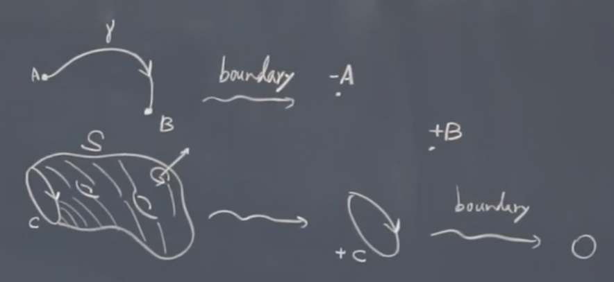
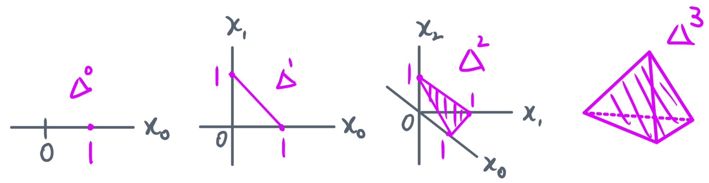
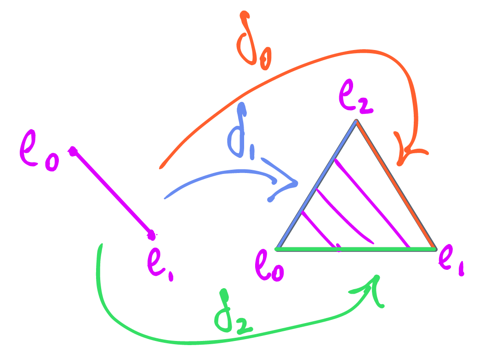

+++

title = "同调代数 1 - 单纯同调与奇异同调"
date = 2023-05-25
draft = false

[taxonomies]
categories = ["代数拓扑"]
tags = ["数学", "拓扑学", "代数拓扑", "同调代数"]

[extra]
lang = "zh"
toc = true
mathjax = true

+++

本文内容已完全施工完毕, 读者可放心阅读！



### 参考资料 & 教材

- **[NTU] Algebraic Topology - Chen-Yu Chi**：台大齐震宇教授的代数拓扑公开课;
- **Introduction to Homological Algebra - nLab**：同调代数的入门教程;
- **Introduction to Topology - 2 - nLab**：同伦论的入门教程.
- **An introduction to algebraic topology - Joseph J. Rotman**：Rotman 的代数拓扑教材.

### 前置需求

本笔记已省去一些基础的定义以及具体细节, 包括但不限于：

- **范畴论 (category theory)**：范畴, 函子, 自然变换, 同构, 自然同构, 伴随性等的基础定义与性质;
- **拓扑学 (topology theory)**：拓扑空间, 开闭集, 连续映射, 同胚, 开球闭球, $\R^n$ 等的基本定义与性质;
- **群论 (group theory)**：群, 自由群, 阿贝尔群, 群同态, 陪集, 商群等的基本定义与性质.

### 记号

为了方便或直观, 这里会使用一些记号：

- 文本描述上的映射 $f$ 通常被记为 $f : X \to Y$, 于复合情况下则记为 $g \circ f$ 或 $X \overset{f}{\to} Y \overset{g}{\to} Z$.
- 自然数集 $\N \coloneqq \N^0 = \set{ 0, 1, 2, \dots }$, 而不含 $0$ 的自然数集则记为 $\N^\times \coloneqq \N^1 = \set{1, 2, \dots}$;
- 范畴 $\mathcal{C}$ 及 $\mathcal{C}$ 中的对象 $X$, 称 $X$ 属于 $\mathcal{C}$ 将被记为 $X \in \mathcal{C}$ 而非 $X \in \operatorname{Ob}(\mathcal{C})$;
- 范畴 $\mathcal{C}$ 及 $\mathcal{C}$ 中的态射 $f$, 称 $f$ 属于 $\mathcal{C}$ 将被记为 $f \in \operatorname{Mor}(\mathcal{C})$;
- 范畴 $\mathcal{C}$ 及 $X \in \mathcal{C}$, 若有 $f : X \to Y$ 以及 $x \in X$, 则态射的具体映射方式被记为 $\map{X}{Y}{x}{f(X)}$.
- 范畴 $\mathcal{C}$ 及 $X, Y, Z \in \mathcal{C}$, 若有 $f : X \to Y$ 和 $g : Y \to Z$, 则复合态射 $h = g \circ f$ 连带其态射集被记为 $\begin{align} X & \overset{h}{\to} Z \\ g & \circ f \end{align}$.

## 动机

在不了解动机的前提下盲目学习一门看似高深的学科, 无异于盲人摸象.

### 1. 对拓扑空间的分类

在广义的拓扑学中, 我们知道如若两个拓扑空间之间存在一个同胚, 意味着它们是 "相同的", 而这个要求通常过于严格, 例如不一定什么空间都保持了集合层面上的双射的, 类似于一个 $n$ 维的开/闭球 $B^n$ 它并不同胚于独点拓扑空间 $*$, 而直观上我们知道 $B^n$ 可以连续地收缩至该点上而依旧保持了拓扑不变的性质 (事实上即所谓的同伦, 后续将会介绍), 所以按照同胚的方式分类而来的空间只占所有拓扑空间中很少的一部分, 对于许多空间却无法按照这种方式给定一个具体的分类, 这当然是拓扑学家们所无法接受的, 那么退而求其次, 找到这些空间在不同胚时的 **拓扑不变量 (topological invariants)**, 使得即使空间之间不同胚, 亦有办法按照这些不变量分类更多的空间.

### 2. 欧拉示性数

通过前人的不懈努力, 我们首先找到一些较为初等的不变量, 例如 **欧拉示性数 (Euler characteristic)** 便是其中之一, 即是说对于一个凸多面体, 有：
$$
\chi = F - E + V \qquad (\text{其中 $F, E, V$ 分别为面/边/顶点的个数})
$$
使得经过运算后对于立方体有 $6 - 12 + 8 = 2$, 四面体则为 $4 - 6 + 4 = 2$, 而根据其中一个延伸出来的结论我们得知对任意与球面 $S^2$ 同胚的多面体, 它的欧拉示性数必为 $2$, 那么显然我们就可以凭借这种方式进行分类, 而这个结论在未推广的情况下只是个初等的结论, 并不能覆盖许多不同种类的空间, 而希望将该结论进行推广, 则需要利用到代数拓扑中强而有力的工具了.

### 3. 同伦与同调

代数拓扑中最重要的拓扑不变量一般分为 **同伦 (homotopy)** 与 **同调 (homology)** 两种, 最原始的情况下, 人们所发现的不变量是同伦, 但同伦这种不变量极难计算, 例如对于球面 $S^n$ 的同伦群至今亦没有完整的结果, 这导致虽然不变量是有了, 但却无法有效率地分类空间, 这显然也不是我们所期望的, 因此便需要引入一种更加 "精细" 的不变量, 亦即是同调了.

### 4. 为什么这门学科要称为 "代数拓扑"？

考虑由所有拓扑空间构成的拓扑空间范畴 $\operatorname{Top}$, 从中抽出任意的 $X \in \operatorname{Top}$, 倘若直接在拓扑空间中研究一些性质是比较困难的事情, 我们希望 "代数化" 地探讨关于 $X$ 上的一些性质, 那么便可以与由代数结构所构成的范畴建立函子关系, 例如阿贝尔群范畴 $\Ab$, 并建立映射 $\map{\Top}{\Ab}{X}{G(X)}$, 那么当然我们所研究的不仅仅只有对象之间的映射, 还要探讨关于连续映射到群同态之间的映射关系, 使得实际上我们能构造出以下满足同态性的交换图：
$$
% https://darknmt.github.io/res/xypic-editor/#eyJub2RlcyI6W3sicG9zaXRpb24iOlsxLDBdLCJ2YWx1ZSI6IlgifSx7InBvc2l0aW9uIjpbMSwxXSwidmFsdWUiOiJHKFgpIn0seyJwb3NpdGlvbiI6WzIsMF0sInZhbHVlIjoiWSJ9LHsicG9zaXRpb24iOlsyLDFdLCJ2YWx1ZSI6IkcoWSkifSx7InBvc2l0aW9uIjpbMCwwXSwidmFsdWUiOiJcXG9wZXJhdG9ybmFtZXtUb3B9In0seyJwb3NpdGlvbiI6WzAsMV0sInZhbHVlIjoiXFxvcGVyYXRvcm5hbWV7QWJ9In1dLCJlZGdlcyI6W3siZnJvbSI6MCwidG8iOjIsInZhbHVlIjoiZiIsImxhYmVsUG9zaXRpb24iOiJsZWZ0In0seyJmcm9tIjoxLCJ0byI6MywidmFsdWUiOiJHKGYpIiwibGFiZWxQb3NpdGlvbiI6InJpZ2h0In0seyJmcm9tIjoyLCJ0byI6M30seyJmcm9tIjowLCJ0byI6MX0seyJmcm9tIjo0LCJ0byI6NX1dfQ==
\xymatrix{
\operatorname{Top} \ar@{->}[d] & X \ar@{->}[r]^{f} \ar@{->}[d] & Y \ar@{->}[d] \\
\operatorname{Ab} & G(X) \ar@{->}[r]_{G(f)} & G(Y)
}
$$
其中 $X, Y \in \operatorname{Top}$, 而 $f$ 则为它们之间的连续映射, 并且 $G(X), G(Y) \in \operatorname{Abel}$ 之间的群同态为 $G(f)$, 很自然地就引出了函子的概念, 而该函子通常被称为从拓扑空间范畴到阿贝尔群范畴的 **同调函子 (homology functor)**.

### 例子 (拓扑空间中的边缘)

透过对拓扑空间的 "代数化", 我们能够得出许多好处, 例如我们考虑一个在拓扑空间上从端点 $A$ 到 $B$ 的线段 $\gamma$, 那么这个线段 (或称为 **面 (face)**) 的 **边界 (boundary)** 显然便是点 $A$ 以及 $B$, 现在再令该线段是带有 "方向" 的, 例如是从出发点 $A$ 到终点 $B$, 则该线段的边界为 $-A, + B$.

而当我们进一步一个复杂的, 带有两个 **亏格 (genus)** 的闭曲面 $S$ 时, 并在该曲面的一旁切出一个截面使得 $S$ 的边界就是围着该截面的一个有向的环状边缘 $+C$. 那么现在问题是 $+C$ 能够拥有边界吗？从上图的可视化中显然我们看到 $+C$ 并没有包含任何端点, 亦即是说其边界数量为 $0$, 就意味着连续接着两次求边缘的态射, 将他们复合起来后所得到的是 $0$, 将该概念加以推广并代数化后便是所谓的 **边缘算子 (boundary operator)** 以及 **链复形 (chain complex)** 中的概念了.

## 1.1. 单形与单纯集

我们首先推广在低维空间关于点, 直线, 三角形与四面体的概念.

### 定义 1.1.1 (标准单形)

设有 $n \in \N$, 定义 **$n$ 维标准单形 / $n$ 维单形 ($n$-simplex)** 为 $\R^{n+1}$ 中以 $e_0, e_1, \dots, e_n$ 为顶点的单形：
$$
\Delta^n \coloneqq \Set{ \vec x \in \R^{n+1} : \Forall{0 \leq x_i \leq 1 \\ i \in I} \sum_{i = 0}^n x_i = 1 } \sub \R^{n+1}
$$
并且 $\Delta^n$ 所携带的拓扑为由 $\R^{n+1}$ 的标准拓扑所诱导出的子空间拓扑.

### 注释

由于下述遇到单纯集时将会与该定义的记号冲突, 因此遇到冲突时我们称标准单形为 **拓扑单形 (topological simplex)**, 记为 $\Delta_\Top^n $.

### 例子 1.1.2 (点, 标准区间, 填充三角形, 填充四面体)

现在假设有 $\Delta^n$, 若我们分别取 $n \in \N$ 为以下不同数值：

- 若 $n = 0$, 即 $\Delta^0 = *$, 则 $0$ 维单形表象如同一个 **点 (point)**;
- 若 $n = 1$, 即 $\Delta^1 = [0, 1]$, 则表现如同一个 **标准区间 (standard interval)** $[0,1]$;
- 若 $n = 2$, 即 $\Delta^2$ 表现如同一个 **填充三角形 (filled triangle)**;
- 若 $n = 3$, 即 $\Delta^3$ 表现如同一个 **填充四面体 (tetrahedron)**.

而 $0$ 至 $3$ 维单形的具体几何呈现可观察下图：

从上图可见, 我们可以将 $\Delta^{n-1}$ 中的第 $k$ 面嵌入至 $\Delta^n$ 的面上, 反之亦可将 $\Delta^n$ 中的第 $k$ 面退化为 $\Delta^{n-1}$, 因此我们有下述定义.

### 定义 1.1.3 (标准单形的第 $k$ 面包含映射)

设 $n \in \N^\times$ 以及 $0 \leq k \leq n$, 则称 $\delta_k$ 为 $n$ 维单形的 **第 $k$ 面映射 ($k$-th face inclusion)**, 并定义为：
$$
\begin{align}
\Delta^{n-1} & \overset{\delta_k}{\hookrightarrow} \Delta^n \qquad (\R^{n} \hookrightarrow \R^{n+1}) \\
(x_0, \dots, x_{n-1}) & \mapsto (x_0, \dots, x_{k-1}, 0, x_k, \dots, x_{n-1})
\end{align}
$$

### 例子 1.1.4 (从 $\Delta^0$ 到 $\Delta^1$ 的第 $k$ 面包含映射)

- 考虑 $\delta_0 : \Delta^0 \to \Delta^1$, 意味着有 $\set{1} \hookrightarrow [0, 1]$ 将单点映射至标注区间 $[0,1]$ 的右端点上;
- 考虑 $\delta_1 : \Delta^0 \to \Delta^1$, 意味着有 $\set{0} \hookrightarrow [0, 1]$ 将单点映射至标准区间 $[0,1]$ 的左端点上.

### 注释 (面映射的几何诠释)

直观上, 若设有一些顶点 $e_i$, 从 $\Delta^1$ 到 $\Delta^2$ 共有三种不同的面映射, 即：

意味着对于 $\Delta^2$ 的顶点集 $[e_0, e_1, e_2]$, 当透过 $\delta_k$ 嵌入第 $k$ 面时, 只需将顶点 $e_k$ 去除, 推广后即意味着：
$$
\delta_k = [e_0, \dots, e_{k-1}, \widehat{e_k}, e_{k+1}, \dots, e_n] : \Delta^{n-1} \to \Delta^n
$$
其中 $\widehat{e_k}$ 表示为该元素戴上 "隐身帽".

### 定义 1.1.5 (标准单形的第 $k$ 的退化映射)

设 $n \in \N^\times$ 以及 $0 \leq k < n$, 则称 $\sigma_k$ 为 $n$ 维单形的 **第 $k$ 退化映射 ($k$-th degenerate projection)**, 并定义为：
$$
\begin{align}
\Delta^{n} & \overset{\sigma_k}{\rightarrowtail} \Delta^{n-1} \qquad (\R^{n+1} \rightarrowtail \R^n) \\
(x_0, \dots, x_n) & \mapsto (x_0, \dots, x_k + x_{k+1}, \dots, x_n)
\end{align}
$$

### 注释

为了构造更为复杂的拓扑形状, 可以考虑将一些标准单形 "粘合" 在一块, 因此我们引入一套粘合的手段, 亦即单纯范畴与单纯集.

### 定义 1.1.6 (单纯范畴)

定义 **单纯范畴 (simplex category / simplicial category)**, 记为 $\Delta$ 或 $\op{Ord}$, 为以下结构所组成的范畴：

- $\Ob{\Delta} \coloneqq \set{ \text{有限全序集} }$;
- $\Mor{\Delta} \coloneqq \set{ \text{保序映射} }$.

单纯范畴 $\Delta$ 中的对象通常被描述为：
$$
[0] \coloneqq \set{0}, \quad [1] \coloneqq \set{0 \to 1}, \quad [2] \coloneqq \set{0 \to 1 \to 2}, \quad \dots
$$

### 注释

- $\Delta$ 的原始定义为自由范畴中 $\op{Cat}$ 的满子范畴, 意味着当中的元素都是被 "生成" 而来的.

- 至于为何我们将上述定义称之为 "单纯范畴", 是因为对任意 $n \in \N$, 可将 $[n]$ 视作 $n$ 维单形的 "脊椎", 例如考虑 $n = 2$ 时, 全序集的所有组合形式将使得 $[2]$ 呈现为下述形式：
  $$
  [2] = \Bb{ \array{ & & 1 \\ & \nearrow & & \searrow \\ 0 & & \to & & 2 } }
  $$

### 定义 1.1.7 (单纯集)

对任意 $n \in \N$, 我们称小集合 $X_n \in \op{sSet}$ 为 $n$ 维单形的 **单纯集 (simplicial set)**, 当满足了：

- 对任意单射 $\delta_k : [n-1] \hookrightarrow [n]$, 则函数 $d_k : X_n \to X_{n-1}$ 为在 $n$ 维单形中的第 $k$ 面映射;
- 对任意满射 $\sigma_k : [n+1] \rightarrowtail [n]$, 则函数 $s_k : X_n \to X_{n+1}$ 为在 $n$ 维单形中的第 $k$ 退化映射;

使得上述这些函数于 $\op{Set}$ 中满足以下 **单纯恒等式 (simplicial identities)**：

1. $d_i \circ d_j = d_{j-1} \circ d_i$, 若 $i < j$;
2. $s_i \circ s_j = s_j \circ s_{i-1}$, 若 $i > j$;
3. $d_i \circ s_j = \begin{dcases} s_{j-1} \circ d_i & \text{若 $i < j$} \\ \text{id} & \text{若 $i = j$ 或 $i = j+1$} \\ s_j \circ d_{i-1} & \text{若 $i > j+1$} \end{dcases}$.

### 注释

- 事实上单纯集可等价定义为预层函子 $X : \Delta^\oppos \to \op{Set}$, 使得对 $\delta_k$ 及 $\sigma_k$, 皆可透过 $X$ 诱导出小集合范畴上的函数：
  $$
  % https://darknmt.github.io/res/xypic-editor/#eyJub2RlcyI6W3sicG9zaXRpb24iOlswLDFdLCJ2YWx1ZSI6IltuLTFdIn0seyJwb3NpdGlvbiI6WzAsMl0sInZhbHVlIjoiW25dIn0seyJwb3NpdGlvbiI6WzEsMV0sInZhbHVlIjoiWF97bi0xfSJ9LHsicG9zaXRpb24iOlsxLDJdLCJ2YWx1ZSI6IlhfbiJ9LHsicG9zaXRpb24iOlswLDBdLCJ2YWx1ZSI6IlxcRGVsdGFeXFx0ZXh0e29wfSJ9LHsicG9zaXRpb24iOlsxLDBdLCJ2YWx1ZSI6IlxcdGV4dHtTZXR9In0seyJwb3NpdGlvbiI6WzMsMF0sInZhbHVlIjoiXFxEZWx0YV5cXHRleHR7b3B9In0seyJwb3NpdGlvbiI6WzQsMF0sInZhbHVlIjoiXFx0ZXh0e1NldH0ifSx7InBvc2l0aW9uIjpbMywxXSwidmFsdWUiOiJbbisxXSJ9LHsicG9zaXRpb24iOlszLDJdLCJ2YWx1ZSI6IltuXSJ9LHsicG9zaXRpb24iOls0LDFdLCJ2YWx1ZSI6Ilhfe24rMX0ifSx7InBvc2l0aW9uIjpbNCwyXSwidmFsdWUiOiJYX24ifV0sImVkZ2VzIjpbeyJmcm9tIjowLCJ0byI6MSwibGFiZWxQb3NpdGlvbiI6InJpZ2h0IiwidmFsdWUiOiJcXGRlbHRhX2siLCJ0YWlsIjoiaG9vayJ9LHsiZnJvbSI6MywidG8iOjIsImxhYmVsUG9zaXRpb24iOiJyaWdodCIsInZhbHVlIjoiZF9rIn0seyJmcm9tIjo0LCJ0byI6NSwidmFsdWUiOiJYIn0seyJmcm9tIjowLCJ0byI6Mn0seyJmcm9tIjoxLCJ0byI6M30seyJmcm9tIjo2LCJ0byI6NywidmFsdWUiOiJYIn0seyJmcm9tIjo4LCJ0byI6OSwidGFpbCI6InRhaWwiLCJsYWJlbFBvc2l0aW9uIjoicmlnaHQiLCJ2YWx1ZSI6Ilxcc2lnbWFfayJ9LHsiZnJvbSI6OCwidG8iOjEwfSx7ImZyb20iOjksInRvIjoxMX0seyJmcm9tIjoxMSwidG8iOjEwLCJ2YWx1ZSI6InNfayIsImxhYmVsUG9zaXRpb24iOiJyaWdodCJ9XX0=
  \xymatrix{
  \Delta^\text{op} \ar@{->}[r]^{X} & \text{Set} &  & \Delta^\text{op} \ar@{->}[r]^{X} & \text{Set} \\
  [n-1] \ar@{^{(}->}[d]_{\delta_k} \ar@{->}[r] & X_{n-1} &  & [n+1] \ar@{)->}[d]_{\sigma_k} \ar@{->}[r] & X_{n+1} \\
  [n] \ar@{->}[r] & X_n \ar@{->}[u]_{d_k} &  & [n] \ar@{->}[r] & X_n \ar@{->}[u]_{s_k}
  }
  $$
  那么便可将拓扑空间中的构造解释为单纯集, 使得我们只要给定单纯范畴中的对象, 则可自动表示为相应的集合, 以便范畴化地刻画这一切.

- $\op{sSet}$ 为所有单纯集所组成的范畴, 对象为作为单纯集的预层 $\Delta^\oppos \to \op{Set}$, 其中的态射为它们之间的自然变换.

- 若将该函子推广, 则可视 $\Delta^\oppos \to \mathcal{C}$ 为范畴 $\mathcal{C}$ 的 **单纯对象 (simplicial object)**, 而单纯集无非就是集合范畴的单纯对象.

- 单纯集的对偶结构 **余单纯集 (cosimplicial set)** 所构成的范畴则记为 $\op{cSet}$.

### 例子 1.1.8 (余单纯对象)

$n$ 维拓扑单形 $\Delta_\Top^n$ 可被重新描述为是 $\Top$ 的 **余单纯对象 (cosimplicial object)**, 即有函子 $\Map{\Delta^{(-)}}{\Delta}{\Top}{[n]}{\Delta_\Top^n}$.

## 1.2. 单纯同调

### 注释

现在便可引入单纯同调的部分了, 让我们从定义标准单形的单纯集开始.

### 定义 1.2.1 (标准单形的单纯集)

对于 $n \in \N$, 则 $n$ 维单形 $\Delta^n$ 的单纯集定义为预层函子 $\Map{X_{(-)}}{\Delta^\oppos}{\op{Set}}{[n]}{Y([n]) \eqqcolon \Delta^n}$.

### 注释 (米田嵌入)

设有局部小范畴 $\mathcal{C}$, 我们称从 $\mathcal{C}$ 到预层范畴 $[\mathcal{C}^\oppos, \op{Set}]$ 的忠实满函子 $\Map{Y}{\mathcal{C}}{[\mathcal{C}^\oppos, \op{Set}]}{c}{\Hom{\mathcal{C}}{-}{c}}$ 为 $\mathcal{C}$ 的 **米田嵌入 (Yoneda embedding)**. 即是说 $Y$ 是函子 $\op{Hom} : \mathcal{C}^\oppos \times \mathcal{C} \to \op{Set}$ 于以下 $\op{Hom}$ 伴随中的像：
$$
\op{Hom}(\mathcal{C^\oppos} \times \mathcal{C}, \Sets) \simeq \op{Hom}(\mathcal{C}, [\mathcal{C}^\oppos, \Sets])
$$
因此 $\Delta^n \coloneqq Y([n]) = \Hom{\Delta}{-}{[n]} : \Delta^\oppos \to \Sets$.

### 注释 (拓扑单形满足单纯恒等式)

若有拓扑单形 $\Delta_\Top^n$, 则其仍满足上述的单纯恒等式, 我们该处只证明 $(1)$, 其余是相似的. 若设 $i < j$, 需证下图于 $\op{sSet}$ 中可交换：
$$
% https://darknmt.github.io/res/xypic-editor/#eyJub2RlcyI6W3sicG9zaXRpb24iOlswLDBdLCJ2YWx1ZSI6IlxcRGVsdGFfXFx0ZXh0e1RvcH1ebiJ9LHsicG9zaXRpb24iOlswLDFdLCJ2YWx1ZSI6IlxcRGVsdGFfXFx0ZXh0e1RvcH1ee24tMX0ifSx7InBvc2l0aW9uIjpbMSwwXSwidmFsdWUiOiJcXERlbHRhX1xcdGV4dHtUb3B9XntuLTF9In0seyJwb3NpdGlvbiI6WzEsMV0sInZhbHVlIjoiXFxEZWx0YV9cXHRleHR7VG9wfV57bi0yfSJ9XSwiZWRnZXMiOlt7ImZyb20iOjAsInRvIjoxLCJ2YWx1ZSI6ImRfaiA9IFxcc2lnbWFfaiIsImxhYmVsUG9zaXRpb24iOiJyaWdodCJ9LHsiZnJvbSI6MCwidG8iOjIsInZhbHVlIjoiZF9pID0gXFxzaWdtYV9pIn0seyJmcm9tIjoyLCJ0byI6MywidmFsdWUiOiJkX3tqLTF9ID0gXFxzaWdtYV97ai0xfSJ9LHsiZnJvbSI6MSwidG8iOjMsImxhYmVsUG9zaXRpb24iOiJyaWdodCIsInZhbHVlIjoiZF9pID0gXFxzaWdtYV9pIn1dfQ==
\xymatrix{
\Delta_\text{Top}^n \ar@{->}[d]_{d_j = \sigma_j} \ar@{->}[r]^{d_i = \sigma_i} & \Delta_\text{Top}^{n-1} \ar@{->}[d]^{d_{j-1} = \sigma_{j-1}} \\
\Delta_\text{Top}^{n-1} \ar@{->}[r]_{d_i = \sigma_i} & \Delta_\text{Top}^{n-2}
}
$$
那么对单形 $(x_0, \dots, x_n) \in \Delta_\Top^n$:
$$
\begin{align}
\sigma_i(\sigma_j(x_0, \dots, x_n)) & = \sigma_i(x_0, \dots, x_j + x_{j+1}, \dots, x_n) \\
& = (x_0, \dots, x_i + x_{i+1}, \dots, x_j + x_{j+1}, \dots, x_n) \\
& = (x_0, \dots, x_i + x_{i+1}, \dots, x_{j-1} + x_{j}, \dots, x_n) \\
& = \sigma_i(x_0, \dots, x_{j-1} + x_j, \dots, x_n) \\
& = \sigma_{j-1}(\sigma_i(x_0, \dots, x_n))
\end{align}
$$
其中 $x_j + x_{j+1}$ 与 $x_{j-1} + x_j$ 可更改下标是由于：
$$
x_0 + \dots + x_{j-1} + (x_j + x_{j+1}) + \dots + x_n = 1 = x_0 + \dots + (x_{j-1} + x_j) + x_{j+1} + \dots + x_n
$$
因此满足标准单形的定义.

### 定义 1.2.2 (单纯链群)

设 $n \in \N$ 以及单纯集 $X_n \in \op{sSet}$：

- 称 $\Z[X_n]$ 为 **单纯链群 (simplicial chain groups)**, 它是由所有在 $X_n$ 中的 $n$ 维单形作为基所生成的整系数自由阿贝尔群;

- 称 $\Z[X_n]$ 中的元素为 **单纯链 (simplicial chain)**, 单纯链是单形的整数系数的线性组合, 即对于任意 $c_n \in \Z[X]$：
  $$
  c_n = \sum_{\sigma \in X_n} a_s \sigma = a_{\sigma_1} \sigma_1 + \dots + a_{\sigma_n} \sigma_n
  $$
  其中对任意 $a_{(-)} : X_n \to \Z$ 而 $s_i \in X_n$.

### 注释 (链群为单纯阿贝尔群)

- 上述的 $\Z[-] : \op{sSet} \to \op{sAb}$ 为 **自由单纯函子 (free simplicial functor)**, 它左伴随于遗忘函子 $U$, 即：
  $$
  \xymatrix{
  \op{sAb} \rtwocell<6>^{\Z[-]}_{U}{'\bot} & \op{sSet}
  }
  $$
  其中 $\op{sAb}$ 为任意于 $\Ab$ 中的单纯对象所构成的子范畴, 该范畴中的对象被称为 **单纯阿贝尔群 (simplicial abelian group)**.

- 这意味着我们可将自由函子 $\Top \overset{\Z[-]}{\to} \Ab$ 拓展为自由单纯函子 $\op{sSet} \overset{X_{(-)}}{\to} \Top \overset{\Z[-]}{\to} \op{sAb} \sub \Ab$.

### 定义 1.2.3 (单纯集上的边缘算子)

设 $n \in \N$ 以及 $X_n \in \op{sSet}$, 我们称 $\part_n$ 为 $n$ 维 **边缘算子 (boundary operator)**, 定义为下述映射：
$$
\Map{\part_n}{\Z[X_n]}{\Z[X_{n-1}]}{[\sigma \in X_n]}{\sum_{k=0}^n (-1)^k d_k \sigma}
$$

### 命题 1.2.4 (边缘算子的复合为 $0$-同态)

对任意 $n \in \N$, 单纯集 $X_n, X_{n-1}, X_{n-2} \in \op{sSet}$, 边缘的两次复合为 $0$, 即 $\part^2 = \Z[X_n] \overset{\part_n}{\to} \Z[X_{n-1}] \overset{\part_{n-1}}{\to} \Z[X_{n-2}] = 0$.

##### 证明

$$
\begin{align}
\part_{n-1}(\part_n \sigma) & = \part_{n-1}\b{\sum_{j = 0}^n (-1)^j d_j \sigma} \\
& = \sum_{j = 0}^n \sum_{i=0}^{n-1} (-1)^{i+j} d_i d_j \sigma \\
& = \sum_{0 \leq j \leq i < n} (-1)^{i+j} d_i d_j \sigma + \sum_{0 \leq i < j \leq n} (-1)^{i+j} d_i d_j \sigma \\
& = \sum_{0 \leq j \leq i < n} (-1)^{i+j} d_i d_j \sigma + \sum_{0 \leq i < j \leq n} (-1)^{i+j} d_{j-1} d_i \sigma \\
& = \sum_{0 \leq j \leq i < n} (-1)^{i+j} d_i d_j \sigma - \sum_{0 \leq i < j < n} (-1)^{i+j} d_j d_i \sigma \\
& = 0
\end{align}
$$

其中的 $\displaystyle \sum_{0 \leq j \leq i < n}$ 以及 $\displaystyle \sum_{0 \leq i < j \leq n}$ 纯粹是为了凑出满足单纯恒等式而设的值, 而第 5 步是将 $j$ 重新编号为 $j + 1$.

### 定义 1.2.5 (链复形)

设 $X \in \op{sSet}$, 则 $X$ 的 **链复形 (chain complex)** 定义为 $C_\bull(X) \coloneqq (\set{C_n}_{n \in \N}, \set{\part_n}_{n \in \N})$, 并且是由以下结构所组成的：

- 定义 $n$ 维 **链群 (chain group)** 为阿贝尔群 $C_n(X) \coloneqq \Z[X_n] \in \op{sAb}$;
- 定义 $n$ 维 **边缘算子 (boundaries)** 为群同态 $\part_n : C_n(X) \to C_{n-1}(X)$;

并将一族阿贝尔群 $\set{C_n}_{n \in \N}$ 与群同态 $\set{\part_n}_{n \in \N}$ 排为以下序列 (将 $C_n(X)$ 简记为 $C_n$)：
$$
C_\bull(X) \coloneqq \bb{\cdots \to C_{n+1} \overset{\part_{n+1}}{\to} C_n \overset{\part_{n}}{\to} C_{n-1} \overset{\part_{n-1}}{\to} C_{n-2} \to \cdots}
$$
使得对于任意维度 $n \in \N$ 都有 $\part_{n-1} \circ \part_n = 0$.

### 定义 1.2.6 (闭环, 边缘, 同调群)

设 $X \in \op{sSet}$ 的链复形为 $C_\bull(X)$, 分别定义：

- $n$ 维 **闭环 (cycles)** 为 $Z_n \coloneqq \Ker{\part_n} < C_n$, 其中的元素被称为 $n$ 维 **闭链 (closed chain)**;
- $n$ 维 **边缘 (boundaries)** 为 $B_n \coloneqq \Im{\part_{n+1}} < Z_n$, 其中的元素被称为 $n$ 维 **边缘链 (boundary chain)**;
- $n$ 维 **同调群 (homology group)** 为商群 $H_n(C_\bull(X)) \coloneqq Z_n/B_n$, 其中的元素被称为 $n$ 维 **同调类 (homology class)**;

### 注释 (同调群的定义)

- 若将 $X$ 取为标准单形的单纯集, 则称它的链复形及同调群为 **单纯链复形 (simplicial chain complex)** 和 **单纯同调群 (simplicial homology group)**, 单纯同调群中的构造我们亦于名字前面加上 **单纯 (simplicial)** 二字.
- 当 $n = 1$ 时我们定义 $\dots \to C_0 \overset{\part_0 \coloneqq 0}{\to} 0$, 所以 $Z_0 \coloneqq C_0$, 因此 $0$ 维同调群必然是 $C_0/\im(\part_1)$.
- 通常将 $n$ 维同调群记为 $H_n(X, \Z)$ (即以 $\Z$ 作系数) 或 $H_n(X)$.
- 注意到 $H_n : \op{sSet} \to \Ab$ 为 **同调函子 (homology functor)**.

### 注释 (同调群的几何含义)

...

### 例子 1.2.7 ($H_0$ 测量连通分支个数)

$0$ 维同调群是最简单的同调群, 其测量的是连通分支的个数, 例如我们考虑将两条 $1$ 维单形于其中一个端点处拼接在一起, 那么它们 $H_0(X) = \Z$, 因为只有一个连通分支. 而当我们将它们分开为不相较的, 两条独立的 $1$ 维单形时, 意味着它们有两个独立的连通分支, 因此就有 $H_0(X) = \Z \times \Z$.

### 例子 1.2.8 (球面 $S^2$ 的单纯同调群)

由于 $S^2$ 是同胚于一个中空的四面体所构成的拓扑形状, 它包含了 $4$ 个顶点 ($0$ 维单形), $6$ 条棱边 ($1$ 维单形) 以及 $4$ 个面 ($2$ 维单形), 意味着于计算它的链群分别由上述不同维度的单形作生成元生成的自由阿贝尔群, 即：
$$
\dots \to 0 \to \Z^{\oplus 6} \overset{\part_2}{\to} \Z^{\oplus 4} \overset{\part_1}{\to} \Z^{\oplus 6} \overset{\part_0}{\to} 0
$$
其中由 $S$ 所生成的 $\Z[S]$ 同构于复制 $|S|$ 份后的直积, 即 $\Z[S] \simeq \displaystyle \bigoplus_{s \in S} \Z$, 那么复制 $n$ 份就记作 $\Z^{\oplus n}$, 经过计算后可得：
$$
H_n(S^2) = \begin{dcases}
0, & \text{若 $n = 0, 1$} \\
\Z, & \text{若 $n = 2$}
\end{dcases}
$$
因此意味着 $S^2$ 有一个二维的洞, 我们可以将类似的情况推广至 $S^n$, 事实上 $S^n$ 有一个 $n$ 维洞, 而其余维度的同调群皆为 $0$.

### 例子 1.2.9 (紧连通的定向流形)

若 $X$ 为 $n$ 维紧连通的有向流形, 则有 $H_n(X) \simeq \Z$.

## 1.3. 奇异同调

### 注释

由于单形同调的计算及剖分过程通常过于繁琐, 我们并不会拘泥于单纯同调上, 因此借机引入一种有别于单形剖分的手段, 即从奇异单形的定义开始.

### 定义 1.3.1 (奇异单形)

设有 $X \in \operatorname{Top}$ 以及 $n \in \N$：

- 称 $X$ 上的 **$n$ 维奇异单形 (singular $n$-simplex)** 为从 $\Delta_\Top^n$ 到 $X$ 的连续映射 $\sigma : \Delta_\Top^n \to X$;
- 全体 $X$ 中的奇异 $n$ 维单形所构成的集合定义为 $(\op{Sing} X)_n \coloneqq \operatorname{Hom}_{\operatorname{Top}}(\Delta_\Top^n, X)$.

### 注释

若令全体奇异单形的集合中的 $n \in \N$ 可变, 则可延伸出奇异单形的单纯集的概念, 而在此之前, 先让我们分别定义奇异单形的面和退化映射.

### 定义 1.3.2 (奇异单形的第 $k$ 面映射)

设 $n \in \N^\times$ 以及 $0 \leq k \leq n$, 则称 $\delta_k$ 为 $n$ 维奇异单形的 **第 $k$ 面映射 ($k$-th face inclusion)**, 并定义为：
$$
\begin{align}
(\op{Sing} X)_n & \overset{d_k}{\hookrightarrow} (\op{Sing} X)_{n-1} \\
\bb{\Delta_\Top^n \overset{\varphi}{\to} X} & \mapsto \bb{\Delta_\Top^{n-1} \overset{\varphi \circ \delta_k}{\to} X}
\end{align}
$$

### 定义 1.3.3 (奇异单形的第 $k$ 退化映射)

设 $n \in \N^\times$ 以及 $0 \leq k < n$, 则称 $\sigma_k$ 为 $n$ 维奇异单形的 **第 $k$ 退化映射 ($k$-th degenerate projection)**, 并定义为：
$$
\begin{align}
(\op{Sing} X)_{n-1} & \overset{d_k}{\hookrightarrow} (\op{Sing} X)_n \\
\bb{\Delta_\Top^{n-1} \overset{\psi}{\to} X} & \mapsto \bb{\Delta_\Top^n \overset{\psi \circ \sigma_k}{\to} X}
\end{align}
$$

### 注释 (奇异单形映射的几何诠释)

上述的面映射与退化映射中的定义, 亦即映射复合可以直观地诠释为：

其中橙色路径为面映射的复合, 靛色则为退化映射的复合.

### 定义 1.3.4 (奇异单形的单纯集)

对任意 $X \in \Top$, 它的单纯集定义为预层函子 $\Map{\op{Sing} X}{\Delta^\oppos}{\op{Set}}{[n]}{(\op{Sing} X)_n}$.

### 定义 1.3.5 (奇异链群, 奇异链复形, 奇异同调群)

设 $X \in \Top$, 则 $X$ 的 **奇异链复形 (singular chain complex)** 定义为 $C_\bull(X) \coloneqq C_\bull(\Z[\op{Sing} X])$, 并且：

- 称该链复形中的链群为 **奇异链群 (singular chain group)**, 即 $C_n(X) \coloneqq \Z[(\op{Sing} X)_n] \in \op{sAb}$;
- 称 $C_n(X)$ 中的元素为 **奇异链 (singular chain)**.
- 称该链复形中的同调群为 **奇异同调群 (singular homology groups)**, 记号与一般链复形相同.

### 注释 (奇异单形之间的连续映射)

对任意 $X, Y \in \Top$, 若给定连续映射 $f : X \to Y$, 则任意 $X$ 中的奇异单形将被 $f$ 按以下规则映射：
$$
\Map{f}{(\op{Sing} X)_n}{(\op{Sing} Y)_n}{ \bb{\Delta_\Top^n \overset{\sigma}{\to} X} }{ \bb{f_*(\sigma) : \Delta_\Top^n \overset{\sigma}{\to} X \overset{f}{\to} Y} }
$$
我们称当中的 $f_*(\sigma)$ 为透过 $f$ 对 $\sigma$ 作 **推出 (pushout)**, 因此 $f = f_*$, 便得到以下命题.

### 命题 1.3.6 (不同拓扑空间的奇异链群是可交换的)

对任意 $X, Y \in \Top$, 函子 $C_n : \Top \to \op{sAb}$, 若有推出 $f_* : (\op{Sing} X)_n \to (\op{Sing} Y)_n$, 则可诱导以下图表于 $\op{sAb}$ 中交换：
$$
% https://darknmt.github.io/res/xypic-editor/#eyJub2RlcyI6W3sicG9zaXRpb24iOlswLDBdLCJ2YWx1ZSI6IkNfbihYKSJ9LHsicG9zaXRpb24iOlswLDFdLCJ2YWx1ZSI6IkNfe24tMX0oWCkifSx7InBvc2l0aW9uIjpbMSwwXSwidmFsdWUiOiJDX24oWSkifSx7InBvc2l0aW9uIjpbMSwxXSwidmFsdWUiOiJDX3tuLTF9KFkpIn1dLCJlZGdlcyI6W3siZnJvbSI6MCwidG8iOjIsInZhbHVlIjoiQ19uKGZfKikifSx7ImZyb20iOjIsInRvIjozLCJ2YWx1ZSI6IlxccGFydGlhbF5ZX24ifSx7ImZyb20iOjEsInRvIjozLCJ2YWx1ZSI6IkNfe24tMX0oZl8qKSIsImxhYmVsUG9zaXRpb24iOiJyaWdodCJ9LHsiZnJvbSI6MCwidG8iOjEsInZhbHVlIjoiXFxwYXJ0aWFsXlhfbiIsImxhYmVsUG9zaXRpb24iOiJyaWdodCJ9XX0=
\xymatrix{
C_n(X) \ar@{->}[r]^{C_n(f_*)} \ar@{->}[d]_{\partial^X_n} & C_n(Y) \ar@{->}[d]^{\partial^Y_n} \\
C_{n-1}(X) \ar@{->}[r]_{C_{n-1}(f_*)} & C_{n-1}(Y)
}
$$

### 定义 1.3.7 (链复形范畴)

称 $\Ch_\bull(\Ab)$ 为阿贝尔范畴 $\Ab$ 的 **链复形范畴 (category of chain complexes)**, 它是由以下结构所构成的范畴：

- $\Ob{\Ch_\bull(\Ab)} \coloneqq \set{ C_\bull \coloneqq C_\bull(-) }$, 即由全体奇异链复形构成;

- $\Hom{\Ch_\bull(\Ab)}{C_\bull}{D_\bull} \coloneqq \set{ C_\bull \to D_\bull }$, 其中的元素 $f_\bull \coloneqq \set{f_n : C_n \to D_n}_{n \in \Z}$ 被称为 **链映射 (chain maps)**, 为一系列同态使得对每个维度 $n$ 均满足 $\part_n \circ f_n = f_{n-1} \circ \part_n$, 即令以下图表交换：
  $$
  % https://darknmt.github.io/res/xypic-editor/#eyJub2RlcyI6W3sicG9zaXRpb24iOlsxLDBdLCJ2YWx1ZSI6IkNfe3ErMX0ifSx7InBvc2l0aW9uIjpbMCwwXSwidmFsdWUiOiJcXGRvdHMifSx7InBvc2l0aW9uIjpbMiwwXSwidmFsdWUiOiJDX3EifSx7InBvc2l0aW9uIjpbMywwXSwidmFsdWUiOiJDX3txLTF9In0seyJwb3NpdGlvbiI6WznsMF0sInZhbHVlIjoin197cS0yfSJ9LHsicG9zaXRpb24iOls1LDBdLCJ2YWx1ZSI6IlxcZG90cyJ9LHsicG9zaXRpb24iOlsxLDFdLCJ2YWx1ZSI6IkRfe3ErMX0ifSx7InBvc2l0aW9uIjpbMiwxXSwidmFsdWUiOiJEX3EifSx7InBvc2l0aW9uIjpbMywxXSwidmFsdWUiOiJEX3txLTF9In0seyJwb3NpdGlvbiI6WznsMV0sInZhbHVlIjoiRF97cS0yfSJ9LHsicG9zaXRpb24iOls1LDFdLCJ2YWx1ZSI6IlxcZG90cyJ9LHsicG9zaXRpb24iOlswLDFdLCJ2YWx1ZSI6IlxcZG90cyJ9XSwiZWRnZXMiOlt7ImZyb20iOjEsInRvIjowfSx7ImZyb20iOjAsInRvIjoyLCJ2YWx1ZSI6IlxccGFydGlhbF97cSsxfSJ9LHsiZnJvbSI6MiwidG8iOjMsInZhbHVlIjoiXFxwYXJ0aWFsX3txfSJ9LHsiZnJvbSI6MywidG8iOjnsInZhbHVlIjoiXFxwYXJ0aWFsX3txLTF9In0seyJmcm9tIjo0LCJ0byI6NX0seyJmcm9tIjowLCJ0byI6NiwidmFsdWUiOiJmX3txKzF9IiwibGFiZWxnb3NpdGlvbiI6InJpZ2h0In0seyJmcm9tIjoyLCJ0byI6NywidmFsdWUiOiJmX3EiLCJsYWJlbFBvc2l0aW9uIjoicmlnaHnifSx7ImZyb20iOjMsInRvIjo4LCJ2YWx1ZSI6ImZfe3EtMX0ifSx7ImZyb20iOjnsInRvIjo5LCJ2YWx1ZSI6ImZfe3EtMn0ifSx7ImZyb20iOjYsInRvIjo3LCJsYWJlbFBvc2l0aW9uIjoicmlnaHniLCJ2YWx1ZSI6IlxccGFydGlhbF97cSsxfSJ9LHsiZnJvbSI6NywidG8iOjgsInZhbHVlIjoiXFxwYXJ0aWFsX3txfSIsImxhYmVsUG9zaXRpb24iOiJyaWdodCJ9LHsiZnJvbSI6OCwidG8iOjksInZhbHVlIjoiXFxwYXJ0aWFsX3txLTF9IiwibGFiZWxnb3NpdGlvbiI6InJpZ2h0In0seyJmcm9tIjo5LCJ0byI6MTB9LHsiZnJvbSI6MTEsInRvIjo2fV19
  \xymatrix{
  \dots \ar@{->}[r] & C_{n-1} \ar@{->}[r]^{\partial_{n-1}} \ar@{->}[d]_{f_{n-1}} & C_n \ar@{->}[r]^{\partial_{n}} \ar@{->}[d]_{f_n} & C_{n-1} \ar@{->}[r]^{\partial_{n-1}} \ar@{->}[d]^{f_{n-1}} & C_{n-2} \ar@{->}[r] \ar@{->}[d]^{f_{n-2}} & \dots \\
  \dots \ar@{->}[r] & D_{n-1} \ar@{->}[r]_{\partial_{n-1}} & D_n \ar@{->}[r]_{\partial_{n}} & D_{n-1} \ar@{->}[r]_{\partial_{n-1}} & D_{n-2} \ar@{->}[r] & \dots
  }
  $$

### 注释 (同调函子的拓展)

注意到于奇异链复形中, 只要给定 $X \in \Top$, 则可决定其的链复形 $C_\bull(X)$, 因此有函子 $C_\bull(-) : \Top \to \Ch_\bull(\Ab)$, 那么对于任意 $n \in \N$, 则奇异同调将单纯集的同调函子 $H_n(-) : \op{sSet} \to \Ab$ 拓展为 $H_n(-) : \Top \to \Ab$.

## 1.4. Hurewicz 定理

### 定义 1.4.1 (链复形的拟同构)

设 $C_\bull, D_\bull \in \Ch_\bull(\Ab)$, 若链映射 $f_\bull : C_\bull \to D_\bull$ 被称为链复形间的 **拟同构 (quasi-isomorphism)**, 当 $f_\bull$ 于任意维度 $n \in \N$ 的映射 $f_n : C \to D$ 诱导出 $C, D$ 的同调群皆为同构, 即 $\hat{f_n} : H_n(C) \overset{\simeq}{\to} H_n(D)$.

### 注释 (对同伦等价的交换化)

总括而言, 我们可以将链复形的拟同构视为弱同伦等价的 **交换化 (abelianization)**, 该事实将由以下将提到的 Hurewicz 定理所阐述.

### 命题 1.4.2 (拟同构的性质)

链复形的拟同构满足自反性及传递性, 但不满足对称性 (交换性).

##### 证明

自反性与传递性是容易证明的, 而对于对称性, 我们考虑链复形 $C_\bull, D_\bull$ 间的映射：
$$
% https://darknmt.github.io/res/xypic-editor/#eyJub2RlcyI6W3sicG9zaXRpb24iOlsxLDBdLCJ2YWx1ZSI6IjAifSx7InBvc2l0aW9uIjpbMiwwXSwidmFsdWUiOiJcXG1hdGhiYntafSJ9LHsicG9zaXRpb24iOlszLDBdLCJ2YWx1ZSI6IlxcbWF0aGJie1p9In0seyJwb3NpdGlvbiI6WzQsMF0sInZhbHVlIjoiMCJ9LHsicG9zaXRpb24iOls1LDBdLCJ2YWx1ZSI6IlxcY2RvdHMifSx7InBvc2l0aW9uIjpbMCwwXSwidmFsdWUiOiJcXGNkb3RzIn0seyJwb3NpdGlvbiI6WzAsMV0sInZhbHVlIjoiXFxjZG90cyJ9LHsicG9zaXRpb24iOlsxLDFdLCJ2YWx1ZSI6IjAifSx7InBvc2l0aW9uIjpbMiwxXSwidmFsdWUiOiIwIn0seyJwb3NpdGlvbiI6WzMsMV0sInZhbHVlIjoiXFxtYXRoYmJ7Wn0vMlxcbWF0aGJie1p9In0seyJwb3NpdGlvbiI6WzQsMV0sInZhbHVlIjoiMCJ9LHsicG9zaXRpb24iOls1LDFdLCJ2YWx1ZSI6IlxcY2RvdHMifV0sImVkZ2VzIjpbeyJmcm9tIjowLCJ0byI6MX0seyJmcm9tIjoxLCJ0byI6MiwidmFsdWUiOiJ4IFxcb3ZlcnNldHtcXHBhcnRpYWxfe24rMX1ee0NfXFxidWxsZXR9fXtcXG1hcHN0b30gMngifSx7ImZyb20iOjIsInRvIjozfSx7ImZyb20iOjMsInRvIjo0fSx7ImZyb20iOjUsInRvIjowfSx7ImZyb20iOjYsInRvIjo3fSx7ImZyb20iOjcsInRvIjo4LCJsYWJlbFBvc2l0aW9uIjoicmlnaHQifSx7ImZyb20iOjgsInRvIjo5LCJ2YWx1ZSI6IlxccGFydGlhbF97bisxfV57RF9cXGJ1bGxldH0iLCJsYWJlbFBvc2l0aW9uIjoicmlnaHQifSx7ImZyb20iOjksInRvIjoxMCwibGFiZWxQb3NpdGlvbiI6InJpZ2h0In0seyJmcm9tIjoxMCwidG8iOjExfSx7ImZyb20iOjAsInRvIjo3LCJsYWJlbFBvc2l0aW9uIjoibGVmdCJ9LHsiZnJvbSI6MSwidG8iOjgsImxhYmVsUG9zaXRpb24iOiJsZWZ0In0seyJmcm9tIjoyLCJ0byI6OSwidmFsdWUiOiJmX24iLCJsYWJlbFBvc2l0aW9uIjoiaW5zaWRlIiwiYmVuZCI6MzB9LHsiZnJvbSI6MywidG8iOjEwfSx7ImZyb20iOjksInRvIjoyLCJiZW5kIjozMCwibGFiZWxQb3NpdGlvbiI6Imluc2lkZSIsInZhbHVlIjoiZ19uIn1dfQ==
\xymatrix{
\cdots \ar@{->}[r] & 0 \ar@{->}[r] \ar@{->}[d] & \mathbb{Z} \ar@{->}[r]^{x \overset{\partial_{n+1}^{C_\bullet}}{\mapsto} 2x} \ar@{->}[d] & \mathbb{Z} \ar@{->}[r] \ar@/^/@{->}[d]|-{f_n} & 0 \ar@{->}[r] \ar@{->}[d] & \cdots \\
\cdots \ar@{->}[r] & 0 \ar@{->}[r] & 0 \ar@{->}[r]_{\partial_{n+1}^{D_\bullet}} & \mathbb{Z}/2\mathbb{Z} \ar@{->}[r] \ar@/^/@{->}[u]|-{g_n} & 0 \ar@{->}[r] & \cdots
}
$$
显然链映射 $f_\bull : C_\bull \to D_\bull$ 可诱导出任意维度的同调群都是同构的. 反观 $g_\bull : D_\bull \to C_\bull$ 中由 $g_n : \Z \to \Z/2\Z$ 所诱导出的同调群同态 $\hat{g_n}$：
$$
\Map{ \hat{g_n} }{ (\Z/2\Z)/\Im{\part_{n+1}^{D_\bull}} }{ \Z/\Im{\part_{n+1}^{C_\bull}} }{ a + \Im{\part_{n+1}^{D_\bull}} }{ g_n(a) + \Im{\part_{n+1}^{C_\bull}} }
$$
易见 $\hat{g_n}$ 依赖于零同态 $g_n$, 因此可确定 $\hat{g_n}$ 为满射, 那么 $\hat{g_n}$ 的核为任意陪集 $a + \Im{\part_{n+1}^{D_\bull}}$ 所构成的而不为平凡子群, 因此 $\hat{g_n}$ 非单, 则 $\hat{g_n}$ 不可能为同构, 由此可见拟同构不满足对称性.

### 定义 1.4.3 (Hurewicz 同态)

设 $(X, x) \in \Top^*$ 为带基点拓扑空间, 我们称以下映射为 **Hurewicz 同态 (Hurewicz homomorphism)**：
$$
\Map{\Phi}{\pi_k(X, x)}{H_k(X)}{ \bb{ S^k \overset{f}{\to} X }_\sim }{ f_*([S_k]) }
$$
即将 $X$ 中的奇异 $k$ 维球体 $f$ 的同伦类映射为透过 $f$ 对同调类 $[S_k] \in H_k(S^k)$ 推出.

### 注释 (Hurewicz 同态为自然变换)

由于 $\pi_k : \Top^* \to \Ab$ 与 $H_k : \Top \to \Ab$ 分别为同伦与同调函子, 则 Hurewicz 同态为自然变换 $\pi_k(-) \Rightarrow H_k(-)$.

### 命题 1.4.4 ($0$ 维的 Hurewicz 同态诱导同构)

任意 $X \in \Top$ 于 $0$ 维上的 Hurewicz 同态诱导出同构 $\Z[\pi_0(X, x)] \simeq H_0(X)$.

### 注释

- $0$ 维同伦群 $\pi_0(X, x)$ 可被视为全体 $X$ 中包含了基点 $x$ 的连通分支所构成的集合;
- 由于正维度的同伦群依赖于已选定的基点 $x$ 的连通分支的同伦型, 而奇异同调群并不依赖于基点 $x$, 因此于忽略该基点后我们仅关心 $X$ 中究竟有多少种不同的连通分支, 而这正正就是 [例子 1.2.7](#例子_1.2.7_($H_0$_测量连通分支个数)) 所阐述的, 所以便有了上述命题.

### 命题 1.4.5 ($1$ 维的 Hurewicz 同态诱导出对同伦群的交换化)

若 $X \in \Top$ 是道路连通的, 则其的 $1$ 维 Hurewicz 同态 $\Phi : \pi_1(X, x) \to H_1(X)$ 是满射的, 且可诱导出同构 $\pi_1(X, x)^\op{ab} \simeq H_1(X)$.

##### 证明

由于 $\Ker\Phi$ 为 $\pi_1(X, x)$ 的换位子群 $[\pi_1, \pi_1]$, 因此我们可以对 $\pi_1(X, x)$ 交换化使得有 $\pi_1(X, x)^\op{ab} \coloneqq \pi_1(X, x)/[\pi_1, \pi_1]$, 意味着将换位子群 $[\pi_1, \pi_1]$ 坍塌为平凡子群, 即 $\Ker{\pi_1(X, x)^\op{ab} \to H_1(X)} = \lang 0 \rang$, 并且 $\Phi$ 是满射诱导出 $\pi_1(X, x)^\op{ab} \to H_1(X)$ 亦满, 因此便有同构 $\pi_1(X, x)^\op{ab} \simeq H_1(X)$.

### 注释 (推广至更高维度)

- 我们可以将上述的 Hurewicz 同态推广至更高维度得到广义上的 **Hurewicz 定理 (Hurewicz theorem)**;
- 需要注意的是定义 Hurewicz 定理时需引入 **同伦连通 (homotopical connectivity)** 的概念.

### 定义 1.4.7 ($n$-连通)

我们称非空拓扑空间 $X \in \Top$ 是 **$n$-连通 ($n$-connected)** 的, 当 $n \geq 0$ 且 $k \leq n$ 时的同伦群 $\pi_k(X)$ 为平凡群.

### 定理 1.4.8 (Hurewicz 定理)

设有 $X \in \Top$, 若对任意 $n \geq 2$ 的维度是 $(n-1)$-连通的, 则第 $n$ 维的 Hurewicz 同态 $\Phi : \pi_n(X, x) \to H_n(X)$ 是同构.


