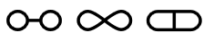
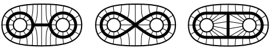

+++

title = "同伦论基础 1 - 同伦与同伦等价"
date = 2023-03-05
draft = false

[taxonomies]
categories = ["代数拓扑"]
tags = ["数学", "代数学", "拓扑学", "代数拓扑"]

[extra]
lang = "zh"
toc = true
mathjax = true

+++

本文内容已完全施工完毕, 读者可放心阅读！



## 1. 同伦与同伦等价

### 注释

对于任意 $n \geq 1$ 的欧氏空间 $\R^n$ 或与 $\R^n$ 同胚的单位开球 $B_0^\circ(1)$, 我们都知道它们均不可能同胚于 $* = \R^0$, 因为这两者从基础集上就已经不为双射了, 但直觉上我们知道开球 $B_0^\circ(1)$ 可以连续地收缩至其原点 $0$ 上, 所以直观上 $n$ 维开球亦被称为是其原点的 **连续形变 (continuous deformations)**. 那么现在假设我们定义有以下闭单位区间 $I \coloneqq [0, 1]$ 与 $B_0^\circ(1)$ 到 $B_0^\circ(1)$ 的连续函数：
$$
\Map{\eta}{I \times B_0^\circ(1)}{B_0^\circ(1)}{(t, x)}{t \cdot x}
$$
显然当取值 $t = 1$ 时单位开球 $B_0^\circ(1)$ 保持不变, 而 $t = 0$ 时会将该开球收缩至原点上, 那么透过交换图我们可总结出以下规律：
$$
% https://darknmt.github.io/res/xypic-editor/#eyJub2RlcyI6W3sicG9zaXRpb24iOlswLDBdLCJ2YWx1ZSI6Ilxcc2V0ezB9IFxcdGltZXMgQl5cXGNpcmNfMCgxKSJ9LHsicG9zaXRpb24iOlswLDFdLCJ2YWx1ZSI6IlswLCAxXSBcXHRpbWVzIEJfMF5cXGNpcmMoMSkifSx7InBvc2l0aW9uIjpbMCwyXSwidmFsdWUiOiJcXHNldHsxfSBcXHRpbWVzIEJeXFxjaXJjXzAoMSkifSx7InBvc2l0aW9uIjpbMSwwXSwidmFsdWUiOiIqIn0seyJwb3NpdGlvbiI6WzEsMV0sInZhbHVlIjoiQl8wXlxcY2lyYygxKSJ9XSwiZWRnZXMiOlt7ImZyb20iOjAsInRvIjozLCJ2YWx1ZSI6IlxcZXhpc3RzICEifSx7ImZyb20iOjMsInRvIjo0LCJ2YWx1ZSI6IlxcdGV4dHtjb25zdH1fMCJ9LHsiZnJvbSI6MSwidG8iOjQsInZhbHVlIjoiXFxldGEifSx7ImZyb20iOjIsInRvIjo0LCJ2YWx1ZSI6Ilxcc2ltZXEiLCJsYWJlbFBvc2l0aW9uIjoicmlnaHQifSx7ImZyb20iOjAsInRvIjoxfSx7ImZyb20iOjIsInRvIjoxfV19
\xymatrix{
\set{0} \times B^\circ_0(1) \ar@{->}[r]^{\exists !} \ar@{->}[d] & * \ar@{->}[d]^{c_0} \\
I \times B_0^\circ(1) \ar@{->}[r]^{\eta} & B_0^\circ(1) \\
\set{1} \times B^\circ_0(1) \ar@{->}[ru]_{\simeq} \ar@{->}[u] & 
}
$$
其中该处的连续形变 $\eta$ 便被我们称为 **同伦 (homotopies)**.

### 定义 1.1 (拓扑区间)

设闭区间 $[0, 1] \sub \R$ 为携带了 $\R$ 的度量拓扑的拓扑子空间, 称 $I \coloneqq [0, 1]$ 为 **拓扑区间 (topological interval)**, 当其满足了：

1. 携带了常值连续函数 $\Map{c_0}{*}{[0, 1]}{x}{0}$ 以及 $\Map{c_1}{*}{[0, 1]}{x}{1}$;
2. 携带了从该区间到点拓扑空间 $*$ ($\Top$ 中的终对象) 的唯一连续函数 $I \to *$.

事实上即可将点空间 $*$ 的 **余对角 (codiagonal)** $\nabla_*$, 即从不交并点空间 $* \sqcup *$ (其中 $* \sqcup * \simeq \Disc{\set{0, 1}}$) 到点空间的唯一连续函数分解为以下形式：
$$
\nabla_* : * \sqcup * \overset{(c_0, c_1)}{\to} I \to *
$$

### 定义 1.2 (同伦)

设 $X, Y \in \Top$, 以及连续函数 $f, g : X \to Y$, 若存在连续函数 $\eta : X \times I \to Y$ (其中 $I$ 为拓扑区间) 使得：

- 图表 $\vcenter{\xymatrix{
  X \ar@{->}[rd]^{f} \ar@{->}[d]_{\iota_0} &  \\
  X \times I \ar@{->}[r]_{\eta} & Y
  }}$ 与 $\vcenter{\xymatrix{
  X \times I \ar@{->}[r]^{\eta} & Y \\
  X \ar@{->}[u]^{\iota_1} \ar@{->}[ru]_{g} & 
  }}$ 皆可交换, 其中嵌入 $\iota_{i = 0,1}$ 定义为 $\Map{\iota_i}{X}{X \times I}{x}{(x, i)}$; 或
- 更具体地, 满足 $\eta(x, 0) = f(x)$ 以及 $\eta(x, 1) = g(x)$.

则以下结论成立：

- 称 $\eta$ 为从 $f$ 到 $g$ 的 **左同伦 (left homotopy)**, 记为 $\eta : f \Rightarrow g$, 或 $f \overTo{\eta} g$;
- 若上下文无须使用到 $\eta$ 时, 称 $f$ **同伦于 (homotopic to)** $g$, 记为 $f \sim_H g$.

### 注释 (同伦与自然变换)

一个更有益的看法是, 将同伦 $f \rArr g$ 视为自然变换, 例如 $\xymatrix@C+1pc{
X \rtwocell<6>^{f}_{g}{\kern{1em} \eta} & Y
}$.

### 命题 1.3 (同伦构成等价关系)

设 $X, Y \in \Top$, 对任意连续函数 $f, g: X \to Y$, 以及它们之间同伦 $f \sim_H g$, 则 $\sim_H$ 构成等价关系.

##### 证明

若 $\sim_H$ 构成等价关系, 须分别证明：

- 自反性 $\Forall{f \in \Top(X, Y)} f \overTo{\eta} f$：

  将 $X \times I$ 视为乘积拓扑空间, 则 $\text{pr}_1 : X \times I \to X$ 为它的典范投射, 这是连续的. 考虑定义 $\eta$ 为连续函数的复合 $\eta : X \times I \overset{\text{pr}_1}{\to} X \overset{f}{\to} Y$, 则可使下图于 $\Top$ 中交换：
  $$
  % https://darknmt.github.io/res/xypic-editor/#eyJub2RlcyI6W3sicG9zaXRpb24iOlswLDBdLCJ2YWx1ZSI6IlgifSx7InBvc2l0aW9uIjpbMiwxXSwidmFsdWUiOiJZIn0seyJwb3NpdGlvbiI6WzAsMV0sInZhbHVlIjoiWCBcXHRpbWVzIEkifSx7InBvc2l0aW9uIjpbMSwxXSwidmFsdWUiOiJYIn1dLCJlZGdlcyI6W3siZnJvbSI6MCwidG8iOjEsImxhYmVsUG9zaXRpb24iOiJsZWZ0IiwidmFsdWUiOiJmIn0seyJmcm9tIjowLCJ0byI6MiwidmFsdWUiOiJcXGlvdGFfe2kgPSAxLDJ9IiwibGFiZWxQb3NpdGlvbiI6InJpZ2h0IiwibGluZSI6InNvbGlkIn0seyJmcm9tIjoyLCJ0byI6MywidmFsdWUiOiJcXHRleHR7cHJ9XzEiLCJsYWJlbFBvc2l0aW9uIjoicmlnaHQifSx7ImZyb20iOjMsInRvIjoxLCJ2YWx1ZSI6ImYiLCJsYWJlbFBvc2l0aW9uIjoicmlnaHQifV19
  \xymatrix{
  X \ar@{->}[rrd]^{f} \ar@{->}[d]_{{\iota_{i = 1,2}}} &  &  \\
  X \times I \ar@{->}[r]_{\text{pr}_1} & X \ar@{->}[r]_{f} & Y
  }
  $$

- 对称性 $\Forall{f, g \in \Top(X, Y)} \b{f \overTo{\eta_1} g} \implies \b{g \overTo{\eta_2} f}$：

  考虑定义映射 $\Map{\eta_2}{X \times I}{Y}{(x, t)}{\eta_1(x, 1-t)}$, 由于 $\eta_2$ 完全依赖于连续映射 $\eta_1$, 因此它也是连续的, 所以可使得下图交换：
  $$
  % https://darknmt.github.io/res/xypic-editor/#eyJub2RlcyI6W3sicG9zaXRpb24iOlswLDBdLCJ2YWx1ZSI6IlgifSx7InBvc2l0aW9uIjpbMSwxXSwidmFsdWUiOiJZIn0seyJwb3NpdGlvbiI6WzAsMl0sInZhbHVlIjoiWCJ9LHsicG9zaXRpb24iOlswLDFdLCJ2YWx1ZSI6IlggXFx0aW1lcyBJIn1dLCJlZGdlcyI6W3siZnJvbSI6MCwidG8iOjMsImxhYmVsUG9zaXRpb24iOiJyaWdodCIsInZhbHVlIjoiXFxpb3RhXzAifSx7ImZyb20iOjIsInRvIjozLCJ2YWx1ZSI6IlxcaW90YV8xIn0seyJmcm9tIjowLCJ0byI6MSwiYmVuZCI6MCwidmFsdWUiOiJcXGV0YV8xKC0sIDEpID0gZyJ9LHsiZnJvbSI6MiwidG8iOjEsImJlbmQiOjAsImxhYmVsUG9zaXRpb24iOiJyaWdodCIsInZhbHVlIjoiXFxldGFfMSgtLCAwKSA9IGYifSx7ImZyb20iOjMsInRvIjoxLCJ2YWx1ZSI6IlxcZXRhXzIiLCJsYWJlbFBvc2l0aW9uIjoiaW5zaWRlIn1dfQ==
  \xymatrix{
  X \ar@{->}[d]_{\iota_0} \ar@{->}[rd]^{{\eta_1(-, 1) = g}} &  \\
  X \times I \ar@{->}[r]|-{\eta_2} & Y \\
  X \ar@{->}[u]^{\iota_1} \ar@{->}[ru]_{{\eta_1(-, 0) = f}} & 
  }
  $$

- 传递性 $\Forall{f, g, h \in \Top(X, Y)} \b{f \overTo{\eta_1} g} \and \b{g \overTo{\eta_2} h} \implies \b{f \overTo{\eta_3} h}$：

  考虑定义以下映射：
  $$
  \Map{\eta_3}{X \times I}{Y}{(x, t)}{\begin{dcases} \eta_1(x, 2t) & \text{若 $0 \leq t \leq \frac{1}{2}$} \\ \eta_2(x, 2t-1) & \text{若 $\frac{1}{2} \leq t \leq 1$} \end{dcases}}
  $$
  再挑选 $X \times I$ 的两个覆盖, 例如 $A = \ds X \times \bb{0, \frac{1}{2}}$ 以及 $B = \ds X \times \bb{\frac{1}{2}, 1}$, 考虑由以下图表：
  $$
  A \overset{f}{\hookleftarrow} A \cap B \overset{g}{\hookrightarrow} B
  $$
  于 $\Top$ 中的推出 $X \times I$ (等同于 $A \cup B$), 则可使 $\vcenter{\xymatrix{
  A \cap B \ar@{^{(}->}[r]^{f} \ar@{^{(}->}[d]_{g} & A \ar@{^{(}->}[d]^{\iota_A} \\
  B \ar@{^{(}->}[r]_{\iota_B} & X \times I
  }}$ 交换, 而更进一步由推出的泛性质, 我们知道只要 $\eta_3|_A$ 与 $\eta_3|_B$ 皆为连续映射, 则存在唯一的连续映射 $\eta_3 : X \times I \to Y$, 使得以下图表所有方块自动交换：
  $$
  % https://darknmt.github.io/res/xypic-editor/#eyJub2RlcyI6W3sicG9zaXRpb24iOlswLDBdLCJ2YWx1ZSI6IkEgXFxjYXAgQiJ9LHsicG9zaXRpb24iOlsxLDBdLCJ2YWx1ZSI6IkEifSx7InBvc2l0aW9uIjpbMSwxXSwidmFsdWUiOiJYIFxcdGltZXMgSSJ9LHsicG9zaXRpb24iOlswLDFdLCJ2YWx1ZSI6IkIifSx7InBvc2l0aW9uIjpbMiwyXSwidmFsdWUiOiJZIn1dLCJlZGdlcyI6W3siZnJvbSI6MCwidG8iOjEsInRhaWwiOiJob29rIiwidmFsdWUiOiJmIn0seyJmcm9tIjoxLCJ0byI6MiwidGFpbCI6Imhvb2siLCJ2YWx1ZSI6IlxcaW90YV9BIn0seyJmcm9tIjozLCJ0byI6MiwidmFsdWUiOiJcXGlvdGFfQiIsImxhYmVsUG9zaXRpb24iOiJyaWdodCIsInRhaWwiOiJob29rIn0seyJmcm9tIjowLCJ0byI6MywidGFpbCI6Imhvb2siLCJ2YWx1ZSI6ImciLCJsYWJlbFBvc2l0aW9uIjoicmlnaHQifSx7ImZyb20iOjEsInRvIjo0LCJiZW5kIjozMCwidmFsdWUiOiJcXGV0YV8zfF9BIn0seyJmcm9tIjozLCJ0byI6NCwiYmVuZCI6LTMwLCJ2YWx1ZSI6IlxcZXRhXzN8X0IiLCJsYWJlbFBvc2l0aW9uIjoicmlnaHQifSx7ImZyb20iOjIsInRvIjo0LCJ2YWx1ZSI6IlxcZXRhXzMifV19
  \xymatrix{
  A \cap B \ar@{^{(}->}[r]^{f} \ar@{^{(}->}[d]_{g} & A \ar@{^{(}->}[d]^{\iota_A} \ar@/^/@{->}[rdd]^{\eta_3|_A} &  \\
  B \ar@{^{(}->}[r]_{\iota_B} \ar@/_/@{->}[rrd]_{\eta_3|_B} & X \times I \ar@{->}[rd]^{\eta_3} &  \\
   &  & Y
  }
  $$
  按照 $\eta_3$ 的定义, 只要设 $\eta_3|_A = \eta_1$ 而 $\eta_3|_B = \eta_2$ 即得 $\eta_3$ 为连续映射. 因此存在同伦 $f \overTo{\eta_3} h$.

### 定义 1.4 (同伦类)

设 $X, Y \in \Top$ 以及任意连续函数 $f \in \Top(X, Y)$, 则 $f$ 的 **同伦类 (homotopy class)** 定义为携带了同伦 $\simeq_H$ 作等价关系的等价类, 即：
$$
[f] \coloneqq \Set{ X \overset{g}{\to} Y \in \Top(X, Y) : f \sim_H g }
$$
而全体连接 $X$ 与 $Y$ 的连续函数的同伦类则构成了商集 $[X, Y] \coloneqq \Top(X, Y) \op{/} \sim_H$.

### 命题 1.5 (同伦类兼容结合律)

同伦类的运算兼容连续函数的结合律, 例如对于 $X, Y, Z \in \Top$, 存在唯一映射 $[X, Y] \times [Y, Z] \to [X, Z]$ 使得下图可交换：
$$
% https://darknmt.github.io/res/xypic-editor/#eyJub2RlcyI6W3sicG9zaXRpb24iOlswLDBdLCJ2YWx1ZSI6IlxcVG9wKFgsIFkpIFxcdGltZXMgXFxUb3AoWSwgWikifSx7InBvc2l0aW9uIjpbMiwwXSwidmFsdWUiOiJcXFRvcChYLCBaKSJ9LHsicG9zaXRpb24iOlswLDFdLCJ2YWx1ZSI6IltYLCBZXSBcXHRpbWVzIFtZLCBaXSJ9LHsicG9zaXRpb24iOlsyLDFdLCJ2YWx1ZSI6IltYLCBaXSJ9XSwiZWRnZXMiOlt7ImZyb20iOjAsInRvIjoxLCJ2YWx1ZSI6IlxcY2lyY197WCwgWSwgWn0ifSx7ImZyb20iOjAsInRvIjoyfSx7ImZyb20iOjIsInRvIjozfSx7ImZyb20iOjEsInRvIjozfV19
\xymatrix{
\Top(X, Y) \times \Top(Y, Z) \ar@{->}[rr]^{{\circ_{X, Y, Z}}} \ar@{->}[d] &  & \Top(X, Z) \ar@{->}[d] \\
[X, Y] \times [Y, Z] \ar@{->}[rr] &  & [X, Z]
}
$$

##### 证明

为了说明映射唯一, 考虑连续函数的复合 $X \overset{f}{\to} Y \overset{g'}{\underset{g}\rightrightarrows} Z \overset{h}\to W$, 以及同伦 $g \overTo{\eta_1} g'$, 则应存在以下同伦：
$$
\eta_2 : h \circ g \circ f \Rightarrow h \circ g' \circ f
$$
那么只需取 $\eta_2 = h \circ \eta_1 \circ (f, \id_I)$, 则可使得以下图表交换：
$$
% https://darknmt.github.io/res/xypic-editor/#eyJub2RlcyI6W3sicG9zaXRpb24iOlsyLDBdLCJ2YWx1ZSI6IlkifSx7InBvc2l0aW9uIjpbNCwxXSwidmFsdWUiOiJXIn0seyJwb3NpdGlvbiI6WzIsMl0sInZhbHVlIjoiWSJ9LHsicG9zaXRpb24iOlsyLDFdLCJ2YWx1ZSI6IlkgXFx0aW1lcyBJIn0seyJwb3NpdGlvbiI6WzMsMV0sInZhbHVlIjoiWiJ9LHsicG9zaXRpb24iOlswLDFdLCJ2YWx1ZSI6IlggXFx0aW1lcyBJIn0seyJwb3NpdGlvbiI6WzAsMF0sInZhbHVlIjoiWCJ9LHsicG9zaXRpb24iOlswLDJdLCJ2YWx1ZSI6IlgifV0sImVkZ2VzIjpbeyJmcm9tIjowLCJ0byI6MywidmFsdWUiOiJcXGlvdGFfMCIsImxhYmVsUG9zaXRpb24iOiJyaWdodCJ9LHsiZnJvbSI6MiwidG8iOjMsInZhbHVlIjoiXFxpb3RhXzEifSx7ImZyb20iOjMsInRvIjo0LCJ2YWx1ZSI6IlxcZXRhXzEiLCJsYWJlbFBvc2l0aW9uIjoiaW5zaWRlIn0seyJmcm9tIjowLCJ0byI6NCwidmFsdWUiOiJnIiwibGFiZWxQb3NpdGlvbiI6ImxlZnQifSx7ImZyb20iOjIsInRvIjo0LCJ2YWx1ZSI6ImcnIiwibGFiZWxQb3NpdGlvbiI6InJpZ2h0In0seyJmcm9tIjo0LCJ0byI6MSwidmFsdWUiOiJoIiwibGFiZWxQb3NpdGlvbiI6Imluc2lkZSJ9LHsiZnJvbSI6NiwidG8iOjUsInZhbHVlIjoiXFxpb3RhXzAiLCJsYWJlbFBvc2l0aW9uIjoicmlnaHQifSx7ImZyb20iOjcsInRvIjo1LCJ2YWx1ZSI6IlxcaW90YV8xIn0seyJmcm9tIjo2LCJ0byI6MCwidmFsdWUiOiJmIn0seyJmcm9tIjo3LCJ0byI6MiwidmFsdWUiOiJmIiwibGFiZWxQb3NpdGlvbiI6InJpZ2h0In0seyJmcm9tIjo1LCJ0byI6MywidmFsdWUiOiIoZiwgXFx0ZXh0e2lkfV97SX0pIiwibGFiZWxQb3NpdGlvbiI6Imluc2lkZSJ9XX0=
\xymatrix{
X \ar@{->}[d]_{\iota_0} \ar@{->}[rr]^{f} &  & Y \ar@{->}[d]_{\iota_0} \ar@{->}[rd]^{g} &  &  \\
X \times I \ar@{->}[rr]|-{{(f, \text{id}_{I})}} &  & Y \times I \ar@{->}[r]|-{\eta_1} & Z \ar@{->}[r]|-{h} & W \\
X \ar@{->}[u]^{\iota_1} \ar@{->}[rr]_{f} &  & Y \ar@{->}[u]^{\iota_1} \ar@{->}[ru]_{g'} &  & 
}
$$

### 定义 1.6 (同伦范畴)

若将全体连续函数的同伦的集合类视为态射, 则由它们所组成的范畴被称为 **同伦范畴 (homotopy category)**, 记为 $\Ho{\Top}$, 具体定义为：

- $\Ob{\Ho{\Top}} \coloneqq \Ob{\Top}$;
- $\Hom{\Ho{\Top}}{X}{Y} \coloneqq [X, Y]$;
- $1_{\Ho{\Top}} \coloneqq \kappa(1_\Top)$;
- $\Ho{\Top}$ 中的复合态射为 $\Top$ 中的复合态射, 由 [命题 1.5](#命题_1.5_(同伦类兼容结合律)) 保证了结合律.

其中于 $\Top$ 中的连续函数则可由函子 $\Top \overset{\kappa}{\to} \Ho{\Top}$ 映射为它所对应的同伦类, 即 $\Map{\kappa}{\Top(X, Y)}{[X, Y]}{f}{[f]}$.

### 定义 1.7 (同伦等价)

设 $X, Y \in \Top$, 给定一个连续函数 $f : X \to Y$, 若满足以下条件：
$$
\Exists{g : Y \to X \\ \text{$g$ 连续}} \b{f \circ g \overTo{\text{同伦}} \id_Y} \and \b{g \circ f \overTo{\text{同伦}} \id_X}
$$
则以下结论成立：

- 称 $f$ 为一个 **同伦等价 (homotopy equivalence)**, 记为 $f : X \overset{\simeq_H}{\to} Y$;
- 称 $g$ 为 $f$ 的 **同伦逆 (homotopy inverse)**;
- 若 $X, Y$ 之间存在同伦等价, 则称 $X$ 与 $Y$ 有相同的 **同伦型 (homotopy type)**, 记为 $X \simeq_H Y$.

### 注释 (同伦等价为同伦范畴中的同构)

- 事实上, 若给定一个 $\Top$ 中的连续函数 $f$ 是同伦等价的, 当且仅当函子 $\kappa$ 的像 $\kappa(f)$ 于 $\Ho{\Top}$ 中是同构.
- $\Ho{\Top}$ 中的对象虽然亦是拓扑空间, 但通常被称为同伦型, 该范畴中的拓扑空间也许离真正的同胚还十分 "遥远", 但却可以拥有相同的同伦型.

### 例子 1.8 (同胚为同伦等价)

作为 "等价性" 更强的同胚 $f : X \to Y$, 其必定是同伦等价的, 同伦逆只须取为 $f^{-1} : Y \to X$ 即可. 反之若 $f$ 是个同伦等价, 它未必就是同胚 (例如不保持双射).

### 命题 1.9 (同伦等价构成等价关系)

同伦等价 $\simeq_H$ 构成等价关系.

##### 证明

分别证明：

- 自反性 $\Forall{X \in \Top} X \simeq_H X$：

  由于恒等连续函数 $\id_X : X \to X$ 是个同胚, 显然同胚构成同伦等价.

- 对称性 $\Forall{X, Y \in \Top} X \simeq_H Y \implies Y \simeq_H X$：

  同样是显然的, 假设 $f : X \overto{\simeq_H} Y$ 是一个同伦等价而 $g : Y \to X$ 是它的同伦逆, 显然当 $g$ 作为同伦等价时 $f$ 则是它的同伦逆.

- 传递性 $\Forall{X, Y, Z \in \Top} (X \simeq_H Y) \and (Y \simeq_H Z) \implies X \simeq_H Z$：

  设有同伦等价 $f : X \overto{\simeq_H} Y$ 以及 $g : Y \overto{\simeq_H} Z$, 按定义则有：
  $$
  \begin{align}
  \Exists{f' : Y \to X \\ \text{$f'$ 连续}} \b{f \circ f' \overTo{\eta_2} \id_Y} \and \b{f' \circ f \overTo{\eta_1} \id_X} \\
  \Exists{g' : Z \to Y \\ \text{$g'$ 连续}} \b{g \circ g' \overTo{\eta_4} \id_Z} \and \b{g' \circ g \overTo{\eta_3} \id_Y}
  \end{align}
  $$
  考虑连续函数的复合 $h : X \overset{f}{\to} Y \overset{g}{\to} Z$, 则存在 $h' : Z \overset{g'}{\to} Y \overset{f'}{\to} X$ 使得 $h' \circ h = (f' \circ g') \circ (g \circ f) \overset{\eta}{\rArr} \id_X$：
  $$
  % https://darknmt.github.io/res/xypic-editor/#eyJub2RlcyI6W3sicG9zaXRpb24iOlszLDFdLCJ2YWx1ZSI6IlgifSx7InBvc2l0aW9uIjpbMCwyXSwidmFsdWUiOiJYIn0seyJwb3NpdGlvbiI6WzEsMF0sInZhbHVlIjoiWSJ9LHsicG9zaXRpb24iOlswLDBdLCJ2YWx1ZSI6IlgifSx7InBvc2l0aW9uIjpbMCwxXSwidmFsdWUiOiJYIFxcdGltZXMgWzAsIDFdIn0seyJwb3NpdGlvbiI6WzIsMV0sInZhbHVlIjoiWSJ9LHsicG9zaXRpb24iOlsxLDJdLCJ2YWx1ZSI6IlkifSx7InBvc2l0aW9uIjpbMSwxXSwidmFsdWUiOiJZIFxcdGltZXMgWzAsIDFdIn1dLCJlZGdlcyI6W3siZnJvbSI6MywidG8iOjIsInZhbHVlIjoiZiJ9LHsiZnJvbSI6MywidG8iOjQsImxhYmVsUG9zaXRpb24iOiJyaWdodCIsInZhbHVlIjoiXFxpb3RhXzAifSx7ImZyb20iOjEsInRvIjo0LCJ2YWx1ZSI6IlxcaW90YV8xIn0seyJmcm9tIjo1LCJ0byI6MCwidmFsdWUiOiJmJyIsImxhYmVsUG9zaXRpb24iOiJsZWZ0In0seyJmcm9tIjoxLCJ0byI6NiwidmFsdWUiOiJmIiwibGFiZWxQb3NpdGlvbiI6InJpZ2h0In0seyJmcm9tIjo2LCJ0byI6NSwidmFsdWUiOiJcXHRleHR7aWR9X1kiLCJsYWJlbFBvc2l0aW9uIjoicmlnaHQifSx7ImZyb20iOjcsInRvIjo1LCJ2YWx1ZSI6IlxcZXRhXzMifSx7ImZyb20iOjIsInRvIjo1LCJ2YWx1ZSI6ImcnIFxcY2lyYyBnIn0seyJmcm9tIjo0LCJ0byI6NywidmFsdWUiOiIoZiwgXFx0ZXh0e2lkfV97WzAsIDFdfSkiLCJsYWJlbFBvc2l0aW9uIjoibGVmdCJ9LHsiZnJvbSI6MiwidG8iOjcsInZhbHVlIjoiXFxpb3RhXzAiLCJsYWJlbFBvc2l0aW9uIjoicmlnaHQifSx7ImZyb20iOjYsInRvIjo3LCJ2YWx1ZSI6IlxcaW90YV8xIn1dfQ==
  \xymatrix{
  X \ar@{->}[r]^{f} \ar@{->}[d]_{\iota_0} & Y \ar@{->}[rd]^{g' \circ g} \ar@{->}[d]_{\iota_0} &  &  \\
  X \times [0, 1] \ar@{->}[r]^{{(f, \text{id}_{[0, 1]})}} & Y \times [0, 1] \ar@{->}[r]^{\eta_3} & Y \ar@{->}[r]^{f'} & X \\
  X \ar@{->}[u]^{\iota_1} \ar@{->}[r]_{f} & Y \ar@{->}[ru]_{\text{id}_Y} \ar@{->}[u]^{\iota_1} &  & 
  }
  $$
  显然对于同伦 $\eta$, 其连续映射只须取为 $f' \circ \eta_3 \circ (f, \id_{I}) : X \times I \to X$ 即可得证. 另一方面, 同伦 $h \circ h' \Rightarrow \id_Z$ 亦是类似的证明方式, 该处略过.

### 定义 1.10 (可缩拓扑空间)

对于任意 $X \in \Top$, 称 $X$ 是 **可缩的 (contractible)**, 当满足 $\ExistsU{f : X \to * \\ \text{$f$ 连续}} f : X \overset{\simeq_H}{\to} *$.

### 注释 (可缩拓扑空间为同伦范畴中的终对象)

显然, 若一个拓扑空间 $X$ 是可缩的当且仅当函子的像 $\kappa(X)$ 于同伦范畴中是终对象.

### 例子 1.11 (开球, 闭球, 欧氏空间)

设 $B^n \sub \R^n$ 为 $n$ 维欧氏空间中的单位开/闭球, 则 $B^n$ 是可缩的.

##### 证明

- 设有连续函数 $p : B^n \to *$, 则可定义它的一个映射至开/闭球原点的逆态射 $c_0 : * \to B^n$, 使得 $p \circ c_0 = \id_*$, 由 [命题 1.3](#命题_1.3_(同伦构成等价关系)) 得知同伦作为等价关系满足自反性, 因此有 $p \circ c_0 = \id_* \Rightarrow \id_*$ 成立.
- 另一方面, 由于 $c_0 \circ p = c_0 : \End_{\Ho{\Top}}(B^n)$, 而定义连续映射 $\Map{\eta}{B^n \times I}{B^n}{(x, t)}{t \cdot x}$ 则可证明它与 $\id_{B^n}$ 是同伦的, 因为 $\eta(-, 0) = c_0$ 而 $\eta(-, 1) = \id_{B^n}$, 因此 $c_0 \circ p \Rightarrow \id_{B^n}$ 成立.

### 例子 1.12 (同伦等价但不同胚的图案)

考虑以下 $\R^2$ 中的拓扑子空间所构成的图案：

上述三者皆不同胚, 但却是同伦等价的 (事实上同伦等价于 $B^n$ 挖去两点), 因为有同伦将它们拓展为：


