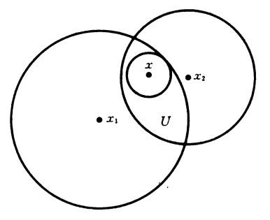

+++
title = "点集拓扑 1 - 度量空间"
date = 2022-11-02
draft = false

[taxonomies]
categories = ["点集拓扑"]
tags = ["数学", "拓扑学", "点集拓扑"]

[extra]
lang = "zh"
toc = true
mathjax = true

+++

本文内容已完全施工完毕, 读者可放心阅读！



## 1.1 度量空间与开集

### 定义 1.1.1 (度量空间)

若 $(X, d)$ 被称为 **度量空间 (metric space)**, 如果存在 $X$ 上的 **度量 (metric)** $d : X \times X \to \R$, 使得满足：

1. **正定性 (positive definiteness)**：$\forall x \in X, \quad d(x,x) = 0$ 且 $\forall x,y \in X, \quad x \neq y \implies d(x, y) \gt 0$;
2. **对称性 (symmetry)**：$\forall x,y \in X, \quad d(x, y) = d(y, x)$;
3. **三角不等式 (triangle inequality)**：$\forall x,y,z \in X, \quad d(x,z) \leq d(x,y) + d(y,z)$.

无歧义地通常可将 $(X, d)$ 记为 $X$.

### 例子 1.1.2 (实数空间 $\R$)

设有实数集 $\R$, 且定义 $\begin{align} d : \R \times \R & \to \R \\ (x, y) & \mapsto |x-y| \end{align}$, 则能够验证其是度量空间 $(\R, d)$ 的一个度量, 而这个度量空间被称为 **实数空间 (real space)** 或 **直线 (stright line)**, 并称 $d$ 为 $\R$ 的 **通常度量 (usual metric)**.

### 例子 1.1.3 ($n$ 维欧氏空间 $\R^n$)

设有 $n$ 维欧氏空间 $\R^n$, 若设 $x = (x_1, x_2, ..., x_n)$ 以及 $y = (y_1, y_2, ..., y_n)$, 若点 $x,y$ 之间的度量 $d : \R^n \times \R^n \to \R$ 定义为 **勾股定理 (Pythagorean theorem)**：
$$
d(x , y) = \sqrt{ \sum_{i = 1}^n (x_i - y_i)^2 }
$$

则 $(\R^n, d)$ 构成度量空间, 称之为 **$n$-维欧氏空间 (Euclidean space of $n$-dimensional)**, 并称 $d$ 为 $\R^n$ 上的通常度量.

### 例子 1.1.4 (Hilbert 空间 $\H$)

若 $\H$ 为平凡收敛的所有 $\R$ 序列构成的集合, 即：
$$
\H = \Set{ x = (x_1, x_2, \dots) : x_i \in \R, i \in \Z^+, \sum_{i \in 1}^{\infin} x_i^2 < \infin }
$$
且设 $x = (x_1, x_2, ...)$, $y = (y_1, y_2, ...)$, 定义度量 $d : \H \times \H \to \R$ 为：
$$
d(x, y) = \sqrt{ \sum_{i = 1}^{\infin} (x_i - y_i)^2 }
$$
则 $(\H, d)$ 构成度量空间, 称之为 **Hilbert 空间 (Hilbert space)**, 并称 $d$ 为 $\H$ 上的通常度量.

### 例子 1.1.5 (离散度量空间)

对于任意集合 $X$ 以及 $x, y \in X$, 若度量映射 $d$ 被定义为：
$$
d(x,y) = \begin{dcases}
1 & \text{if}\ x \neq y \\
0 & \text{if}\ x = y
\end{dcases}
$$
且满足所有度量空间的条件, 则称为 **离散度量空间 (discrete metric space)**.

### 例子 1.1.6

 设 $f, g$ 是空间 $X = \set{ f : [0, 1] \to \R }$ 上的函数, 那么 $d(f, g) = \max |f - g|$ 是否定义了度量 ($\max$ 表示最大距离) ？

##### 证明

透过验证度量空间的条件, 我们有：

1. 正定性：若有 $\max |f(x)-g(x)| = 0$, 因为可以设 $x = x_0 \in [0,1]$, 即仅存在一个交点 $x_0$ 使得 $\max |f(x_0) - g(x_0)| = 0$, 而对于区间 $[0,1]$ 中其他的点却不重合, 因此 $f \neq g$.
2. 对称性：$d(f, g) = \max | f - g | = \max | g - f | = d(g, f) $;
3. 三角不等式：$d(f, h) = \max |f-h| = \max |f-g+g-h| \leq \max |f-g| + \max |g-h| = d(f,g) + d(g, h)$;

因此 $X$ 并不是一个度量空间.

### 例子 1.1.7 ($\R^{[0,1]}$ 上可微函数之间的面积)

设 $f, g$ 是 $\R^{[0,1]}$ 上的可微函数, 且设 $\R^{[0,1]}$ 为度量空间, 那么 $f, g$ 之间的距离 $d(f, g)$ 可被表示为该两函数之间图形的面积, 即有：
$$
d(f,g) = \int_0^1 | f(x) - g(x) |\ dx
$$

### 定义 1.1.8 (开球 / 闭球 / 球面)

设有度量空间 $X$, 且对于任意 $x \in X$ 以及半径 $\epsilon \in \R^+$ ($\epsilon > 0$), 定义：

- **开球 (open ball)**：$B^{\circ}_x(\epsilon) := \set{ y \in X : d(x,y) < \epsilon }$;
- **闭球 (closed ball)**：$B_x(\epsilon) := \set{ y \in X : d(x,y) \leq \epsilon }$;
- **球面 (sphere)**：$S_x(\epsilon) := \set{ y \in X : d(x,y) = \epsilon }$.

开球 $B^{\circ}_x(\epsilon)$ 亦被称为以 $x$ 为中心, 并以 $\epsilon$ 为半径的 **球形邻域 (ball neighbourhood)**, 或 以 $x$ 为半径的 **$\epsilon$-邻域 ($\epsilon$-neighbourhood)**.

### 定义 1.1.9 (边界子集)

设有度量空间 $X$, 那么子集 $S \sub X$ 被称为 **边界子集 (bounded subset)** 若 $S$ 被包含于开球 $B_x^{\circ}(r)$ 内, 即 $S \sub B_x^{\circ}(r)$, 且围绕在点 $x \in X$ 的半径 $r \in \R$ 外.

### 命题 1.1.10 (任意点至少存在一个开球, 且都属于它的任意开球)

设有度量空间 $X$ 以及任意点 $x \in X$：

1. 存在至少一个开球 $B^{\circ}_x(\epsilon)$;
2. 对于任意其余开球 $B^{\circ}_x(\epsilon')$, 有 $x \in B^{\circ}_x(\epsilon') \sub B^{\circ}_x(\epsilon)$.

##### 证明

1. 由开球的定义得, 若 $\epsilon > 0$, 则必然能够构造出一个开球, 这是显然的;
2. 若设度量为 $d(x, x) = 0$, 则 $x$ 属于它的每一个开球.

### 命题 1.1.11 (任二开球的交是任意开球的并)

设有度量空间 $X$, 对于任意开球 $B_{x_1}^{\circ}(\epsilon_1), B_{x_2}^{\circ}(\epsilon_2)$, 有：
$$
B_{x_1}^{\circ}(\epsilon_1) \cap B_{x_2}^{\circ}(\epsilon_2) = \bigcup_{x \in U} B_x^{\circ}(\epsilon_x)
$$

##### 证明

设有 $B_{x_1}^{\circ}(\epsilon_1)$ 以及 $B_{x_2}^{\circ}(\epsilon_2)$, 若 $U = B_{x_1}^{\circ}(\epsilon_1) \cap B_{x_2}^{\circ}(\epsilon_2)$, 则透过其定义知 $U \iff (d(x_1,y_1) \lt \epsilon_1) \and (d(x_2,y_2) \lt \epsilon_2)$, 使得对于 $i = 1,2$ 有 $0 \lt \epsilon_i - d(x_i, y_i)$, 那么存在 $x \in U$, 且设 $\epsilon_x = \min(\epsilon_1 - d(x_1,y_1), \epsilon_2 - d(x_2,y_2))$ 则亦可得 $B_x^{\circ}(\epsilon_x) \sube U$, 最终使得：
$$
U = \bigcup_{x \in U} B^{\circ}_x(\epsilon_x).
$$
即如图中所示：

### 命题 1.1.12 (若点 $y$ 在 $x$ 的任意开球内, 则 $y$ 存在开球包含于 $x$ 的开球中)

设有度量空间 $X$, 以及任意 $x, y \in X$, 且有 $x$ 的开球 $B^{\circ}_{x}(\epsilon)$, 若 $y \in B^{\circ}_x(\epsilon)$, 则存在 $y$ 的开球 $B^{\circ}_y(\epsilon')$ 使得 $B^{\circ}_y(\epsilon') \sub B^{\circ}_x(\epsilon)$.

##### 证明

假设有任意点 $y' \in B^{\circ}_y(\epsilon')$ 以及 $y \in B^{\circ}_x(\epsilon)$, 则需证 $y' \in B^{\circ}_x(\epsilon)$, 即有命题：
$$
(d(y, y') < \epsilon') \and (d(x, y) < \epsilon) \implies d(x, y') < \epsilon
$$
那么将 $d(x, y)$ 与 $d(y, y')$ 相加, 并透过三角不等式则有：
$$
d(x, y') \leq d(x,y) + d(y, y') \lt d(x, y) + \epsilon'
$$
则取 $\epsilon' = \epsilon - d(x, y)$ 使得最终有 $d(x, y') < \epsilon$, 因此 $B^{\circ}_y(\epsilon') \sub B^{\circ}_x(\epsilon)$ 成立.

### 定义 1.1.13 (度量空间中的开集)

设有度量空间 $X$ 且 $A \sub X$, 若对于任意 $a \in A$, 存在 $\epsilon > 0$ 使得 $B^{\circ}_a(\epsilon) \sub A$, 则称 $A$ 为度量空间 $X$ 的一个 **开集 (open sets)**.

### 注释

事实上根据 [命题 1.1.12](#命题_1.1.12_(若点_$y$_在_$x$_的任意开球内,_则_$y$_存在开球包含于_$x$_的开球中)) 所述, 若假设有开球 , 开球本身也是个开集.

### 命题 1.1.14 ($\R$ 中的开区间构成开集)

设有 $a, b \in \R$：

1. 若 $a < b$, 则开区间 $(a, b) = \set{x \in \R : a < x < b}$ 是 $\R$ 中的开集.
2. $(a, \infin) = \set{x \in \R, x > a}$, $(-\infin, b) = \set{x \in \R, x < b}$ 以及 $(-\infin, \infin) = \R$ 均为开集.

##### 证明

1. 即问对于任意 $x \in (a, b)$, 存在 $\epsilon > 0$ 使得 $B^{\circ}_x(\epsilon) \sub (a, b)$, 那么则仅需限制 $\epsilon = \min(x-a, b-x)$ 即可得证.
2. 对于 $x \in (a, \infin)$, 仅需取 $\epsilon = x-a$, 而对于 $x \in (-\infin,b)$ 则取 $\epsilon = b-x$, $(-\infin, \infin)$ 是显然的.

### 例子 1.1.15 (闭区间, 半开半闭区间, 无穷闭区间均不是开集)

要注意的是对于：

- 闭区间：$[a, b] = \set{x \in \R : a \leq x \leq b}$;
- 半开半闭区间：$(a,b] = \set{ x \in \R : a < x \leq b }$ 以及 $[a, b) = \set{ x \in \R, a \leq x \lt b }$;
- 无穷闭区间：$[a, \infin) = \set{ x \in \R : a \leq x }$ 以及 $(-\infin, b] = \set{ x \in \R : x \leq b }$

都不是 $\R$ 中的开集.

### 定理 1.1.16 (度量空间中开集的基本性质)

设有度量空间 $X$, 则有：

1. $X, \empty$ 都是开集;
2. 任意多个开集的并仍是开集;
3. 有限多个开集的交仍是开集 $\iff$ 任二开集的交仍是开集.

##### 证明

1. 由 [命题 1.1.10 (1)](#命题_1.1.10_(任意点至少存在一个开球,_且都属于它的任意开球)) 得 $X$ 中的任意点至少都存在一个开球, 显然 $X$ 是开集. 而 $\empty$ 的子集只能是为空, 因此 $\empty$ 亦是开集.

2. 假设有开集族 $\mathcal{U} = \set{ U : \forall u \in U, \exists \epsilon > 0, B^{\circ}_u(\epsilon) \sub U}$ 及它们的并 $\bigcup_{U \in \mathcal{U}} U$, 即证对于任意 $x \in \bigcup_{U \in \mathcal{U}} U$, 存在 $\epsilon > 0$ 使得 $B^{\circ}_x(\epsilon) \sub \bigcup_{U \in \mathcal{U}} U$, 那么现在根据开集族的定义, 则有：
   $$
   y \in \bigcup_{U \in \mathcal{U}} U \iff \exists U \in \mathcal{U}, y \in U \overset{开集族定义}{\iff} \exists U \in \mathcal{U}, y \in B^{\circ}_u(\epsilon) \sub U \quad (\forall u \in U, \exists \epsilon > 0)
   $$
   则显然这里有开球 $B^{\circ}_u(\epsilon)$ 包含于 $U$ 且也含于 $\bigcup_{U \in \mathcal{U}} U$ 中, 因此命题成立.

3. 假设 $U, V \sub X$ 为开集, 那么它们之间都必然有开球分别含于 $U$ 或 $V$ 中, 且由于 $U \cap V$, 则它们之间存在交点, 而根据 [命题 1.1.11](#命题_1.1.11_(任二开球的交是任意开球的并)), 开球的交是任意开球之间的并, 那么再利用到 $(2)$ 则显然命题成立.

### 注释

实际上将该三条性质推广, 则可作为拓扑空间的定义, 在第二章会提及到.

## 1.2 度量空间的邻域与连续性

### 定义 1.2.1 (度量空间中的邻域)

设有度量空间 $X$, $x \in X$, 以及 $U \sub X$, 若存在开集 $V$ 使得 $x \in V \sub U$, 则称 $U$ 为 $x$ 的 **邻域 (neighbourhood)**, 通常记为 $U_x$ (或无歧义情况下记为 $U$).

### 定理 1.2.2 (邻域定义的等价描述)

设有度量空间 $X$, $x \in X$, 则 $X$ 的子集 $U$ 是 $x$ 的一个邻域 $\iff$ $x$ 存在开球包含于 $U$.

##### 证明

$(\Rightarrow)$ 既然 $X$ 的子集 $U$ 是 $x$ 的一个邻域, 根据邻域的定义则 $U$ 中必然含有开集 $V$, 而又根据开集的定义则存在开球 $B^{\circ}_x(\epsilon) \sub V$, 使得有 $B^{\circ}_x(\epsilon) \sub V \sub U$.

$(\Leftarrow)$ 若有 $x \in B^{\circ}_x \sub U$, 那么根据 [命题 1.1.12](#命题_1.1.12_(若点_$y$_在_$x$_的任意开球内,_则_$y$_存在开球包含于_$x$_的开球中)) 我们知道开球 $B^{\circ}_x$ 实际上也是个开集使得满足邻域的定义.

### 定义 1.2.3 (度量空间中的连续映射)

设 $X, Y$ 为度量空间, 映射 $f : X \to Y$ 以及 $x_0 \in X$, 若对于 $f(x_0)$ 的任意开球 $B^{\circ}_{f(x_0)}(\epsilon)$, 存在 $x_0$ 的开球 $B^{\circ}_{x_0}(\delta)$ 使得满足：
$$
f(B^{\circ}_{x_0}(\delta)) \sub B^{\circ}_{f(x_0)}(\epsilon)
$$
则称映射 $f$ **在点 $x_0$ 处是连续的 (continuous at point $x_0$)**, 并且若任意点 $x \in X$ 都连续, 则称 $f$ 为 **连续映射 (continuous maps)**.

### 注释

实际上连续函数的这个定义是数学分析中 $(\epsilon,\delta)$ 语言的推广, 即设 $d, d'$ 分别为 $X, Y$ 上的度量, 则 $f$ 在点 $x_0$ 处连续被描述为：
$$
\forall \epsilon > 0, \exists \delta > 0, d(x, x_0) < \delta \implies d'(f(x), f(x_0)) < \epsilon
$$
其中 $d(x, x_0) < \delta \iff x \in B^{\circ}_{x_0}(\delta)$ 而 $d'(f(x), f(x_0)) < \epsilon \iff f(x) \in B^{\circ}_{f(x_0)}(\epsilon)$.

### 定理 1.2.4 (连续映射的基本性质)

设 $X, Y$ 为度量空间, 映射 $f : X \to Y$ 以及 $x_0 \in X$, 则：

1. $f$ 在点 $x_0$ 处是连续的 $\iff$ $f(x_0)$ 的任意邻域的原像是 $x_0$ 的邻域;
2. $f$ 是连续的 $\iff$ $Y$ 中任意开集的原像是 $X$ 中的开集.

##### 证明

1. $(\Rightarrow)$ 需证明：$f$ 在点 $x_0$ 处是连续的 $\implies$ 假设 $f(x_0)$ 的任意邻域 $U$, 根据 [定理 1.2.2](#定理_1.2.2_(邻域定义的等价描述)) 有开球 $B^{\circ}_{f(x_0)}(\epsilon) \sub U$, 使得其原像 $f^{-1}(U)$ 应为 $x_0$ 的邻域.

   由于 $f$ 在点 $x_0$ 处连续, 所以必定存在 $B^{\circ}_{x_0}(\delta)$ 使得有 $f(B^{\circ}_{x_0}(\delta)) \sub B^{\circ}_{f(x_0)}(\epsilon)$, 而 $B^{\circ}_{f(x_0)}(\epsilon) \sub U$, 因此有：
   $$
   f^{-1}(f(B^{\circ}_{x_0}(\delta))) = B^{\circ}_{x_0}(\delta) \sub f^{-1}(B^{\circ}_{f(x_0)}(\epsilon)) \sub f^{-1}(U) \\
   $$
   那么显然地 $f^{-1}(U)$ 包含了开球 $B^{\circ}_{x_0}(\delta)$, 所以就是 $x_0$ 的邻域, 因此命题成立.

   $(\Leftarrow)$ 需证明：$f$ 在点 $x_0$ 处是连续的 $\implies$ 设 $f(x_0)$ 的任意开球 $B^{\circ}_{f(x_0)}(\epsilon)$, 需找到 $x_0$ 的开球 $B^{\circ}_{x_0}(\delta)$ 使得满足 $f(B^{\circ}_{x_0}(\delta)) \sub B^{\circ}_{f(x_0)}(\epsilon)$.

   由于 $f(x_0)$ 的任意邻域 $U$ 的原像 $f^{-1}(U)$ 是 $x_0$ 的邻域, 根据 [定理 1.2.2](#定理_1.2.2_(邻域定义的等价描述)) $x_0$ 就有开球 $B^{\circ}_{x_0}(\delta) \sub f^{-1}(U)$, 则有 $f(B^{\circ}_{x_0}(\delta)) \sub f(f^{-1}(U)) = U$, 取 $U$ 为任意的 $B^{\circ}_{f(x_0)}(\epsilon)$ 则可使 $f(B^{\circ}_{x_0}(\delta)) \sub B^{\circ}_{f(x_0)}(\epsilon)$ 成立.

2. $(\Rightarrow)$ 需证明：$f$ 是连续的 $\implies$ 设 $Y$ 中任意开集 $U$, 原像 $f^{-1}(U)$ 中以及 $x \in f^{-1}(U)$, 若存在 $\delta > 0$ 使得 $B^{\circ}_{x}(\delta) \sub f^{-1}(U)$, 则 $f^{-1}(U)$ 是 $X$ 中的开集.

   若 $f$ 是连续的, 由 $(1)$ 可以得对于任意点 $x \in X$, 都有 $f(x)$ 的任意邻域 $U_{f(x)}$ 的原像 $f^{-1}(U)$ 是 $x$ 的邻域, 那么根据 [定理 1.2.2](#定理_1.2.2_(邻域定义的等价描述)), 那必然存在 $\delta > 0$ 使得 $B^{\circ}_x(\delta) \sub f^{-1}(U)$ 成立.

   $(\Leftarrow)$ 需证明：$Y$ 中任意开集的原像是 $X$ 中的开集 $\implies$ 根据 $(1)$, 即对于任意点 $x \in X$, 若有任意邻域 $U_{f(x)}$, 则对任意 $B^{\circ}_{f(x)}(\epsilon) \sub U_{f(x)}$ 进而使得应存在开集 $f^{-1}(B^{\circ}_{f(x)}(\epsilon)) \sub f^{-1}(U_{f(x)})$, 则 $f^{-1}(U_{f(x)})$ 是 $x$ 的邻域.

   假设 $Y$ 中任意开集 $B^{\circ}_{f(x)}(\epsilon)$ 的原像 $f^{-1}(B^{\circ}_{f(x)}(\epsilon))$ 为 $X$ 中的开集, 那么由于 $B^{\circ}_{f(x)}(\epsilon) \sub U_{f(x)}$, 所以就有 $f^{-1}(B^{\circ}_{f(x)}(\epsilon)) \sub f^{-1}(U_{f(x)})$ 使得 $f^{-1}(U_{f(x)})$ 为 $x$ 的邻域, 因此命题成立.

## 参考资料

本笔记参考了以下书籍或教材：

- [Introduction to Topology - 1 - nLab](https://www.ncatlab.org/nlab/show/Introduction+to+Topology+--+1)
- [Notes on Introductory Point-Set Topology - Allen Hatcher](https://pi.math.cornell.edu/~hatcher/Top/TopNotes.pdf)
- [Introduction to Topology - Renzo’s Math 490](https://www.math.colostate.edu/~renzo/teaching/Topology10/Notes.pdf)
- [基础拓扑学讲义 - 尤承业](https://zhihongecnu.github.io/pdf/textbooks/%E5%9F%BA%E7%A1%80%E6%8B%93%E6%89%91%E5%AD%A6%E8%AE%B2%E4%B9%89.pdf)
- 点集拓扑讲义 - 熊金城



