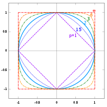
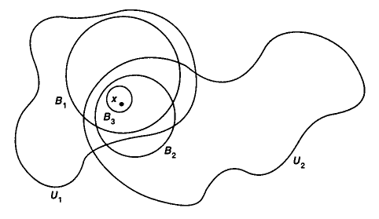

+++
title = "点集拓扑 1 - 度量空间, 连续性与紧性"
date = 2023-01-22
draft = false

[taxonomies]
categories = ["点集拓扑"]
tags = ["数学", "拓扑学", "点集拓扑"]

[extra]
lang = "zh"
toc = true
mathjax = true

+++

本文内容已完全施工完毕, 读者可放心阅读！



## 1.0 前言

本笔记以 [nLab 上的点集拓扑教程](https://www.ncatlab.org/nlab/show/Introduction+to+Topology+--+1) 作参考, 并且将适当地略过一些不重要的证明或例子, 务求尽快建立对拓扑学的认知.

## 1.1 度量空间

### 定义 1.1.1 (度量空间)

若 $(X, d)$ 被称为 **度量空间 (metric space)**, 当存在 $X$ 上的 **度量 (metric)** $d : X \times X \to \R$, 使得对于任意 $x, y, z \in X$ 满足了：

1. **正定性 (positive definiteness)**：$d(x,x) = 0$ 且 $x \neq y \implies d(x, y) \gt 0$;
2. **对称性 (symmetry)**：$d(x, y) = d(y, x)$;
3. **三角不等式 (triangle inequality)**：$d(x,z) \leq d(x,y) + d(y,z)$.

无歧义地通常可将 $(X, d)$ 记为 $X$.

### 例子 1.1.2 (实数空间 $\R$)

设有实数集 $\R$, 且定义 $\begin{align} \R \times \R & \overset{d}{\to} \R \\ (x, y) & \mapsto |x-y| \end{align}$, 则能够验证其是度量空间 $(\R, d)$ 的一个度量, 而这个度量空间被称为 **实数空间 (real space)** 或 **直线 (stright line)**, 并称 $d$ 为 $\R$ 的 **通常度量 (usual metric)**.

### 定义 1.1.3 (开球 / 闭球 / 球面)

设有度量空间 $X$, 且对于任意 $x \in X$ 以及半径 $\epsilon \in \R^+$ ($\epsilon > 0$), 定义：

- **开球 (open ball)**：$B^{\circ}_x(\epsilon) := \set{ y \in X : d(x,y) < \epsilon }$;
- **闭球 (closed ball)**：$B_x(\epsilon) := \set{ y \in X : d(x,y) \leq \epsilon }$;
- **球面 (sphere)**：$S_x(\epsilon) := \set{ y \in X : d(x,y) = \epsilon }$.

开球 $B^{\circ}_x(\epsilon)$ 亦被称为以 $x$ 为中心, 并以 $\epsilon$ 为半径的 **球形邻域 (ball neighbourhood)**, 或 以 $x$ 为半径的 **$\epsilon$-邻域 ($\epsilon$-neighbourhood)**.

### 定义 1.1.4 (边界子集)

设有度量空间 $X$, 若子集 $S \sub X$ 被称为 **边界子集 (bounded subset)** 当 $S$ 被包含于开球 $B_x^{\circ}(r)$ 内, 即 $S \sub B_x^{\circ}(r)$, 其中有 $x \in X, r \in \R$.

### 命题 1.1.5 (任意点至少存在一个开球, 且都属于它的任意开球)

设有度量空间 $X$ 以及任意点 $x \in X$：

1. 存在至少一个开球 $B^{\circ}_x(\epsilon)$;
2. 对于任意其余开球 $B^{\circ}_x(\epsilon')$, 有 $x \in B^{\circ}_x(\epsilon') \sub B^{\circ}_x(\epsilon)$.

##### 证明

1. 由开球的定义得, 若 $\epsilon > 0$, 则必然能够构造出一个开球, 这是显然的;
2. 若设度量为 $d(x, x) = 0$, 则 $x$ 属于它的每一个开球.

### 命题 1.1.6 (任二开球的交是任意开球的并)

设有度量空间 $X$, 对于任意开球 $B_{x_1}^{\circ}(\epsilon_1), B_{x_2}^{\circ}(\epsilon_2)$, 有：
$$
B_{x_1}^{\circ}(\epsilon_1) \cap B_{x_2}^{\circ}(\epsilon_2) = \bigcup_{x \in U} B_x^{\circ}(\epsilon_x)
$$

即如图中所示：

##### 证明

设有 $B_{x_1}^{\circ}(\epsilon_1)$ 以及 $B_{x_2}^{\circ}(\epsilon_2)$, 若 $U = B_{x_1}^{\circ}(\epsilon_1) \cap B_{x_2}^{\circ}(\epsilon_2)$, 则透过其定义知 $U \iff (d(x_1,y_1) \lt \epsilon_1) \and (d(x_2,y_2) \lt \epsilon_2)$, 使得对于 $i = 1,2$ 有 $0 \lt \epsilon_i - d(x_i, y_i)$, 那么存在 $x \in U$, 且设 $\epsilon_x = \min(\epsilon_1 - d(x_1,y_1), \epsilon_2 - d(x_2,y_2))$ 则亦可得 $B_x^{\circ}(\epsilon_x) \sube U$, 最终使得：
$$
U = \bigcup_{x \in U} B^{\circ}_x(\epsilon_x).
$$

### 命题 1.1.7 (若点 $y$ 在 $x$ 的任意开球内, 则 $y$ 存在开球包含于 $x$ 的开球中)

设有度量空间 $X$, 以及任意 $x, y \in X$, 且有 $x$ 的开球 $B^{\circ}_{x}(\epsilon)$, 若 $y \in B^{\circ}_x(\epsilon)$, 则存在 $y$ 的开球 $B^{\circ}_y(\epsilon')$ 使得 $B^{\circ}_y(\epsilon') \sub B^{\circ}_x(\epsilon)$.

##### 证明

假设有任意点 $y' \in B^{\circ}_y(\epsilon')$ 以及 $y \in B^{\circ}_x(\epsilon)$, 则需证 $y' \in B^{\circ}_x(\epsilon)$, 即有命题：
$$
(d(y, y') < \epsilon') \and (d(x, y) < \epsilon) \implies d(x, y') < \epsilon
$$
那么将 $d(x, y)$ 与 $d(y, y')$ 相加, 并透过三角不等式则有：
$$
d(x, y') \leq d(x,y) + d(y, y') \lt d(x, y) + \epsilon'
$$
则取 $\epsilon' = \epsilon - d(x, y)$ 使得最终有 $d(x, y') < \epsilon$, 因此 $B^{\circ}_y(\epsilon') \sub B^{\circ}_x(\epsilon)$ 成立.

### 定义 1.1.8 (赋范线性空间)

设有实线性空间 $V$ 以及 **范数 (norm)** $\Vert - \Vert : V \to \R_{\geq 0}$, 若 $(V, \Vert - \Vert)$ 被称为 **赋范线性空间 (normed vector space)**, 当对于任意 $v, w \in V$ 满足了：

1. **线性性 (linearity)**：$\Vert cv \Vert = |c| \Vert v \Vert$;
2. **三角不等式 (triangle inequality)**：$\Vert v + w \Vert \leq \Vert v \Vert + \Vert w \Vert$;
3. **非退化性 (non-degeneracy)**：若 $\Vert v \Vert = 0$, 则 $v = 0$.

### 命题 1.1.9 (赋范线性空间构成度量空间)

任意赋范线性空间 $(V, \Vert - \Vert)$ 若设有度量 $d(x, y) \coloneqq \Vert x - y \Vert$, 则 $(V, \Vert - \Vert)$ 构成度量空间.

### 例子 1.1.10 (欧氏空间)

对于任意 $n \in \N$, 若有 **笛卡尔空间 (Cartesian space)** $\R^n = \set{ \vec{x} = (x_i)^n_{i = 1} : x_i \in \R }$, 以及定义 **欧几里得范数 (Euclidean norm)** 为：
$$
\Vert \vec{x} \Vert \coloneqq \sqrt{ \sum_{i = 1}^n (x_i)^2 }
$$
根据 [命题 1.1.9](#命题_1.1.9_(赋范线性空间构成度量空间)) 显然 $(\R^n, \Vert - \Vert)$ 构成度量空间, 被称为 $n$ 维 **欧氏空间 (Euclidean space)**, 无歧义情况下可简记为 $\R^n$.

### 例子 1.1.11 ($p$-范数)

对于 [例子 1.1.10](#例子_1.1.10_(欧氏空间)), 我们可以定义一个更广义的例子, 即对于任意 $n \in \N$ 以及 $p \in \R$, $p \geq 1$, 则笛卡尔空间 $\R^n$ 中能定义有 **$p$ 范数 ($p$-norm)**：
$$
\Vert \vec{x} \Vert_p \coloneqq \begin{dcases}
\root{p}\of{ \sum_{i} |x_i|^p }, & \quad p \neq \infin \\
\max_{i \in I} |x_i|, & \text{otherwise}
\end{dcases}
$$
其中若 $p = \infin$ 时称 $\Vert \vec{x} \Vert_{\infin}$ 为 **最大范数 (supremum norm)**, 正如下图所示：

可见当 $p = 2$ 时候就形成了 $\R^2$ 中的单位元, 而 $p$ 趋于无穷时则越来越近似于正方形.

## 1.2 度量空间中的连续性

### 定义 1.2.1 (以 $(\epsilon,\delta)$ 定义的连续映射)

对于任意两个度量空间 $(X, d_X)$ 以及 $(Y, d_Y)$, 若函数 $f : X \to Y$ 称为是在点 $x \in X$ 上 **连续的 (continuous)**, 当满足条件：
$$
\forall \epsilon > 0, \exists \delta > 0, ((d_X(x, x') < \delta) \implies d_Y(f(x), f(x')) < \epsilon) \qquad (\epsilon, \delta \in \R)
$$
其中对于任意 $x' \in X$. 若 $f$ 被称为是 **连续函数 (continuous function)** 当其在任意 $x \in X$ 点上都是连续的.

### 例子 1.2.2 (与子集中任意元素的距离)

设有度量空间 $(X, d)$ 以及 $S \sub X$, 定义函数 $\begin{align} X & \overset{d(S, -)}{\to} \R \\ x & \ \ \mapsto \inf \set{ d(s, x) : s \in S } \end{align}$, 则 $d(S, -)$ 为连续函数, 其中 $\R$ 为欧氏空间.

##### 证明

即需证明, 对于任意点 $x \in X$, 以及任意的 $\epsilon > 0$, 若存在 $\delta > 0$, 且对任意 $y \in X$ 有 $d(x, y) < \delta$ 使得 $|d(S, x) - d(S, y)| < \epsilon$：

由于对任意 $s \in S$ 以及 $y \in X$, 考虑三角不等式：
$$
\begin{align}
d(s, x) & \leq d(s, y) + d(y, x) \\
d(s, y) & \leq d(s, x) + d(x, y)
\end{align}
$$
由于对任意的 $s \in S$, 由于 $d(S, x) = \inf \set{ d(s, x) : s \in S }$ 为 $\set{ d(s, x) : s \in S }$ 的最大下确界, 因此：
$$
\begin{align}
d(S, x) & \leq d(S, y) + d(y, x) \\
d(S, y) & \leq d(S, x) + d(x, y)
\end{align}
$$
使得有 $d(S, x) - d(S, y) \leq d(y, x) \overset{\text{对称性}}{=} d(x, y)$ 以及 $d(S, y) - d(S, x) \leq d(x, y)$, 因此取 $\delta = \epsilon$ 便使得 $|d(S, x) - d(S, y)| \leq d(x, y) < \epsilon$ 成立.

### 例子 1.2.3 (有理函数是连续的)

- 把实数轴 $\R$ 想象为 $1$ 维的欧氏空间 $\R$, 且对于任意 $P \in \R[X]$ 的实多项式, 则所定义的函数 $\begin{align} \R & \overset{f_P}{\to} \R \\ & x \mapsto P(x) \end{align}$ 是连续的, 因此多项式为连续函数. 
- 平方根函数 $\sqrt{(-)} : \R_{\geq 0} \to \R_{\geq 0}$ 亦是连续的.

### 定义 1.2.4 (度量空间的邻域与开集)

设有度量空间 $(X, d)$, 则：

- 称 $U_x \sub X$ 为点 $x \in X$ 的 **邻域 (neighbourhood)** 当存在 $\epsilon > 0$ 使得 $x \in B^{\circ}_x(\epsilon) \sub U_x$.
- 称 $U \sub X$ 为 $X$ 的 **开集 (open set)** 当对于任意 $x \in U$, 若存在 $\epsilon > 0$ 使得 $x \in B^{\circ}_x(\epsilon) \sub U$.
- 称 $U_x \sub X$ 为点 $x \in X$ 的 **开邻域 (open neighbourhood)** 当包含了 $x$ 的邻域 $U_x$ 仍是个开集.

下图便以图像的方式呈现了对于任给的点 $x$, 存在一些开球 $B_i$ 包含了 $x$, 并且有着这些开球所对应的邻域 $U_i$：

### 例子 1.2.5 ($\R$ 中的开区间构成开集)

设有 $a, b \in \R$：

1. 若 $a < b$, 则开区间 $(a, b) = \set{x \in \R : a < x < b}$ 是 $\R$ 中的开集.
2. $(a, \infin) = \set{x \in \R, x > a}$, $(-\infin, b) = \set{x \in \R, x < b}$ 以及 $(-\infin, \infin) = \R$ 均为开集.

##### 证明

1. 即问对于任意 $x \in (a, b)$, 存在 $\epsilon > 0$ 使得 $B^{\circ}_x(\epsilon) \sub (a, b)$, 那么则仅需限制 $\epsilon = \min(x-a, b-x)$ 即可得证.
2. 对于 $x \in (a, \infin)$, 仅需取 $\epsilon = x-a$, 而对于 $x \in (-\infin,b)$ 则取 $\epsilon = b-x$, $(-\infin, \infin)$ 是显然的.

### 例子 1.2.6 (闭区间, 半开半闭区间, 无穷闭区间均不是开集)

以下这些皆不是 $\R$ 中的开集：

- 闭区间：$[a, b] = \set{x \in \R : a \leq x \leq b}$;
- 半开半闭区间：$(a,b] = \set{ x \in \R : a < x \leq b }$ 以及 $[a, b) = \set{ x \in \R, a \leq x \lt b }$;
- 无穷闭区间：$[a, \infin) = \set{ x \in \R : a \leq x }$ 以及 $(-\infin, b] = \set{ x \in \R : x \leq b }$

### 定理 1.2.7 (度量空间中开集的基本性质)

设有度量空间 $X$, 则有：

1. $X, \empty$ 都是开集;
2. 任意多个开集的并仍是开集;
3. 有限多个开集的交仍是开集 $\iff$ 任二开集的交仍是开集.

##### 证明

1. 由 [命题 1.1.5 (1)](#命题_1.1.5_(任意点至少存在一个开球,_且都属于它的任意开球)) 得 $X$ 中的任意点至少都存在一个开球, 显然 $X$ 是开集. 而 $\empty$ 的子集只能是为空, 因此 $\empty$ 亦是开集.

2. 假设有开集族 $\mathcal{U} = \set{ U : \forall u \in U, \exists \epsilon > 0, B^{\circ}_u(\epsilon) \sub U}$ 及它们的并 $\bigcup_{U \in \mathcal{U}} U$, 即证对于任意 $x \in \bigcup_{U \in \mathcal{U}} U$, 存在 $\epsilon > 0$ 使得 $B^{\circ}_x(\epsilon) \sub \bigcup_{U \in \mathcal{U}} U$, 那么现在根据开集族的定义, 则有：
   $$
   y \in \bigcup_{U \in \mathcal{U}} U \iff \exists U \in \mathcal{U}, y \in U \overset{开集族定义}{\iff} \exists U \in \mathcal{U}, y \in B^{\circ}_u(\epsilon) \sub U \quad (\forall u \in U, \exists \epsilon > 0)
   $$
   则显然这里有开球 $B^{\circ}_u(\epsilon)$ 包含于 $U$ 且也含于 $\bigcup_{U \in \mathcal{U}} U$ 中, 因此命题成立.

3. 假设 $U, V \sub X$ 为开集, 那么它们之间都必然有开球分别含于 $U$ 或 $V$ 中, 且由于 $U \cap V$, 则它们之间存在交点, 而根据 [命题 1.1.6](#命题_1.1.6_(任二开球的交是任意开球的并)), 开球的交是任意开球之间的并, 那么再利用到 $(2)$ 则显然命题成立.

### 定理 1.2.8 (邻域定义的等价描述)

设有度量空间 $X$, $x \in X$, 则 $X$ 的子集 $U$ 是 $x$ 的一个邻域 $\iff$ $x$ 存在开球包含于 $U$.

##### 证明

$(\Rightarrow)$ 既然 $X$ 的子集 $U$ 是 $x$ 的一个邻域, 根据邻域的定义则 $U$ 中必然含有开集 $V$, 而又根据开集的定义则存在开球 $B^{\circ}_x(\epsilon) \sub V$, 使得有 $B^{\circ}_x(\epsilon) \sub V \sub U$.

$(\Leftarrow)$ 若有 $x \in B^{\circ}_x \sub U$, 那么根据 [命题 1.1.7](#命题_1.1.7_(若点_$y$_在_$x$_的任意开球内,_则_$y$_存在开球包含于_$x$_的开球中)) 我们知道开球 $B^{\circ}_x$ 实际上也是个开集使得满足邻域的定义.

### 定义 1.2.9 (度量空间中的连续映射)

设 $X, Y$ 为度量空间, 映射 $f : X \to Y$ 以及 $x_0 \in X$, 若对于 $f(x_0)$ 的任意开球 $B^{\circ}_{f(x_0)}(\epsilon)$, 存在 $x_0$ 的开球 $B^{\circ}_{x_0}(\delta)$ 使得满足：
$$
f(B^{\circ}_{x_0}(\delta)) \sub B^{\circ}_{f(x_0)}(\epsilon)
$$
则称映射 $f$ **在点 $x_0$ 处是连续的 (continuous at point $x_0$)**, 并且若任意点 $x \in X$ 都连续, 则称 $f$ 为 **连续映射 (continuous maps)**.

### 注释

实际上连续函数的这个定义是数学分析中 $(\epsilon,\delta)$ 语言的推广, 即设 $d, d'$ 分别为 $X, Y$ 上的度量, 则 $f$ 在点 $x_0$ 处连续被描述为：
$$
\forall \epsilon > 0, \exists \delta > 0, d(x, x_0) < \delta \implies d'(f(x), f(x_0)) < \epsilon
$$
其中 $d(x, x_0) < \delta \iff x \in B^{\circ}_{x_0}(\delta)$ 而 $d'(f(x), f(x_0)) < \epsilon \iff f(x) \in B^{\circ}_{f(x_0)}(\epsilon)$.

### 定理 1.2.10 (连续映射的等价定义)

设 $X, Y$ 为度量空间, 映射 $f : X \to Y$ 以及 $x_0 \in X$, 则：

1. $f$ 在点 $x_0$ 处是连续的 $\iff$ $f(x_0)$ 的任意邻域的原像是 $x_0$ 的邻域;
2. $f$ 是连续的 $\iff$ $Y$ 中任意开集的原像是 $X$ 中的开集.

##### 证明

1. $(\Rightarrow)$ 需证明：$f$ 在点 $x_0$ 处是连续的 $\implies$ 假设 $f(x_0)$ 的任意邻域 $U$, 根据 [定理 1.2.8](#定理_1.2.8_(邻域定义的等价描述)) 有开球 $B^{\circ}_{f(x_0)}(\epsilon) \sub U$, 使得其原像 $f^{-1}(U)$ 应为 $x_0$ 的邻域.

   由于 $f$ 在点 $x_0$ 处连续, 所以必定存在 $B^{\circ}_{x_0}(\delta)$ 使得有 $f(B^{\circ}_{x_0}(\delta)) \sub B^{\circ}_{f(x_0)}(\epsilon)$, 而 $B^{\circ}_{f(x_0)}(\epsilon) \sub U$, 因此有：
   $$
   f^{-1}(f(B^{\circ}_{x_0}(\delta))) = B^{\circ}_{x_0}(\delta) \sub f^{-1}(B^{\circ}_{f(x_0)}(\epsilon)) \sub f^{-1}(U) \\
   $$
   那么显然地 $f^{-1}(U)$ 包含了开球 $B^{\circ}_{x_0}(\delta)$, 所以就是 $x_0$ 的邻域, 因此命题成立.

   $(\Leftarrow)$ 需证明：$f$ 在点 $x_0$ 处是连续的 $\implies$ 设 $f(x_0)$ 的任意开球 $B^{\circ}_{f(x_0)}(\epsilon)$, 需找到 $x_0$ 的开球 $B^{\circ}_{x_0}(\delta)$ 使得满足 $f(B^{\circ}_{x_0}(\delta)) \sub B^{\circ}_{f(x_0)}(\epsilon)$.

   由于 $f(x_0)$ 的任意邻域 $U$ 的原像 $f^{-1}(U)$ 是 $x_0$ 的邻域, 根据 [定理 1.2.8](#定理_1.2.8_(邻域定义的等价描述)) $x_0$ 就有开球 $B^{\circ}_{x_0}(\delta) \sub f^{-1}(U)$, 则有 $f(B^{\circ}_{x_0}(\delta)) \sub f(f^{-1}(U)) = U$, 取 $U$ 为任意的 $B^{\circ}_{f(x_0)}(\epsilon)$ 则可使 $f(B^{\circ}_{x_0}(\delta)) \sub B^{\circ}_{f(x_0)}(\epsilon)$ 成立.

2. $(\Rightarrow)$ 需证明：$f$ 是连续的 $\implies$ 设 $Y$ 中任意开集 $U$, 原像 $f^{-1}(U)$ 中以及 $x \in f^{-1}(U)$, 若存在 $\delta > 0$ 使得 $B^{\circ}_{x}(\delta) \sub f^{-1}(U)$, 则 $f^{-1}(U)$ 是 $X$ 中的开集.

   若 $f$ 是连续的, 由 $(1)$ 可以得对于任意点 $x \in X$, 都有 $f(x)$ 的任意邻域 $U_{f(x)}$ 的原像 $f^{-1}(U)$ 是 $x$ 的邻域, 那么根据 [定理 1.2.8](#定理_1.2.8_(邻域定义的等价描述)), 那必然存在 $\delta > 0$ 使得 $B^{\circ}_x(\delta) \sub f^{-1}(U)$ 成立.

   $(\Leftarrow)$ 需证明：$Y$ 中任意开集的原像是 $X$ 中的开集 $\implies$ 根据 $(1)$, 即对于任意点 $x \in X$, 若有任意邻域 $U_{f(x)}$, 则对任意 $B^{\circ}_{f(x)}(\epsilon) \sub U_{f(x)}$ 进而使得应存在开集 $f^{-1}(B^{\circ}_{f(x)}(\epsilon)) \sub f^{-1}(U_{f(x)})$, 则 $f^{-1}(U_{f(x)})$ 是 $x$ 的邻域.

   假设 $Y$ 中任意开集 $B^{\circ}_{f(x)}(\epsilon)$ 的原像 $f^{-1}(B^{\circ}_{f(x)}(\epsilon))$ 为 $X$ 中的开集, 那么由于 $B^{\circ}_{f(x)}(\epsilon) \sub U_{f(x)}$, 所以就有 $f^{-1}(B^{\circ}_{f(x)}(\epsilon)) \sub f^{-1}(U_{f(x)})$ 使得 $f^{-1}(U_{f(x)})$ 为 $x$ 的邻域, 因此命题成立.

## 1.3 度量空间中的紧性

### 定义 1.3.1 (序列与子列)

设有集合 $X$, 分别定义：

- $X$ 中元素的 **序列 (sequence)** 为函数 $x_{(-)} : \N \to X$.
- **子序列 (sub-sequence)** 为序列的复合形式, 即 $x_{\iota(-)} : \N \overset{\iota}{\hookrightarrow} \N \overset{x_{(-)}}{\to} X$, 其中 $\iota$ 为单射函数.

### 定义 1.3.2 (收敛于序列极限)

设有度量空间 $(X, d)$, 若序列 $x_{(-)} : \N \to X$ 被称为 **收敛于点 (converge to point)** $x_{\infin} \in X$, 记为 $x_i \overset{i \to \infin}{\to} x_{\infin}$, 当满足以下条件：
$$
\forall \epsilon > 0, \exists n \in \N, \forall i > n, d(x_i, x_\infin) \leq \epsilon \qquad (\epsilon \in \R, i \in \N)
$$
其中点 $x_{\infin}$ 被称为 $x_{(-)}$ 的 **序列极限 (limit of the sequence)**, 记为 $\lim_{i \to \infin} x_i = x_\infin$.

### 定义 1.3.3 (柯西序列)

设有度量空间 $(X, d)$, 若 $X$ 中的序列 $x_{(-)} : \N \to X$ 被称为 **柯西序列 (Cauchy sequence)** 当其满足以下条件：
$$
\forall \epsilon > 0, \exists N \in \N, \forall i, j > N, d(x_i, x_j) \leq \epsilon \qquad (\epsilon \in \R, \quad i,j \in \N)
$$

### 定义 1.3.4 (完备度量空间, 巴拿赫空间)

- 若度量空间 $(X, d)$ 中的任意柯西序列都是收敛的, 则称 $X$ 为 **完备度量空间 (complete metric space)**;
- 若赋范线性空间 $(V, \Vert - \Vert)$ 是完备的 (由于赋范线性空间构成度量空间), 则称 $V$ 为 **巴拿赫空间 (Banach space)**.

### 定义 1.3.5 (列紧度量空间)

若度量空间 $(X, d)$ 被称为是 **列紧的 (sequentially compact)** 当对于任意 $X$ 序列的子序列都是收敛的.

### 注释

上述关于列紧度量空间的 $(\epsilon, N)$ 定义可被推广至更一般的拓扑空间中讨论, 因此引出以下的定义与命题.

### 命题 1.3.6 (列紧度量空间等价于紧度量空间)

设有度量空间 $(X, d)$, 则以下命题是等价的：

1. $X$ 是是列紧的;
2. 对任意 $X$ 中的开集族 $\set{ U_i \sub X }_{i \in I}$ 覆盖了 $X$, 若存在有限子集 $J \sub I$ 仍覆盖了 $X$.

### 注释

- 任意开集族 $\set{ U_i \sub X }_{i \in I}$ 被称为 **覆盖 (cover)** 了 $X$, 若满足 $X = \bigcup_{i \in I} U_i$;
- 若在更广义的拓扑空间中讨论, 则开集族 $\set{U_i \sub X}_{i \in I}$ 被称为覆盖了 $X$ 的 **开覆盖 (open cover)**.
- 这里不详细描写证明过程, 因为更方便的证明方式将于后续的章节铺垫完基础工具后再作介绍.



