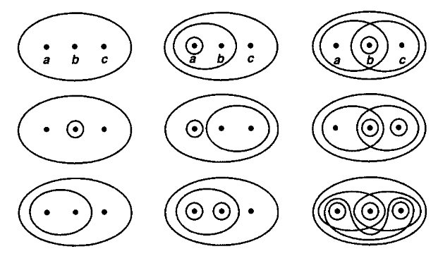
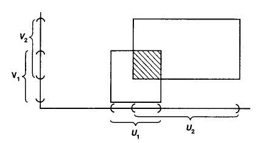
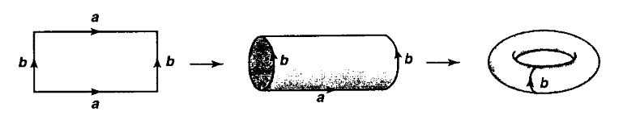

+++

title = "点集拓扑 2 - 拓扑空间, 拓扑基, 子空间与商空间"
date = 2023-02-09
draft = false

[taxonomies]
categories = ["点集拓扑"]
tags = ["数学", "拓扑学", "点集拓扑"]

[extra]
lang = "zh"
toc = true
mathjax = true

+++

本文内容已完全施工完毕, 读者可放心阅读！

本文最后更新日期：2024-04-28



## 2.1. 拓扑空间基础

### 定义 2.1.1 (拓扑空间, 开集)

设 $X$​​​​ 为非空集, $X$​​ 的一个子集族 $\tau$​​ 被称为 $X$​​ 的一个 **拓扑 (topology)**, 若其满足 **拓扑公理 (topological axioms)**：

1. $X, \empty \in \tau$;
2. $\tau$​ 中任意多个成员的并集仍在 $\tau$​ 中;
3. $\tau$ 中有限多个成员的交集仍在 $\tau$​ 中 $\iff$ $\tau$ 中任二成员的交仍在 $\tau$ 中.

则 $(X, \tau)$ 被称为是 **拓扑空间 (topological space)**, 一般可简记为 $X$, 而 $\tau$​ 中的成员称为该拓扑空间的 **开集 / 开子集 (open sets / open subsets)**.

### 例子 2.1.2 (空拓扑与点空间)

- 空集存在唯一的拓扑 $\tau_{\empty} \coloneqq \set{ \empty }$ 使得 $(\empty, \tau_{\empty})$ 构成拓扑空间, 称为 **空拓扑空间 (empty topological space)**;
- 独点集 $\set{1}$ 存在唯一拓扑 $\tau \coloneqq \set{ \empty, \set{1} }$ 使得 $* \coloneqq (\set{1}, \tau)$ 构成拓扑空间, 被称为 **点拓扑空间 (point topological space)**;
- 点拓扑空间事实上等价于 $\R^0$ 上的度量拓扑所构成的 $0$ 维欧氏空间, 关于度量拓扑的定义将在后续提及.

### 例子 2.1.3 (两个元素的集合所构成的拓扑)

两个元素的集合 $\set{0, 1}$ 分别可对应至以下拓扑 $\tau$, 使得 $(\set{0, 1}, \tau)$ 构成拓扑空间：

- **余离散拓扑 (codiscrete topology)**：$\tau = \set{ \empty, \set{ 0, 1 } }$;
- **离散拓扑 (discrete topology)**：$\tau = \set{ \empty, \set{0}, \set{1}, \set{0, 1} }$;
- **谢尔宾斯基空间 (Sierpinski space)** 拓扑：$\tau = \set{ \empty, \set{1}, \set{0, 1} }$.

我们可以将离散/余离散拓扑的定义推广至更一般的集合中, 于 [例子 2.1.6](#例子_2.1.6_(离散与余离散拓扑)) 将重新提及. 

### 例子 2.1.4 (三个元素的集合所构成的拓扑)

下述图示揭示了集合 $\set{a, b, c}$ 的拓扑结构, 其中被圈起来的即为集合中对应的开集：

### 注释 (拓扑的比较)

同一个拓扑空间可能携带了不同的拓扑, 而这些拓扑间是有粗细之分的. 通俗地说, 由于每个拓扑都包含了该空间中一系列开集作为 "信息", 而当一个拓扑所包含的开集数量越多, 那么所刻画的空间就越 "精细", 反之则越 "粗糙" (这好比电脑图像中的像素越多, 就越高清类似), 为此可以引入以下定义.

### 定义 2.1.5 (细/粗拓扑, 最细/最粗拓扑)

设 $X$ 为集合, 以及 $X$ 中的两个拓扑 $\tau_1, \tau_2 \in \mathcal{P}(X)$, 这令 $(X, \tau_1), (X, \tau_2)$ 构成拓扑空间：

- 若 $\tau_1 \sub \tau_2$, 则称 $\tau_2$ 是比 $\tau_1$ **更细致 (finer)** 的拓扑, 或称 $\tau_1$ 是比 $\tau_2$ **更粗糙 (coarser)** 的拓扑;
- 若拓扑 $\tau$ 比任意 $X$ 的拓扑 $\tau'$ 都要大, 即 $\Forall{\text{拓扑 $\tau' \in \mathcal{P}(X)$}} \tau' \sub \tau$, 则称 $\tau$ 为 $X$ 中的 **最细拓扑 (finest topology)**.
- 若拓扑 $\tau$ 比任意 $X$ 的拓扑 $\tau'$ 都要小, 即 $\Forall{\text{拓扑 $\tau' \in \mathcal{P}(X)$}} \tau \sub \tau'$, 则称 $\tau$ 为 $X$ 中的 **最粗拓扑 (coarest topology)**.

### 例子 2.1.6 (离散与余离散拓扑)

设有任意集合 $X$, 永远都存在两个极端情况使得 $X$ 与 $\tau \sub \mathcal{P}(X)$ 构成拓扑空间：

- 称 $\tau \coloneqq \mathcal{P}(X)$ 为 $X$ 的 **离散拓扑 (discrete topology)**, 且它是 $X$ 中的最细拓扑, 记为 $\op{Disc}(X)$;
- 称 $\tau \coloneqq \set{ \empty, X }$ 为 $X$ 的 **余离散拓扑 (codiscrete topology)**, 且它是 $X$ 中的最粗拓扑, 记为 $\op{CoDisc}(X)$.

### 例子 2.1.7 (余有限拓扑)

设 $X$ 为集合, 定义 $X$ 的 **余有限拓扑 (cofinite topology)** (或称 **有限补拓扑 (finite complement topology)**) 为：
$$
\tau_{\text{cofin}} \coloneqq \set{ S \sub X : \text{$X \backslash S$ 为有限集} } \cup \set{ \empty }
$$
使得 $(X, \tau_{\text{cofin}})$ 构成余有限拓扑空间. 若 $X$ 本身是有限集, 则对于任意 $S \sub X$, 显然 $X \backslash S$ 必为有限集, 即 $\tau_{\text{cofin}} = \mathcal{P}(X)$, 因此 $\tau_{\text{cofin}}$ 与离散拓扑的定义是重合的.

### 定义 2.1.8 (邻域, 开邻域, 邻域系)

设 $S$​​ 为拓扑空间 $X$​​ 的一个子集, 以及点 $x \in X$​​, 若存在开集 $V$​​ 使得 $x \in V \sub S$​​, 则：

- 称 $S$ 是 $x$ 的 **邻域 (neighbourhood)**, 记为 $U_x$;
- 所有点 $x$ 的邻域构成的子集族称为点 $x$ 的 **邻域系 (neighbourhood system)**, 记为 $\mathcal{U}_x$;
- 若邻域 $U_x$​ 同时亦是开集 $U_x \in \tau$​, 则称 $U_x$​ 为 **开邻域 (open neighbourhood)**.

## 2.2. 拓扑基, 子基与拓扑的生成

### 注释 (基底的概念)

拓扑基, 子基类似于由集合生成的代数结构 (群, 环, 线性空间等) 般, 部分拓扑空间 $(X, \tau)$ 同样可由一些基底 $\mathcal{B} \sub \tau$ 中的元素生成.

### 定义 2.2.1 (拓扑基, 子基)

设 $(X, \tau)$ 为拓扑空间, 且令 $\mathcal{B} \sub \tau$ 为 $X$ 中一族开集, 则：

- 称 $\mathcal{B}$ 为 $\tau$ 的 **拓扑基 (base / basis)**, 当满足 $\Forall{\text{开集 $O \in \tau$}} O = \ds \bigcup_{B \in \mathcal{B}} B$.
- 称 $\mathcal{B}_\mathcal{S}$ 为 $\tau$ 的 **子基 (subbase / subbasis)**, 当满足 $\Forall{\text{开集 $O \in \tau$}} O = \ds \bigcup_{B \in \mathcal{B}_\mathcal{S}} B$, 其中 $\ds \Forall{S \sub \tau} \mathcal{B}_\mathcal{S} \coloneqq \Set{ \bigcap_{S \in \mathcal{S}} S : \text{$\mathcal{S}$ 有限} }$.

### 注释

- 用白话讲, 拓扑基 $\mathcal{B}$ 指的是 $X$ 中任意开集 $O \in \tau$ 皆可表示为 **$\mathcal{B}$ 中这些元素的任意多个并**.
- 类似地, 子基 $\mathcal{B}_\mathcal{S}$ 指的是 $X$ 中任意开集 $O \in \tau$ 皆可表示为 **$\mathcal{S}$ 中任意元素的有限交的任意多个并**.

### 命题 2.2.2 (拓扑基的识别)

设 $X$ 为集合以及 $\tau \sub \mathcal{P}(X)$：

1. 若 $X$ 中的幂子集 $\mathcal{B} \sub \mathcal{P}(X)$ 为 $\tau$ 的拓扑基 $\iff$ 以下条件 **同时成立**：
   1. **$\mathcal{B}$ 覆盖了 $X$**：$\Forall{x \in X} \Exists{B \in \mathcal{B}} x \in B$, 或是 $\ds X = \bigcup_{B \in \mathcal{B}} B$;
   2. $\Forall{B_1, B_2 \in \mathcal{B}} \Forall{x \in B_1 \cap B_2} \Exists{B \in \mathcal{B}} (x \in B) \and (B \sub B_1 \cap B_2)$.
2. 若 $\mathcal{B}_\mathcal{S} \sub \tau$ 为 $\tau$ 的子基 $\iff$ $\tau$ 是包含了 $B$ 的最粗拓扑.

### 定义 2.2.3 (由基生成的拓扑)

设 $X$ 为集合以及拓扑基 $\mathcal{B} \sub \mathcal{P}(X)$, 称 $\tau_\mathcal{B}$ 为 **由 $\mathcal{B}$ 生成的拓扑 (topology generated by $\mathcal{B}$)**, 定义为：
$$
\tau_\mathcal{B} \coloneqq \Set{ \bigcup_{B \in \mathcal{B}} B \sub X } \cup \set{ \empty }
$$

### 注释 (由基生成的拓扑的确为拓扑)

易见 $\tau_\mathcal{B}$ 事实上满足了所有的拓扑公理, 这是由于 $\mathcal{B}$ 中的元素皆为开集, 因此 $\tau_\mathcal{B}$ 是一个拓扑.

### 例子 2.2.4 (开射线)

我们称集族 $\mathcal{A} \coloneqq \Set{ (a, \infin) \sub \R : a \in \R }$ 为 **开射线 (open ray)** 或 **半开线段 (open half-lines)**, 则：

1. $\mathcal{A}$ 是 $\R$ 的某个拓扑的基 (但它可能不是其他拓扑的基, 如标准拓扑);
2. 虽然 $\mathcal{A}$ 是 $\R$ 的基, 但它自身不是 $\R$ 中的拓扑.

##### 证明

1. 利用 [命题 2.2.2](#命题_2.2.2_(拓扑基的识别)), 我们知道：
   - 显然对任意 $x \in \R$, 总是存在一个开区间使得 $x \in (x - 1, \infin) \in \mathcal{A}$, 因此 $\mathcal{A}$ 覆盖了 $\R$.
   - 对任意两个开区间 $(a, \infin), (b, \infin) \in \mathcal{A}$, 为了方便起见, 我们令 $a < b$, 显然对任意 $x \in (a, \infin) \cap (b, \infin) = (b, \infin)$, 因此总是存在 $(b, \infin)$ 使得 $(b, \infin) \sub (a, \infin) \cap (b, \infin)$.
2. 假设 $\mathcal{A}$ 是 $\R$ 中的拓扑, 虽然易见 $\mathcal{A}$ 中元素的有限交和任意并皆封闭于其中, 但 $\empty$ 不是.

### 例子 2.2.5 (更多 $\R$ 中的基)

- 所有开区间的集合 $\mathcal{B} \coloneqq \set{ (a, b) \sub \R : a < b }$ 是 $\R$ 中的基, 显然它所生成的拓扑 $\tau_\mathcal{B}$ 要比上述 [例子 2.2.4](#例子_2.2.4_(开射线)) 中定义的基所生成的拓扑 $\tau_\mathcal{A}$ 要精细许多, 同时我们亦称 $\tau_\mathcal{B}$ 为 $\R$ 上的 **标准拓扑 (standard topology)**;
- 所有半开区间的集合 $\mathcal{L} \coloneqq \Set{ [a, b) \sub \R : a < b }$ (或 $\mathcal{L}' \coloneqq \Set{ (a, b] \sub \R : a < b }$) 同样是 $\R$ 中的基, 称由它所生成的拓扑 $\tau_\mathcal{L}$ 为 $\R$ 上的 **下极限拓扑 (lower limit topology)**, 而 $\tau_\mathcal{L'}$ 则称为 **上极限拓扑 (upper limit topology)**.

### 例子 2.2.6 (度量拓扑)

将上述 [例子 2.2.5](#例子_2.2.5_(更多_$\R$_中的基)) 的开区间集从 $\R^1$ 推广至 $\R^n$, 甚至更一般的, 推广至任意携带了度量 $d$ 的度量空间 $(X, d)$, 那么它的基就是以 $x_i$ 为中心, 并以 $\epsilon_i > 0$ 为半径的所有开球的集合：
$$
\mathcal{B} \coloneqq \Set{ B_{x_i}(\epsilon_i) : x_i \in X, \epsilon_i > 0 }
$$
其中分别定义：

- $\tau_d \coloneqq \tau_\mathcal{B}$ 是由 $\mathcal{B}$ 所生成的拓扑, 称之为由度量 $d$ 诱导出的 **度量拓扑 (metric topology)** 或 **标准拓扑 (standard topology)**;
- 携带了度量拓扑的 $n$ 维笛卡尔空间 $\R^n$ 被称为 $n$ 维 **欧氏空间 (Euclidean space)**, 记为 $(\R^n, \tau_d)$.

### 命题 2.2.7 (生成拓扑的比较)

令 $\mathcal{B}_1, \mathcal{B}_2 \in \mathcal{P}(X)$ 为集合 $X$ 中的拓扑基, 那么：
$$
\tau_{\mathcal{B}_1} \sub \tau_{\mathcal{B}_2} \iff \b{ \Forall{x \in X} \Forall{B_1 \in \mathcal{B}_1 \\ x \in B_1} \Exists{B_2 \in \mathcal{B}_2} (x \in B_2) \and (B_2 \sub B_1) }
$$

## 2.3. 一些重要的空间

### 注释 (从已知空间构造新的空间)

我们可以从已有的拓扑空间构造出新的空间, 例如以下这些即将提及的例子：

1. [不交并空间](#例子_2.3.1_(不交并空间));
2. [子空间](#定义_2.3.2_(子空间));
3. [商空间](#定义_2.3.3_(商空间));
4. [乘积空间](#例子_2.3.4_(二元乘积空间)).

并且于后续章节中我们可将以上这些例子对应到范畴论中, 并作为泛构造的特殊实例.

### 例子 2.3.1 (不交并空间)

对于任意拓扑空间所组成的集族 $\set{ (X_i, \tau_i) }_{i \in I}$, 这些拓扑空间之间的不交并仍构成拓扑空间, 称为该集族的 **不交并空间 (disjoint union space)**, 即：
$$
\bigsqcup_{i \in I} \b{X_i, \tau_i} \coloneqq \left(\bigsqcup_{i \in I} X_i, \bigsqcup_{i \in I} \tau_i \right)
$$
特别地, 当 $I$ 是任意指标集, 那么则可以 "复制" 出 $|I|$ 份的点空间, 使得其等价于离散拓扑空间, 即：
$$
\bigsqcup_{i \in I} * = \op{Disc}(I)
$$

### 定义 2.3.2 (子空间)

设 $(X, \tau_X)$ 为拓扑空间, 考虑以下资料：

- 子集 $S \sub X$ (或视为 $\iota : S \hookrightarrow X$);
- $S$ 的拓扑定义为 $\tau_S \coloneqq \Set{ U_S \sub S : \Exists{U_X \in \tau_X} U_S = U_X \cap S }$.

则以下结论成立：

- 称 $(S, \tau_S)$ 为 $(X, \tau_X)$ 的 **子空间 (subspace)**.
- 称 $\iota$ 为 **包含映射 (inclusion map)**.
- 事实上这亦是 $\iota$ 的 **始拓扑 (initial topology)**, 将于后续章节展开讨论.

### 定义 2.3.3 (商空间)

设 $(X, \tau_X)$ 为拓扑空间, 考虑以下资料：

- $\mathcal{R} \sub X \times X$ 为 $X$ 中的等价关系;
- $X /\mathcal{R}$ 为以 $\mathcal{R}$ 作等价关系的商集;
- 由 $\mathcal{R}$ 诱导出的映射 $\Map{\pi}{X}{X/\mathcal{R}}{x}{[x]_\mathcal{R}}$;
- $X/\mathcal{R}$ 的拓扑定义为 $\tau_{X/\mathcal{R}} \coloneqq \Set{ [O]_\mathcal{R} \sub X/\mathcal{R} : \pi^{-1}\b{[O]_\mathcal{R}} \in \tau_{X} }$.

则以下结论成立：

- 资料 $\b{X/R, \tau_{X/R}}$ 构成拓扑空间, 称为商掉等价关系 $\mathcal{R}$ 后的 **商空间 (quotient space)**;

- 称其中的拓扑 $\tau_{X/\mathcal{R}}$ 为 **商拓扑 (quotient topology)**.

- 称 $\pi$ 为 **典范投射 (canonical projection)** 或 **商映射 (quotient map)**, 换句话说 $\pi$ 为商映射当且仅当：
  $$
  \Forall{[U]_\mathcal{R} \sub X/\mathcal{R}} [U]_\mathcal{R} \in \tau_{X/\mathcal{R}} \iff \pi^{-1}\b{[U]_\mathcal{R}} \in \tau_X
  $$

- 事实上这亦是投射 $\pi$ 的 **终拓扑 (final topology)**, 将于后续章节展开讨论.

### 例子 2.3.4 (二元乘积空间)

对于任意两个拓扑空间 $(X_1, \tau_{X_1})$ 以及 $(X_2, \tau_{X_2})$：

- 定义 $X_1 \times X_2$ 的拓扑基 $\mathcal{B} \sub \tau_{X_1 \times X_2}$ 为 $\set{ U_1 \times U_2 : U_1 \in \tau_{X_1}, U_2 \in \tau_{X_2} }$;
- 定义拓扑 $\tau_{X_1 \times X_2}$ 为由 $\mathcal{B}$ 所生成的, 即 $\ds \Set{ \bigcup_{U_1 \times U_2 \in \mathcal{B}} (U_1 \times U_2) }$;
- 称 $(X_1 \times X_2, \tau_{X_1 \times X_2})$ 为 **二元乘积空间 (binary product space)**.

几何考量如下图：

当然我们可以将其推广至有限多个拓扑空间的乘积, 而对于无穷多个拓扑空间的乘积则没有那么简单, 需于后续章节中在引入 **拓扑空间范畴 (category of topological spaces)** 后以范畴论中的 **极限 (limits)** 进行讨论.

### 例子 2.3.5 (通过等价关系生成的商空间)

- 设有 $1$ 维欧氏空间 $\R$, 当然其便是以度量拓扑构成的拓扑空间, 那么若考虑其中的闭区间 $[0, 1] \sub \R$, 则构成 $\R$ 中的子空间;

- 若有乘积空间 $[0, 1] \times [0, 1]$, 如果将其考虑为一个二维平面上的闭矩形, 并且分别将对边 "粘贴" 在一起, 即定义关于对边的等价关系 $\sim$, 那么我们便可以基于该等价关系得出商空间 $([0, 1] \times [0, 1])/\sim$, 使得首先将同一方向的两条对边粘合后得到一个 **圆柱形 (cylinder)**, 再将该圆柱形另外两条对边进行粘合便得到 **环面 (torus)** 的模样, 即如下图：

  

### 例子 2.3.6 (球面与圆盘)

对于任意 $n \in \N$：

- 欧氏空间 $\R^n$ 中的 **闭单位球 (closed unit ball)** 被称为 $n$ 维 **圆盘 (disk)**, 记为 $D^n$, 且定义为：
  $$
  D^n \coloneqq \Set{ \vec{x} \in \R^n : \sum_{i} (x^i)^2 \leq 1 } \sub \R^n
  $$
  使得 $D^n$ 与由 $\R^n$ 中度量拓扑诱导出的子空间拓扑构成拓扑空间;

- 欧氏空间 $\R^n$ 中的 $n-1$ 维 **球面 (sphere)** 同样与对应的子空间拓扑构成拓扑空间, 记为 $S^{n-1}$;

- 其中 $S^{-1} = \empty$ 为空拓扑空间, 且 $S^0 = * \sqcup *$ 点空间的为不交并空间, 由上述例子中得知其为离散拓扑空间;

- $i_n : S^{n-1} \hookrightarrow D^n$ 为 **边界 (boundary)** (或球面) 到圆盘的包含映射.

### 注释

下面是一些代数几何中的例子.

### 例子 2.3.7 (仿射空间中的 Zariski 拓扑)

设 $k$ 为域以及 $n \in \N$, 对于多项式环中的子集 $\mathcal{F} \sub k[X_1, \cdots, X_n]$, 我们定义 $V(\mathcal{F}) \sub k^n$ 为 $\mathcal{F}$ 中多项式的零点集, 具体地说：
$$
V(\mathcal{F}) \coloneqq \Set{ (a_1, \cdots, a_n) \in k^n : \Forall{f \in \mathcal{F}} f(a_1, \cdots, a_n) = 0 }
$$
并且称该子集为 **Zariski 闭集 (Zariski closed subsets)**, 现在再定义：
$$
\tau_{\mathbb{A}_k^n} \coloneqq \Set{ k^n \backslash V(\mathcal{F}) \sub k^n : \mathcal{F} \sub k[X_1, \cdots, X_n] }
$$
其中的元素为 Zariski 闭集的补, 称之为 $k^n$ 中的 **Zariski 开集 (Zariski open subsets)**. 另一方面 $\tau_{\mathbb{A}_k^n}$ 同时亦是 $k^n$ 中的拓扑, 称之为 **Zariski 拓扑 (Zariski topology)**, 而由该拓扑所给出的拓扑空间 $\mathbb{A}_k^n \coloneqq \b{ k^n, \tau_{\mathbb{A}_k^n} }$ 则称为 $k$ 上的 $n$ 维 **仿射空间 (affine space)**.

### 例子 2.3.8 (交换环的素谱上的 Zariski 拓扑)

我们将上述 [例子 2.3.7](#例子_2.3.7_(仿射空间中的_Zariski_拓扑)) 从域 $k^n$ 推广至任意交换环 $R$, 且令 $\text{PrimeIdl}(R)$ 为所有 $R$ 上素理想的集合, 那么对于任意 $\mathcal{F} \sub R$, 同样可以定义：
$$
V(\mathcal{F}) \coloneqq \Set{ \mathfrak{p} \in \text{PrimeIdl}(R) : \mathcal{F} \sub \mathfrak{p} }
$$
其中的元素皆为包含了 $\mathcal{F}$ 的素理想 $\mathfrak{p}$, 几何地考量, 它就对应了空间中的一个点, 这也是作为素数在交换环上的推广. 显然 $V(\mathcal{F})$ 为 素理想上的 Zariski 闭集, 同样地 $R$ 对 $V(\mathcal{F})$ 中的素理想作补则可得到拓扑 $\tau_{\text{Spec$(R)$}} \sub \text{PrimeIdl}(R)$, 那么就给出了拓扑空间 $\text{Spec}(R) \coloneqq \b{\text{PrimeIdl}(R), \tau_{\text{Spec$(R)$}}}$, 称之为 **交换环上的素谱 (prime spectrum of the commutative ring)**.

