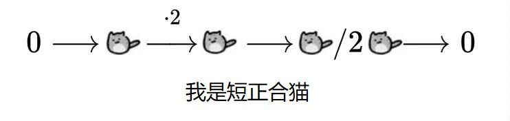

+++
title = "测试用例"
date = 2022-11-23
draft = false

[taxonomies]
categories = ["博客搭建"]
tags = ["博客搭建"]

[extra]
lang = "zh"
show_comment = true
mathjax = true
mermaid = true

+++

这里是关于博客的一些测试用例, 用作验证一些关于 Zola 的特性.

## 1. Markdown 元素

### 1.1 标题

| Markdown |   渲染后输出    |
| :------: | :-------------: |
| # 标题 1 | <h1>标题 1</h1> |
| # 标题 2 | <h2>标题 2</h2> |
| # 标题 3 | <h3>标题 3</h3> |
| # 标题 4 | <h4>标题 4</h4> |
| # 标题 5 | <h5>标题 5</h5> |
| # 标题 6 | <h6>标题 6</h6> |

### 1.2 文本段落与换行

|           Markdown           |               渲染后输出                |
| :--------------------------: | :-------------------------------------: |
|         文本段落测试         |           <p>文本段落测试</p>           |
| 文本段落测试,<br />隔了一行. | <p>文本第一段落测试,<br />隔了一行.</p> |

### 1.3 字体强调

|       Markdown       |   渲染后输出   |
| :------------------: | :------------: |
|   \*\*加粗字体\*\*   |  **加粗字体**  |
|   \_\_加粗字体\_\_   |  __加粗字体__  |
|       \*斜体\*       |     *斜体*     |
|       \_斜体\_       |     _斜体_     |
| \*\*\*斜体加粗\*\*\* | ***斜体加粗*** |
| \_\_\_斜体加粗\_\_\_ | ___斜体加粗___ |
| \_\_\*斜体加粗\*\_\_ | __*斜体加粗*__ |
| \*\*\_斜体加粗\_\*\* | **_斜体加粗_** |

### 1.4 块引用与段落

#### 1.4.1 块引用常规示例

> 这里是一段块引用的示例

##### 输入为:

```
> 这里是一段块引用的示例
```

#### 1.4.2 多段落的块引用

> 这里是块引用的第一个段落的第一行,
> 这里是第一段的第二行
>
> 而这里是第二个段落

##### 输入为:

```
> 这里是块引用的第一个段落的第一行,
> 这里是第一段的第二行
> 
> 而这里是第二个段落
```

#### 1.4.3 内嵌的块引用

>第一层
>
>> 第二层
>>
>> > 第三层

##### 输入为:

```
> 第一层
>
>> 第二层
>>
>>> 第三层
```

#### 1.4.4 块引用与其他元素

>#### 4 级标题
>
>我可以列举一些东西, 例如:
>
>- 第一项
>- 第二项
>
>然后 **加粗** 又可以 *斜体化*.

##### 输入为:

```
>#### 4 级标题
>
>我可以列举一些东西, 例如:
>
>- 第一项
>- 第二项
>
>然后 **加粗** 又可以 *斜体化*.
```

### 1.5 列表

#### 1.5.1 有序列表

|                        Markdown                        |                          渲染后输出                          |
| :----------------------------------------------------: | :----------------------------------------------------------: |
| 1. 第一项<br />2. 第二项<br />3. 第三项<br />4. 第四项 | <ol> <li>第一项</li> <li>第二项</li> <li>第三项</li> <li>第四项</li></ol> |
| 1. 第一项<br />1. 第二项<br />1. 第三项<br />1. 第四项 | <ol> <li>第一项</li> <li>第二项</li> <li>第三项</li> <li>第四项</li></ol> |
| 1. 第一项<br />8. 第二项<br />3. 第三项<br />5. 第四项 | <ol> <li>第一项</li> <li>第二项</li> <li>第三项</li> <li>第四项</li></ol> |

#### 1.5.2 有序的内嵌列表

1. 第一项
2. 第二项
3. 第三项
   1. 第三项内嵌第一项
   2. 第三项内嵌第二项
4. 第四项

##### 输入为:

```
1. 第一项
2. 第二项
3. 第三项
   1. 第三项内嵌第一项
   2. 第三项内嵌第二项
4. 第四项
```

#### 1.5.3 无序列表

|                      Markdown                      |                          渲染后输出                          |
| :------------------------------------------------: | :----------------------------------------------------------: |
| - 第一项<br />- 第二项<br />- 第三项<br />- 第四项 | <ul> <li>第一项</li> <li>第二项</li> <li>第三项</li> <li>第四项</li></ul> |
| * 第一项<br />* 第二项<br />* 第三项<br />* 第四项 | <ul> <li>第一项</li> <li>第二项</li> <li>第三项</li> <li>第四项</li></ul> |
| + 第一项<br />+ 第二项<br />+ 第三项<br />+ 第四项 | <ul> <li>第一项</li> <li>第二项</li> <li>第三项</li> <li>第四项</li></ul> |

#### 1.5.4 无序的内嵌列表

- 第一项
- 第二项
- 第三项
  - 第三项内嵌第一项
  - 第三项内嵌第二项
- 第四项

##### 输入为:

```
- 第一项
- 第二项
- 第三项
  - 第三项内嵌第一项
  - 第三项内嵌第二项
- 第四项
```

#### 1.5.5 有序列表中内嵌无序列表

1. 第一项
2. 第二项
3. 第三项
   - 第三项内嵌第一项
   - 第三项内嵌第二项
4. 第四项

##### 输入为:

```
1. 第一项
2. 第二项
3. 第三项
   - 第三项内嵌第一项
   - 第三项内嵌第二项
4. 第四项
```

#### 1.5.6 列表与其他元素混合

1. 第一项
2. 第二项的第一个段落
   第二项的另二个段落
3. 第三项
   - 第三项内嵌第一项
   - 第三项内嵌第二项
4. 第四项
   > 第四项中的引用块

##### 输入为:

```
1. 第一项
2. 第二项的第一个段落
   第二项的另二个段落
3. 第三项
   - 第三项内嵌第一项
   - 第三项内嵌第二项
4. 第四项
   > 第四项中的引用块
```

### 1.6 代码块

```java
System.out.println("Hello world")
```

##### 输入为:

````
```
System.out.println("Hello world")
```
````

### 1.7 短语上的代码块

|                     Markdown                     |                 渲染后输出                 |
| :----------------------------------------------: | :----------------------------------------: |
|             \`这里是短语上的代码块`           |`这里是短语上的代码块`|
| \`\`使用双引号禁止该块内的 \`单引号\` 被转义\`\` | ``使用双引号禁止该块内的 `单引号` 被转义`` |

### 1.8 分割线

第一行
***
被分割了的第二行

---

被分割了的第三行
____________
最后的一行

##### 输入为:

```
第一行
***
被分割了的第二行

---

被分割了的第三行
______________
最后的一行
```

### 1.10 链接

#### 1.10.1 内部链接

[跳转到 Markdown 元素](#1._Markdown_元素)

[跳转到 $\text{MathJax}$](#2._$\text{MathJax}$)

[跳转到 Shortcodes](#3._Shortcodes)

##### 输入为:

```
[跳转到 Markdown 元素](#1._Markdown_元素)

[跳转到 $\text{MathJax}$](#2._$\text{MathJax}$)

[跳转到 Shortcodes](#3._Shortcodes)
```

#### 1.10.2 外部链接

[跳转到百度](https://www.baidu.com)

[跳转到谷歌](https://www.google.com "赞美 Google")

[跳转到 Github](https://github.com "程序员的圣地")

##### 输入为:

```
[跳转到百度](https://www.baidu.com)

[跳转到谷歌](https://www.google.com "赞美 Google")

[跳转到 Github](https://github.com "程序员的圣地")
```

#### 1.10.3 URL 与 Email 地址

<https://9032676.com>

<9032676@gmail.com>

##### 输入为:

```
<https://9032676.com>

<9032676@gmail.com>
```

#### 1.10.4 强调链接

[跳转到*百度*](https://www.baidu.com)

[跳转到**谷歌**](https://www.google.com "赞美 Google")

[***跳转到 Github***](https://github.com "程序员的圣地")

##### 输入为:

```
[跳转到*百度*](https://www.baidu.com)

[跳转到**谷歌**](https://www.google.com "赞美 Google")

[***跳转到 Github***](https://github.com "程序员的圣地")
```

#### 1.10.5 类引用链接

[我的博客首页][1]

[Zola 官网][2]

[1]: <https://9032676.com> "点击回到博客首页"
[2]: https://www.zola.com/	"点击跳转到 Zola 官网"

##### 输入为:

```
[我的博客首页][1]

[Zola 官网][2]

[1]: <https://9032676.com> "点击回到博客首页"
[2]: https://www.zola.com/	"点击跳转到 Zola 官网"
```

### 1.11 图片




##### 输入为:

```


```



## 2. $\text{MathJax}$

### 2.1 常规示例

$$
f(x) = \int_{-\infty}^\infin \hat f(\xi) e^{2 \pi i \xi x}\ d\xi
$$

```latex
f(x) = \int_{-\infty}^\infin \hat f(\xi) e^{2 \pi i \xi x}\ d\xi
```

### 2.2 环境示例

|                           MathJax                            |                         渲染后的公式                         |
| :----------------------------------------------------------: | :----------------------------------------------------------: |
|         `\begin{matrix} a & b \\ c & d \end{matrix}`         |        $$\begin{matrix} a & b \\ c & d \end{matrix}$$        |
|        `\begin{pmatrix} a & b \\ c & d \end{pmatrix}`        |       $$\begin{pmatrix} a & b \\ c & d \end{pmatrix}$$       |
|        `\begin{vmatrix} a & b \\ c & d \end{vmatrix}`        |       $$\begin{vmatrix} a & b \\ c & d \end{vmatrix}$$       |
|        `\begin{Bmatrix} a & b \\ c & d \end{Bmatrix}`        |       $$\begin{Bmatrix} a & b \\ c & d \end{Bmatrix}$$       |
|        `\begin{array}{cc} a & b \\ c & d \end{array}`        |       $$\begin{array}{cc} a & b \\ c & d \end{array}$$       |
|        `\begin{bmatrix} a & b \\ c & d \end{bmatrix}`        |       $$\begin{bmatrix} a & b \\ c & d \end{bmatrix}$$       |
|        `\begin{Vmatrix} a & b \\ c & d \end{Vmatrix}`        |       $$\begin{Vmatrix} a & b \\ c & d \end{Vmatrix}$$       |
|    `\begin{smallmatrix} a & b \\ c & d \end{smallmatrix}`    |    $\begin{smallmatrix} a & b \\ c & d \end{smallmatrix}$    |
| `\def \arraystretch{1.5} \begin{array}{c:c:c} a & b & c \\` <br />`\hline d & e & f \\ \hdashline g & h & i \end{array}` | $$\def \arraystretch{1.5} \begin{array}{c:c:c} a & b & c \\ \hline d & e & f \\ \hdashline g & h & i \end{array}$$ |
| `x = \begin{cases} a & \text{if $b$} \\`<br />`c & \text{if $d$} \end{cases}` | $$x = \begin{cases} a & \text{if $b$} \\ c & \text{if $d$} \end{cases}$$ |
| `\begin{rcases} a & \text{if $b$} \\`<br />`c & \text{if $d$} \end{rcases} \Rightarrow \dots` | $$\begin{rcases} a & \text{if $b$} \\ c & \text{if $d$} \end{rcases} \Rightarrow \dots$$ |
| `\sum_{\begin{subarray}{l} i \in \Lambda \\`<br />`0<j<n \end{subarray}}` | $$\sum_{\begin{subarray}{l} i \in \Lambda \\ 0<j<n \end{subarray}}$$ |

### 2.3 Xypic 拓展的交换图

$$
\xymatrix{
U \ar@/_/[ddr]_y \ar@/^/[drr]^x
\ar@{.>}[dr]|-{(x,y)} \\
& X \times_Z Y \ar[d]^q \ar[r]_p
& X \ar[d]_f \\
& Y \ar[r]^g & Z
}
$$

##### 输入为:

```latex
\xymatrix{
U \ar@/_/[ddr]_y \ar@/^/[drr]^x
\ar@{.>}[dr]|-{(x,y)} \\
& X \times_Z Y \ar[d]^q \ar[r]_p
& X \ar[d]_f \\
& Y \ar[r]^g & Z
}
```

### 2.4 内联公式

这里是一段内联公式 $a + b = c$ 的测试案例.

于内联公式中使用 `\begin{pmatrix}...\end{pmatrix}` 环境, 例如矩阵 $\begin{pmatrix} a & b \\ c & d \end{pmatrix}$.

### 2.5 禁止 Markdown 符号转义

`_` 禁止转义为 _斜体_, 例如: $x_{i} y_{j}$, 其中输入为: `x_{i} y_{j}`.

`**` 禁止转义为 **加粗**, 例如: $**加粗**$, 其中输入为: `**加粗**`.

### 2.6 忽略 MathJax 注释内容

$$
% 这里是注释
\text{这一段存在注释的 MathJax}
$$

##### 输入为:

```latex
% 这里是注释
\text{这一段存在注释的 MathJax}
```

### 2.7 自定义宏

#### 2.7.1 常用符号

|                           MathJax                            |                 渲染后公式                 |
| :----------------------------------------------------------: | :----------------------------------------: |
| `\underforall{S \sub X \\ T \sub S}`<br />`\Forall{S \sub X \\ T \sub S}` |     $$\Forall{S \sub X \\ T \sub S}$$      |
| `\underexists{S \sub X \\ T \sub S}`<br />`\Exists{S \sub X \\ T \sub S}`<br />`\Exist{S \sub X \\ T \sub S}` |     $$\Exists{S \sub X \\ T \sub S}$$      |
| `\underbigcap{i \in I \\ j < i \leq k} S_i`<br />`\Bigcap{i \in I \\ j < i \leq k} S_i` |  $$\Bigcap{i \in I \\ j < i \leq k} S_i$$  |
| `\underbigcup{i \in I \\ j < i \leq k} S_i`<br />`\Bigcup{i \in I \\ j < i \leq k} S_i` |  $$\Bigcup{i \in I \\ j < i \leq k} S_i$$  |
| `\underbigsqcup{i \in I \\ j < i \leq k} S_i`<br />`\Bigsqcup{i \in I \\ j < i \leq k} S_i` | $$\Bigsqcup{i \in I \\ j < i \leq k} S_i$$ |
|                    `\map{X}{Y}{x}{f(x)}`                     |          $$\map{X}{Y}{x}{f(x)}$$           |
|                `\Map{\varphi}{X}{Y}{x}{f(x)}`                |      $$\Map{\varphi}{X}{Y}{x}{f(x)}$$      |
|              `\opname{Ker} f`<br />`\op{Ker} f`              |               $$\op{Ker} f$$               |



## 3. Shortcodes

### 3.1 原始文本

这是一段原始文本

##### 输入为:

```
这是一段原始文本
```
